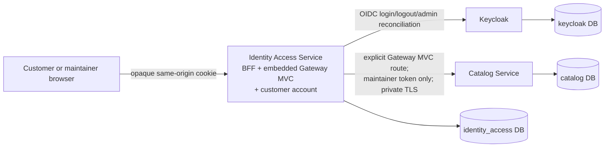

# Customer Identity and Access Design Package

> **Scope:** Jira [COM-2](https://shubhamjagtap.atlassian.net/browse/COM-2) — customer and catalog-maintainer authentication, authorization, personal-data ownership, sessions, and deletion  
> **Status:** Accepted; Gates 0 and 1 complete  
> **Controlling PRD:** [`CF-PRD-001` v1.0](https://app.notion.com/p/3b6faa3e42dd818d8debd9dfffb883ab)  
> **Date:** 2026-08-17

## Recommended reading order

1. [`hld.md`](hld.md) — system context, two-service architecture, ownership, main sequence diagrams, security/reliability, and readiness.
2. [`lld.md`](lld.md) — modules, class diagram, APIs/events, state machines, algorithms, transactions, and tests.
3. [`schema-design.md`](schema-design.md) — service-owned databases, tables, DDL, indexes, locks, retention, migration, and query evidence.
4. [`implementation-plan.md`](implementation-plan.md) — actor/service responsibility matrix and Jira-mapped delivery/evidence gates.
5. [`design-review.md`](design-review.md) — applied staff-engineer checklist, findings, approval path, and verdict.
6. [`../../development/master-local-setup-guide.md`](../../development/master-local-setup-guide.md) — master setup, operations, troubleshooting, extension rules, and consolidated Gate 0/1 decision register.

## Decisions

- [`IDA-DEC-001`](decisions/IDA-DEC-001-microservices-from-start.md) — start with two deliberately small application microservices for the explicit learning objective; proposed supersession of the old topology only.
- [`IDA-DEC-002`](decisions/IDA-DEC-002-service-boundaries.md) — keep `auth` and `customeraccount` as separate modules inside Identity Access; isolate Catalog authority as the network boundary.
- [`IDA-DEC-003`](decisions/IDA-DEC-003-principal-propagation.md) — conditionally relay only the server-side maintainer token to Catalog, which validates it and checks its own grant.
- [`IDA-DEC-004`](decisions/IDA-DEC-004-deny-first-deletion.md) — commit local denial and data scrubbing before response, then reconcile remote owners durably.
- [`IDA-DEC-005`](decisions/IDA-DEC-005-embedded-spring-cloud-gateway.md) — embed Spring Cloud Gateway Server Web MVC in Identity Access as the Java route/filter foundation without adding a deployable or durable authority.

## Selected topology at a glance

Keycloak owns credentials and identities. Identity Access owns both actors' BFF login/logout sessions and customer application accounts; its embedded Spring Cloud Gateway Server MVC component is only the downstream routing/filter engine. Catalog owns the final maintainer business grant and catalog state. Customer sign-up is bounded/synthetic and Keycloak-hosted; catalog maintainers have no self-registration path.

## Current verdict and next activity

**Verdict: ready for Gate 2 / COM-43.** Gate 0 synchronized and accepted the topology decisions. Gate 1 implemented and validated the monorepo, independent service/database boundaries, local runtime, native Spring API versioning, Swagger UI policy, CI checks, and evidence path. The next implementation boundary is the real Keycloak/BFF principal flow; no mock-auth shortcut is permitted. The E3 Cart deletion consumer remains required before COM-52/54 can be fully Done.
