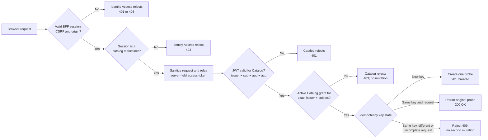
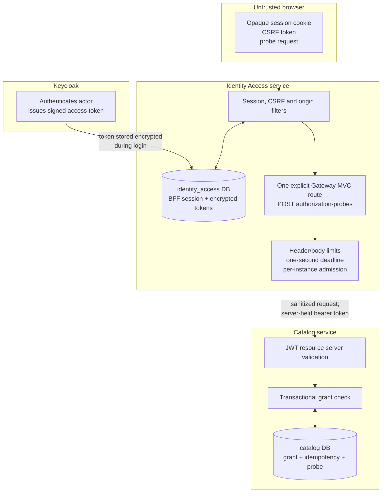
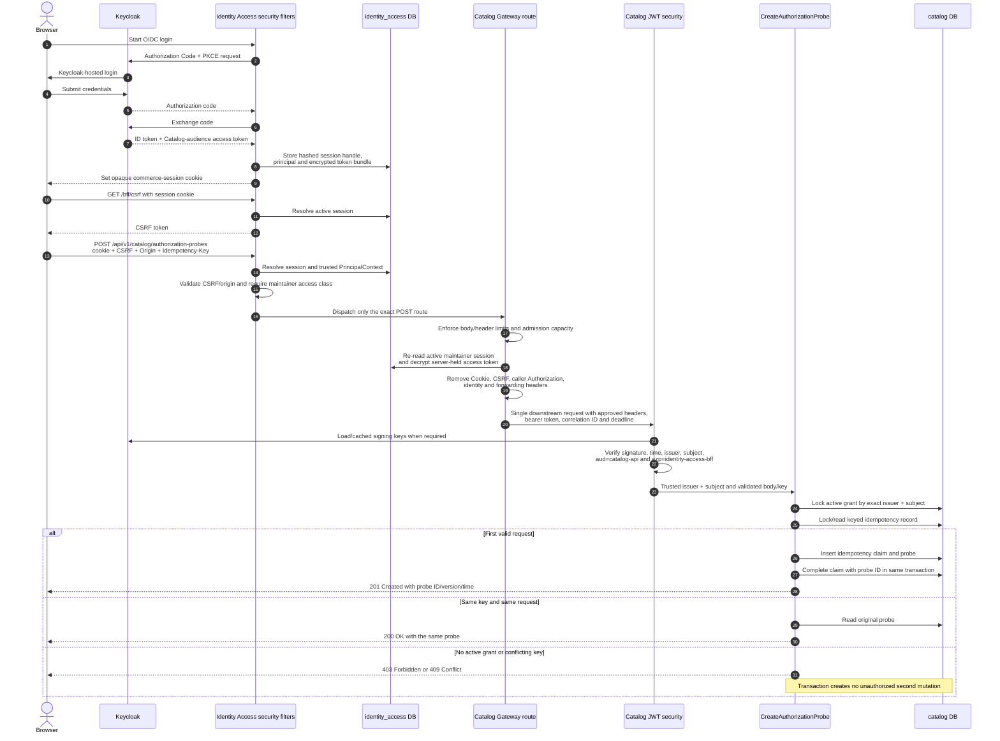
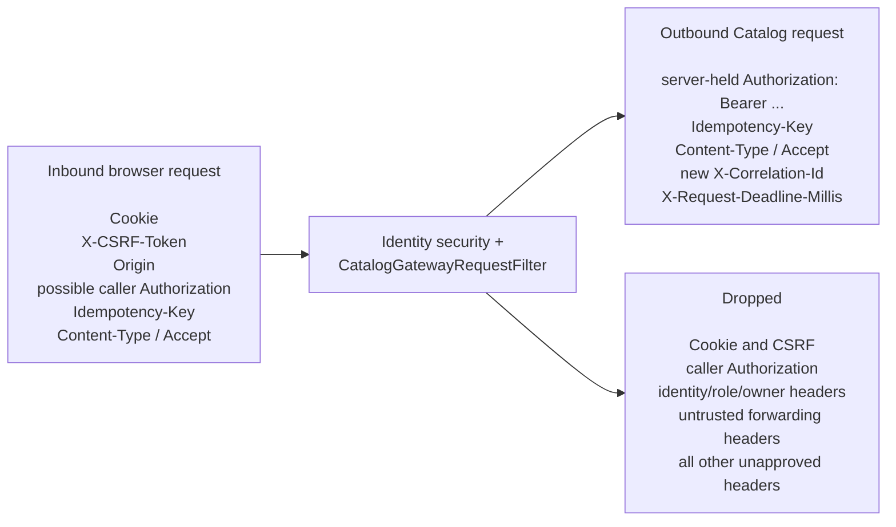

# Gate 3 COM-46 Catalog-Maintainer Authorization Flow

## Purpose

Gate 3 proves one narrow security property before real Catalog commands are added:

> A signed-in catalog maintainer may reach one explicitly approved Catalog mutation, but a browser, customer, forged request, or maintainer without an active Catalog-owned grant cannot change Catalog state.

The mutation is intentionally a small authorization probe. Later Catalog commands can replace the probe while preserving the same trust boundaries.

## What the gate establishes

Identity Access performs an early coarse check. Catalog remains the final authorization owner and does not trust the BFF role by itself.

## Trust boundaries and owned state

| Component | What it may decide | What it must not decide |
|---|---|---|
| Keycloak | Identity and coarse realm role represented in signed tokens | Whether the actor currently has a Catalog business grant |
| Identity Access | Whether the opaque session is active and classified as a maintainer; whether the request may use the explicit gateway route | Final permission to mutate Catalog state |
| Gateway filters | Limits, sanitation, admission, correlation, deadline, and token relay | Actor identity from caller-supplied headers |
| Catalog JWT validation | Whether the token is authentic and intended for this Catalog/API-client combination | Permission based only on a token role |
| Catalog transaction | Whether the exact `(issuer, subject)` grant is active and whether the command is new or a replay | Customer identity or BFF session lifecycle |

## End-to-end sequence in the current code

### Important current behavior

- The browser never receives or supplies the Catalog bearer token. Identity Access retrieves it from the encrypted BFF session.
- The current relay uses the access token already stored in the session; it does not refresh the token in this Gate 3 path.
- The gateway performs exactly one downstream attempt. There is no unsafe-request retry.
- Catalog authorizes the opaque Keycloak `(issuer, subject)` pair against its own grant table. Email and caller-provided role/owner headers are not authority.
- Grant lookup, idempotency decision, and probe mutation run in one Catalog transaction.
- Idempotency keys are HMAC-hashed before persistence; raw keys are not stored.

## Request transformation

## Outcome matrix

| Scenario | Deciding layer | Result | Catalog mutation |
|---|---|---:|---:|
| No active BFF session | Identity Access security | `401` | None |
| Active customer session | Identity Access access class | `403` | None; no downstream call |
| Missing/invalid CSRF or origin | Identity Access security | `403` | None; no downstream call |
| Unmatched path or HTTP method | Explicit route policy | `404` | None; no downstream call |
| Missing/oversized body or oversized headers | Gateway request filter | `413` | None; no downstream call |
| Admission capacity exhausted | Gateway admission filter | `429` | None; no downstream call |
| Catalog unavailable | Gateway error mapping | `503` | No confirmed mutation |
| One-second downstream deadline exhausted | Gateway error mapping | `504` | Outcome recovered by replaying the same idempotency key |
| Forged/invalid/wrong-audience token | Catalog JWT resource server | `401` | None |
| Valid token but no active exact Catalog grant | Catalog transaction | `403` | None |
| New valid maintainer command | Catalog transaction | `201` | Exactly one probe |
| Same key and same command | Catalog transaction | `200` | No second probe |
| Same key with conflicting state/request | Catalog transaction | `409` | No second probe |

## Code map

| Responsibility | Main code |
|---|---|
| Route declaration and one-second HTTP client | `CatalogGatewayConfiguration` |
| Route completeness, uniqueness, overlap and target checks | `GatewayRouteValidator`, `GatewayRouteRegistry` |
| Browser request limits, trusted principal check, sanitation and token relay | `CatalogGatewayRequestFilter` |
| Per-instance concurrent admission | `GatewayAdmissionFilter` |
| Active BFF session and encrypted access-token retrieval | `BffSessionAuthenticationFilter`, `BffSessionService` |
| Catalog resource-server boundary | Catalog `SecurityConfiguration`, `CatalogSecurityConfiguration` |
| Final grant and idempotency transaction | `CreateAuthorizationProbe` |
| Catalog-owned persistence | `CatalogMaintainerGrantRepository`, `CatalogCommandIdempotencyRepository`, `CatalogAuthorizationProbeRepository` |
| Schema and constraints | `V002__create_catalog_maintainer_gate.sql` |
| Real actor and replay canary | `scripts/verify-bff-oidc-flow.sh` |

All new Gate 3 persistence repositories are Spring Data JPA repositories. Gate 3 introduces no JDBC-based repository.

## End result

The current code creates a double authorization boundary:

1. Identity Access proves that the browser owns an active maintainer BFF session and permits only the reviewed route.
2. Catalog independently proves that the relayed token is authentic and that its exact subject has an active Catalog-owned grant in the same transaction as the write.

Passing only one boundary is insufficient. This is the reusable security shape intended for future Catalog maintenance commands.
