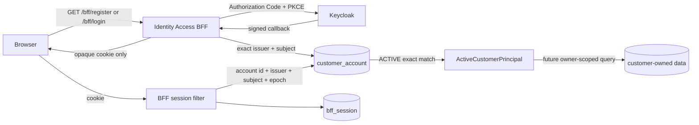
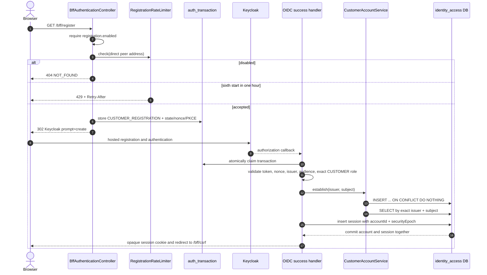
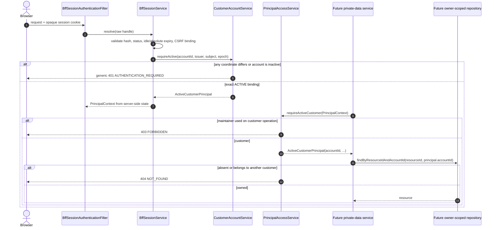
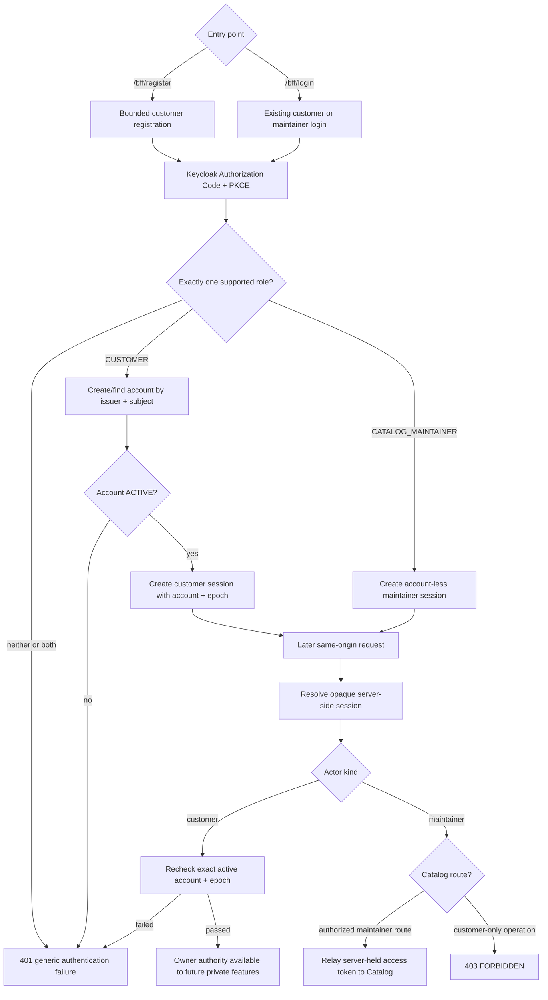

# Gate 4 and Gate 5 code-flow guide

> Scope: COM-45/T7A and COM-48/T11A. COM-44/T7B black-box evidence is deferred.
> Purpose: explain the implemented customer registration, account binding, and reusable ownership controls.
> Non-goal: this slice does not add a production customer profile, address, cart, or deletion API.

## End result

Gate 4 adds a bounded Keycloak-hosted registration entry point and binds every accepted customer to exactly one local account using the signed OIDC `(issuer, subject)` pair. Gate 5 adds a reusable conversion from an authenticated BFF session to an `ActiveCustomerPrincipal`. Future private-data repositories must query with that principal's `accountId`; callers cannot select their authority with an account id, email, role, issuer, subject, or forwarded header.

## Responsibility map

| Responsibility | Code location |
| --- | --- |
| Start login or bounded registration | `auth/controllers/BffAuthenticationController` |
| Build fixed login/registration OIDC requests | `auth/services/OidcAuthorizationRequestFactory` |
| Persist and claim one-time flow kind, nonce, and PKCE material | `auth/repositories/AuthTransactionStore` |
| Validate signed OIDC identity and exact actor role | `auth/services/OidcPrincipalValidator` |
| Atomically bind account and create session | `auth/services/BffSessionService` |
| Create/find exact principal binding | `customeraccount/repositories/CustomerAccountRepository` |
| Enforce active account and epoch | `customeraccount/services/CustomerAccountService` |
| Produce reusable ownership authority | `customeraccount/services/PrincipalAccessService` |
| Emit fixed-value, PII-free security audit events | `customeraccount/utils/CustomerAccountAuditLogger` |
| Return stable, non-enumerating denial problems | `config/GlobalProblemHandler` and Spring Security handlers |
| Enforce schema invariants and invalidate legacy customer sessions | `V003__create_customer_account_binding.sql` |

The `customeraccount` capability keeps models, repositories, services, and exceptions in their own responsibility packages. It intentionally has no controller or DTO yet because this slice exposes no customer-account resource API.

## Gate 4: registration and account binding

Normal `/bff/login` uses the same binding step. The first accepted customer login creates the account; duplicate or concurrent callbacks resolve the same unique row. Email is never a join key. A disabled, deleting, or deleted account prevents session issuance. Maintainers remain account-less and cannot use the registration completion path.

## Gate 5: principal-derived ownership

The production feature in Gate 5 is the active-account/ownership control itself. The proof is deliberately service-level in this slice because no private customer resource API exists yet. `PrincipalAccessServiceTest`, `CustomerAccountServiceTest`, architecture tests, and the PostgreSQL concurrency test exercise the reusable control without inventing `/api/v1/me` early.

## Current end-to-end actor flow

## Security and rollout notes

- Registration is enabled only by the local `dev` profile and the local Keycloak realm; the base configuration remains disabled, so staging and production fail closed until explicitly enabled.
- The registration limiter trusts only the servlet container's direct peer address and ignores caller-supplied forwarding headers.
- Migration V003 deletes pre-Gate-4 customer sessions because they contain no account or security epoch. Users must authenticate again; maintainer sessions are unaffected.
- The unique `(issuer, subject)` constraint is the concurrency authority. The repository's upsert makes callback replay idempotent without merging by email.
- Session resolution checks the account on every customer request. Changing status or security epoch invalidates existing customer sessions immediately.
- `CustomerOwnedResourceNotFoundException` gives future owner-scoped lookups the same 404 for missing and cross-owner resources.
- Rollback disables `/bff/register` and invalidates customer sessions. The durable account rows remain for a forward fix; they are not destructively removed.

## Verification map

| Objective | Automated evidence |
| --- | --- |
| Hosted registration request is distinct from login | `OidcAuthorizationRequestFactoryTest` |
| Registration start is bounded | `RegistrationRateLimiterTest` |
| Exact active account binding | `CustomerAccountServiceTest` |
| Concurrent callbacks create one account | `CustomerAccountRepositoryTest` with PostgreSQL/Testcontainers |
| Customer/maintainer and missing-account denial | `PrincipalAccessServiceTest` |
| Controllers cannot bypass account services for repositories | `ArchitectureRulesTest` |
| Local OIDC flow exposes `prompt=create` and persists a bound session | `scripts/verify-bff-oidc-flow.sh` |
| Realm registration/default-role/password policy does not drift | `scripts/verify-keycloak-realm-drift.sh` |
