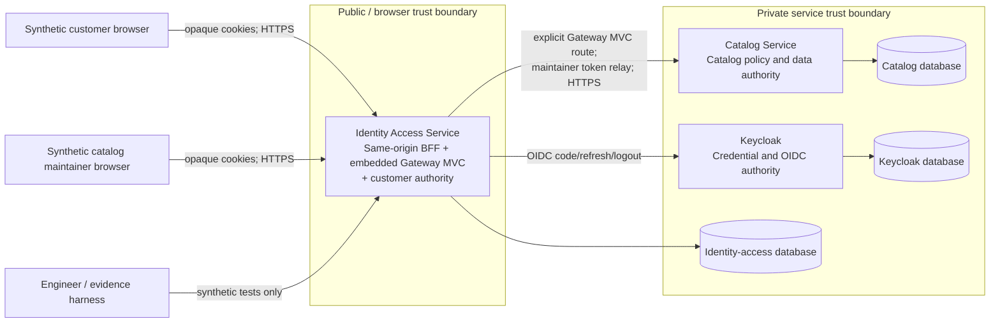
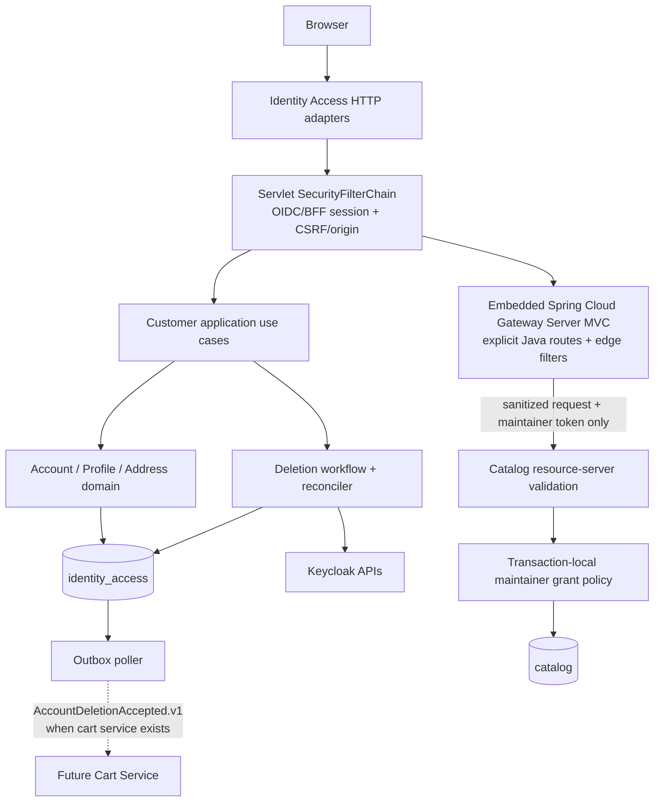
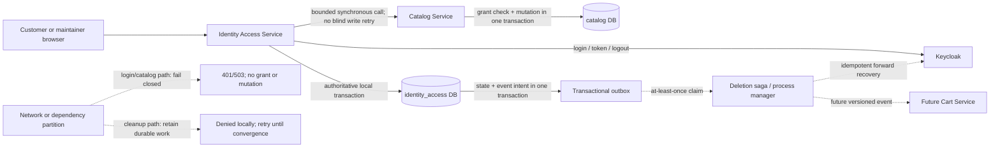

# Customer Identity and Access — High-Level Design

> **Status:** Proposed; conditionally ready for bootstrap  
> **Owner:** Product owner / technical owner  
> **Controlling PRD:** [`CF-PRD-001` v1.0](https://app.notion.com/p/3b6faa3e42dd818d8debd9dfffb883ab)  
> **Delivery scope:** [COM-2](https://shubhamjagtap.atlassian.net/browse/COM-2), COM-11–COM-17 and COM-43–COM-56  
> **Related decisions:** [`IDA-DEC-001`](decisions/IDA-DEC-001-microservices-from-start.md), [`IDA-DEC-002`](decisions/IDA-DEC-002-service-boundaries.md), [`IDA-DEC-003`](decisions/IDA-DEC-003-principal-propagation.md), [`IDA-DEC-004`](decisions/IDA-DEC-004-deny-first-deletion.md), [`IDA-DEC-005`](decisions/IDA-DEC-005-embedded-spring-cloud-gateway.md)  
> **Last updated:** 2026-08-17

## 1. Executive decision summary

Build the capability as a deliberately small microservice system from the start:

1. **Identity Access Service** — the public same-origin BFF for both customers and catalog maintainers, with embedded Spring Cloud Gateway Server Web MVC as its downstream routing/filter engine, and the authority for BFF sessions, `(iss, sub)` customer binding, active/deleting customer status, minimized profile, addresses, and the deny-first account-deletion workflow.
2. **Catalog Service** — a separately deployable catalog authority. For COM-2 it provides the real resource-server and catalog-maintainer authorization boundary; catalog lifecycle remains in E1.
3. **Keycloak** — the external authentication authority for credentials, OIDC protocol state, subjects, identity-provider sessions, and coarse role claims.

Each application service owns its logical PostgreSQL database and migrations. Local development may place those databases in one PostgreSQL server to reduce cost, but database users cannot read across service databases. Browser traffic receives only opaque BFF cookies. Customer access tokens do not leave the Identity Access Service; only the catalog-maintainer server-side token may be relayed to the Catalog Service, which validates it and applies its own transaction-local grant policy.

Spring Cloud Gateway is embedded in the Identity Access process; it is not a third application service or a new authority. It replaces the conceptual custom Catalog proxy with versioned Java WebMvc.fn routes and handler filters. Local `/bff/**` and `/api/v1/me/**` controllers, JDBC repositories, and local transactions remain unchanged.

This topology is selected for the product owner's explicit microservices learning goal, not because measured load requires distribution. The accepted cost is network failure, contract/versioning, multi-database operations, tracing, and a changed performance baseline. A recent systematic mapping of 114 migration studies identifies communication and database migration among the principal monolith-to-microservice challenges, and official platform guidance notes that per-service data ownership removes the option of one cross-service ACID transaction. This is why a later extraction would be feasible but not mechanical or guaranteed to be easy.

The design is **conditionally ready** because the new user decision supersedes the one-application topology in the existing Notion decision and `CF-PERF-DEC-001`. The performance/acceptance documents must be synchronized before any result is called a valid `CF-XCAP-SCN-022`–`028` result. COM-43 bootstrap work may begin after review of the exact two-service boundary.

## 2. Scope and authority

### Goals

- Establish first-party OIDC Authorization Code + PKCE through a same-origin BFF.
- Keep raw passwords in Keycloak and OAuth tokens out of browser-visible surfaces.
- Authenticate synthetic customers and catalog maintainers through the same real boundary.
- Bind customer ownership to validated `(iss, sub)`, never email or a caller-supplied owner ID.
- Enforce catalog-only maintainer authority and zero customer-data authority.
- Provide owner-only minimized profile and address CRUD with at most one default address.
- Provide current-session logout and all-session revocation for approved events.
- Delete the Week 1 account footprint through an immediate deny-all boundary and retryable reconciliation.
- Produce evidence for the COM-2 scenario and evidence IDs without inventing product behavior.
- Teach genuine microservice concerns while keeping the number of application deployables small.
- Establish a reusable, fail-closed routing/filter foundation for approved downstream service APIs without moving business authorization to the edge.

### Non-goals

- Public arbitrary registration, social login, MFA, recovery, verification, offline access, account linking, or third-party/mobile bearer clients.
- Support/admin access to customer profile or addresses.
- Address deliverability verification or an external address vendor.
- Catalog lifecycle implementation, cart implementation, or P0 order/inventory/payment implementation in this epic.
- A service per entity, separate gateway deployable, Kubernetes, service mesh, broker, distributed cache, search engine, replica, or load balancer.
- Production availability, real-user privacy-compliance, or scalability claims.

### Sources and assumptions

| Source or assumption | Classification/status | Design implication | Verification/approval needed |
|---|---|---|---|
| User direction, 2026-08-13 | Approved latest direction | Start with microservices for learning; keep design simple/effective/fast | Synchronize the superseded Notion/performance topology |
| User direction, 2026-08-17 | Approved latest technical direction | Embed Spring Cloud Gateway Server Web MVC in Identity Access; use Java routes; add no deployable/Redis/database | Exact compatible Spring release train remains a setup decision |
| `CF-PRD-001` v1.0 | Approved | Fixes journeys D, E, G; functional semantics and non-goals | None |
| Notion Decisions and Rationale | Approved but topology partly superseded | Preserves Keycloak/BFF/security decisions; old modular-monolith/one-app decision remains history | Add a supersession record after design approval |
| Security baseline and research sections 7–10 | Approved/normative | Controls token, session, ownership, PII, deletion, retention, and evidence behavior | None |
| Performance baseline/research | Approved; topology conflict | Preserve D2, workload, targets, PostgreSQL-first and evidence rules; replace one-app resource/topology wording | Product/architecture sync required |
| Cross-capability acceptance matrix | Approved; topology conflict in scenarios 022–028 | Preserve controls and assertions; reallocate resource envelope and record inter-service latency/failure | Acceptance sync required |
| Jira COM-2 hierarchy | Delivery authority | Seven stories and fourteen subtasks define delivery/evidence slices | No Jira write in this design task |
| Repository implementation | Fact: absent | No build, application, migrations, commands, or tests exist | Local setup plan follows this design |
| Cart deletion consumer | Cross-epic dependency | COM-52 can create the event/contract, but full cart deletion evidence requires E3's cart owner | Link dependency before COM-52 is Done |

## 3. Requirements and design drivers

| Requirement/invariant ID | Design pressure | Enforcing owner | Planned evidence |
|---|---|---|---|
| `CF-IDN-001`, `CF-SEC-IDN-001`–`004` | Real OIDC code flow, fail-closed claims, no mock auth | Identity Access Service + Keycloak | `SCN-007`, `EVID-004` |
| `CF-IDN-003`, `CF-SEC-SES-003`–`008` | Persistent sessions, bounded refresh, local-first logout, subject revocation | Identity Access Service | `SCN-009`, `026`; `EVID-004`–`006`, `012` |
| `CF-IDN-004`, `CF-SEC-IDN-005` | Ownership identity cannot be email | Identity Access Service database | Account uniqueness and re-registration integration tests |
| `CF-ACC-001`, `CF-SEC-PII-001`–`006` | PII minimization and owner-only access | Identity Access Service | `SCN-012`–`014`; `EVID-005`, `006`, `008` |
| `CF-ADDR-001`–`002`, `CF-INV-005` | Owner scoping and one-default concurrency invariant | Identity Access Service database | Transactional concurrency tests |
| `CF-AUTHZ-001`–`002`, `CF-INV-004`, `011` | Authentication is insufficient; no identifier authority or disclosure | Each owning service | Complete actor/path matrix, zero state/field changes |
| COM-11 / S26 | Maintainer authenticates through real BFF and receives only catalog authority | Identity Access Service + Catalog Service | `SCN-002`, `007`, `011`, `012`, `014` |
| `CF-ACC-002`, `CF-SEC-NFR-009`–`010` | Two-system deletion, immediate deny, no resurrection | Identity Access Service deletion workflow | `SCN-009`, `029`; fault/restore evidence |
| `CF-SEC-NFR-001`–`003` | Five-minute token, 30-minute idle, eight-hour absolute, 256-bit secrets | Keycloak config + Identity Access Service | Time-controlled tests |
| `CF-SEC-NFR-007` | Enumeration-safe result and timing policy | Keycloak + edge controls | 1,000 attempts/class, shape and p95 comparison |
| `CF-SEC-NFR-008`, `011` | Zero authorization or canary tolerance | All services/evidence harness | Hard-stop matrix and canary scan |
| User simplicity goal | Limit distributed surface | Architecture | Two application services, one monorepo, no broker/mesh/Kubernetes initially |

## 4. Architecturally significant scenarios

| Scenario | Required outcome | Architecture implication |
|---|---|---|
| Valid customer login | Opaque BFF session bound to `(iss, sub)`; no browser token | Identity Access Service owns the OIDC client and persistent session store |
| Valid maintainer catalog request | Real OIDC/BFF flow; only catalog mutation authority | Server-side token relay only for maintainer; Catalog Service validates token and local grant |
| Valid opaque handle is stolen/replayed | Current session may be impersonated until expiry/revocation; no sender-constrained claim | Prevent acquisition, never persist/log raw handle, validate authoritative session each request, and bound with idle/absolute/epoch/logout/back-channel/deletion revocation |
| Anonymous/customer catalog mutation | `401`/`403`, no state change | Catalog policy is enforced in Catalog Service, not only at BFF |
| Maintainer calls profile/address path | `403` or owner-hidden `404`, zero fields/change | Identity Access Service has no role-to-owner shortcut |
| Duplicate/replayed callback | One account/session outcome or fail-closed | One-time auth transaction and `(issuer, subject)` uniqueness |
| Cross-owner address ID | Generic `404`, no field or mutation | Repository query is scoped by derived `account_id` and `address_id` together |
| Concurrent default changes | At most one default | Account-row serialization plus partial unique index |
| Concurrent profile edits | One committed version; stale writer conflicts safely | Optimistic version and conditional update |
| Logout with Keycloak unavailable | Local handle is unusable before response; remote revoke retries | Local transaction precedes remote cleanup |
| Credential/admin subject logout | All matching BFF sessions invalid within 60 seconds | OIDC back-channel logout persisted by issuer/sub or `sid` |
| Account deletion with remote failure | Local PII is removed/deny-all before `202`; workflow retries for up to 24 hours | Deny-first local transaction, outbox/workflow, idempotent Keycloak/cart steps |
| Service/database outage | Fail closed; no stale authority or partial mutation | No local fallback cache for authority; distinct `503` dependency outcome |
| Lost response on mutation | Retry returns/reconstructs same outcome | Scoped idempotency records without duplicated PII |
| Restore an old backup | Deletion ledger runs before readiness | Startup restore gate blocks traffic until ledger replay verifies |

## 5. System context



Trust rules:

- The browser is untrusted. Cookies are opaque, `Secure`, `HttpOnly`, host-only, `SameSite=Lax`, and use the `__Host-` prefix.
- The Identity Access Service is the only public application write boundary in this slice.
- The embedded gateway may authenticate and reject at the edge, but it never becomes the final authorization owner for Catalog or another downstream domain.
- The Catalog Service never trusts owner, role, issuer, subject, or forwarding headers supplied by the browser.
- Keycloak authenticates; each owning service authorizes its own actions and objects.
- Databases are not shared contracts. No service reads another service's tables.

## 6. Proposed architecture



| Component/module | Responsibility | Owns | Exposes | Must not do |
|---|---|---|---|---|
| Identity Access Service — `auth` module | OIDC transactions for both actors, server-side tokens, opaque sessions, CSRF/origin/CORS, login/logout | Auth transactions and sessions | Browser authentication/session endpoints; authenticated `PrincipalContext` and token ports | Store passwords; expose tokens; accept browser owner/role claims; authorize catalog state |
| Identity Access Service — `edgegateway` infrastructure | Explicit Spring Cloud Gateway Server MVC routes, coarse access class, header sanitation, request limits, deadlines, per-instance admission control, maintainer-token relay, edge errors/metrics | No durable business or session state | Only approved downstream method/path routes | Define public product behavior; persist sessions/routes/limits; trust caller identity headers; replace downstream authorization |
| Identity Access Service — `customeraccount` module | `(iss, sub)` binding after customer sign-up/login, active status, profile, address, owner-scoped queries | Account/profile/address/deletion state | `/api/v1/me/**` commands/queries | Own login credentials; accept customer IDs from callers; access Catalog DB |
| Identity Access Service — `deletion` module/worker | Deny-first customer deletion plus idempotent Keycloak and future cart reconciliation | Workflow, deletion ledger, outbox | Operator state/metrics; no customer PII payload | Restore access after acceptance; rely on an in-memory retry |
| Catalog Service — security/policy shell | Validate maintainer token and catalog-owned grant inside write transaction | Maintainer grant; later catalog state | Catalog commands/queries defined by E1 | Trust BFF headers alone; access customer data or identity DB |
| Keycloak | Credentials, password policy, OIDC subject/session, coarse roles | Realm/client/user/credential state | OIDC discovery/auth/token/logout/back-channel behavior | Own commerce profile/address/catalog policy |
| PostgreSQL | Durable service-owned state | Separate logical databases and roles | SQL only to owning service | Provide cross-service joins or transactions |

### 6.1 Embedded gateway boundary

Every downstream route is declared through the Java WebMvc.fn gateway route registry with:

- a unique route ID;
- explicit HTTP methods and explicit path predicates;
- a configured private target service;
- one access class: `PUBLIC`, `CUSTOMER`, or `MAINTAINER`;
- an end-to-end/downstream deadline allocation; and
- a request-size policy plus coarse admission policy.

Startup fails for duplicate IDs, missing access policy, invalid targets, ambiguous overlapping predicates, or an unrestricted catch-all. `/api/v1/catalog/**` remains the public namespace, but the gateway forwards only E1-approved method/path contracts within that namespace. No public product-search or product-detail route is registered by COM-2; E1 must first define its visibility, consistency, payload, and rate semantics.

The gateway applies browser-edge controls consistently, but authority remains local to the owner:

| Concern | Gateway/Identity Access responsibility | Owning service responsibility |
|---|---|---|
| Authentication | Resolve the opaque BFF session and build a trusted principal | Validate any service credential received at its private boundary |
| Coarse actor access | Reject anonymous/customer/maintainer mismatches before proxying | Evaluate current business grant, object, and command policy |
| Browser controls | CSRF, Origin/Referer, Fetch Metadata, CORS, cookie handling | Do not depend on browser-only controls for service authorization |
| Request mediation | Explicit route, sanitation, size/rate/deadline, correlation | Validate contract/body and enforce idempotency/transactions |
| Principal propagation | Relay only the approved server-held maintainer token | Validate token claims and authorize beside owned state |

### 6.2 Actor lifecycle and service responsibilities

Authentication and application-account ownership are intentionally different responsibilities. Keycloak proves the identity and owns credentials; the Identity Access Service owns the browser session and customer application account; the Catalog Service owns the final maintainer grant and catalog state.

| Actor operation | Browser-facing orchestrator | Credential/identity authority | Application state created or changed | Explicitly not responsible |
|---|---|---|---|---|
| Customer bounded synthetic sign-up | Identity Access `auth` starts `/bff/register` and handles the OIDC callback | Keycloak hosts the registration form, validates/stores email and password, and creates a new subject | Identity Access `customeraccount` binds `(issuer, subject)` exactly once and creates the local customer account | Catalog; browser-side token code; a separate Customer Service |
| Customer login | Identity Access `auth` starts/finishes Authorization Code + PKCE and creates the opaque BFF session | Keycloak authenticates the password and issues server-side tokens | Existing account is resolved by `(issuer, subject)`; no shadow account | Catalog and the customer-domain API do not verify passwords |
| Customer logout | Identity Access invalidates the current local session first, clears cookies, and coordinates revocation/RP logout | Keycloak revokes/ends the corresponding identity-provider session when reachable | Ordinary logout preserves customer profile/address; approved all-session events are separate | Catalog does not own browser sessions |
| Customer account/profile/address/deletion | Identity Access `customeraccount` and `deletion` | Keycloak is called only for identity disable/delete reconciliation | Identity-access DB is authoritative for status, profile, addresses, security epoch, and deletion workflow | Keycloak does not store commerce profile/address data |
| Catalog-maintainer provisioning | No public browser registration; reviewed bootstrap/admin workflow only | A Keycloak administrator pre-creates the synthetic identity and coarse role | A Catalog administrator/migration creates the independent `catalog_maintainer_grant` | Identity Access cannot grant catalog write authority by itself |
| Catalog-maintainer login | The same Identity Access `auth` module and BFF endpoints used by customers | Keycloak authenticates and issues the server-side maintainer token | Identity Access creates an opaque BFF session with a coarse authority hint; no customer account is created | Catalog does not host a login form or issue browser sessions |
| Catalog-maintainer logout | The same local-first Identity Access session flow | The same Keycloak revocation/RP logout integration | Catalog grant remains unchanged; only the current login session ends | Logout does not revoke the maintainer's business grant |
| Catalog-maintainer mutation | Identity Access performs edge rejection and an explicit Gateway MVC route relays the server-side token | The Keycloak token supplies authenticated issuer/subject and coarse claim | Catalog validates the token, locks/checks its local grant, and commits catalog state | Neither Keycloak, Identity Access, nor the gateway is the final catalog authorization owner |

The approved Week 1 scope permits **bounded synthetic customer sign-up**, not arbitrary public registration. Catalog maintainers have **no self-registration path**. A maintainer identity and a Catalog grant are two separate administrative facts; if authentication succeeds but the Catalog grant is absent or revoked, catalog mutation returns `403` with no state change.

Do not split `auth` and `customeraccount` into separate deployables at bootstrap. They remain separate modules and ports inside Identity Access because every owned-resource request needs a session-to-subject-to-active-account decision, and customer deletion must revoke local sessions and deny account data in one transaction. A network split would add a hop and a distributed deletion/revocation workflow without a current team, scale, trust-zone, or release-cadence driver. `IDA-DEC-002` defines evidence that would justify extracting them later.

### Dependency direction

- Domain code depends only on domain types and ports.
- Application use cases depend on domain types and port interfaces.
- HTTP, persistence, Keycloak, clock, crypto, and Spring Cloud Gateway MVC adapters implement ports.
- Identity Access and Catalog Service share only versioned wire contracts/test fixtures, never domain or persistence classes.
- Architecture tests fail service-to-service package imports, entity leakage, and domain-to-framework dependencies.

## 7. Data ownership and consistency

| Data/rule | Authority | Consistency requirement | Transaction boundary | Derived consumers |
|---|---|---|---|---|
| Password, email login, OIDC subject/session | Keycloak | Keycloak authoritative | Keycloak transaction | Identity Access stores issuer/sub reference only |
| OIDC auth transaction and BFF session | Identity Access Service | Strong local consistency | Identity-access DB transaction | Browser cookie is a handle, not authority by itself |
| Customer status/profile/address | Identity Access Service | Strong local consistency | Account-scoped DB transaction | Audit metadata only |
| At most one default address | Identity Access Service DB | Strong invariant | Lock account row; update address set atomically | None |
| Catalog maintainer grant | Catalog Service | Strong at final catalog write | Catalog DB transaction locks/version-checks grant | Keycloak role is coarse input, not sole write authority |
| Account deletion acceptance | Identity Access Service | Strong deny-before-response | One local transaction | Keycloak/cart cleanup is eventual and retryable |
| Deletion cleanup phase | Identity Access Service workflow | At-least-once steps, idempotent effects | One transaction per phase | Operator metrics and future cart consumer |
| Security audit | Identity Access Service | Append with related local state when material | Same local transaction where possible | 90-day pseudonymous evidence |

No distributed transaction is used. The only cross-system workflow in COM-2 is deletion/logout reconciliation. Its invariant is made local first: once the account status becomes `DELETING`, the Identity Access Service rejects every session and owned-resource action even if Keycloak or a future consumer is unavailable.

## 8. Principal flows

### 8.1 Shared login, bounded customer sign-up, and account binding

```mermaid
sequenceDiagram
    actor Browser
    participant BFF as Identity Access Service
    participant DB as Identity-access DB
    participant KC as Keycloak

    Browser->>BFF: GET /bff/login or /bff/register
    BFF->>DB: Store flow kind + hashed state + protected nonce/PKCE (10 min)
    BFF-->>Browser: 302 exact Keycloak authorization URI
    alt bounded customer registration
        Browser->>KC: Hosted registration; Keycloak stores email/password and creates subject
    else customer or maintainer login
        Browser->>KC: Hosted login; Keycloak verifies credentials
    end
    KC-->>Browser: 302 callback with code + state
    Browser->>BFF: GET /login/oauth2/code/keycloak
    BFF->>DB: Consume matching one-time auth transaction
    BFF->>KC: Exchange code + verifier
    KC-->>BFF: ID/access/refresh tokens
    BFF->>BFF: Validate signature, alg, iss, aud, azp, time, nonce
    alt validated customer principal
        BFF->>DB: Bind/load account by (iss, sub); create CUSTOMER session with account_id
        DB-->>BFF: Commit account/session once
    else validated catalog maintainer principal
        BFF->>DB: Create MAINTAINER session with no customer account_id
        DB-->>BFF: Commit session once
    end
    BFF-->>Browser: Opaque __Host- session cookie
```

Failure semantics:

- Protocol/tamper failure: generic authentication failure; no account/session commit.
- Identity dependency failure: distinct `503`; no partial local account/session.
- Duplicate callback: consumed state fails closed and cannot mint a second session.
- Lost response after commit: browser repeats initiation; `(iss, sub)` uniqueness prevents a second account.
- A `CUSTOMER_REGISTRATION` auth transaction cannot create a maintainer: maintainer provisioning has no public route and requires reviewed Keycloak plus Catalog administration.

### 8.2 Catalog maintainer authorization

```mermaid
sequenceDiagram
    actor Maintainer
    participant BFF as Identity Access / BFF
    participant GW as Embedded Gateway MVC
    participant SDB as Session DB
    participant CAT as Catalog Service
    participant CDB as Catalog DB

    Maintainer->>BFF: Unsafe catalog request + opaque cookie + CSRF
    BFF->>SDB: Validate active session, expiry, origin, authority hint
    BFF->>GW: Trusted principal + approved explicit route
    GW->>GW: Enforce MAINTAINER; strip browser/spoofable headers
    GW->>BFF: Resolve/refresh server-held maintainer token
    BFF-->>GW: Current token or fail closed
    GW->>CAT: Sanitized HTTPS request + maintainer access token
    CAT->>CAT: Validate token signature/iss/aud/azp/time
    CAT->>CDB: Lock/read active grant by (iss, sub)
    CAT->>CDB: Enforce policy and catalog write atomically
    CDB-->>CAT: Commit
    CAT-->>GW: Semantic result
    GW-->>BFF: Sanitized/normalized result
    BFF-->>Maintainer: Result; token never exposed
```

- Anonymous traffic stops at the BFF with `401`.
- Authenticated non-maintainer traffic returns `403` and does not reach a catalog write.
- Unmatched methods/paths return a generic `404` and are never proxied. The namespace is not a catch-all route.
- The gateway strips browser cookies, CSRF, caller `Authorization`, spoofable identity, and untrusted forwarding headers before constructing the downstream request.
- The gateway never automatically retries an unsafe Catalog command.
- Catalog Service repeats the check. A BFF bug is not an authorization grant.
- Catalog-owned grant status/version is checked in the same transaction as the future catalog mutation, preventing a stale coarse claim from winning a concurrent grant removal.

### 8.3 Address default transition

```mermaid
sequenceDiagram
    actor Customer
    participant API as Identity Access Service
    participant DB as Identity-access DB

    Customer->>API: PUT /api/v1/me/addresses/{id}/default
    API->>DB: Begin; lock derived active account
    API->>DB: Resolve id inside account-owned collection
    API->>DB: Clear existing default; set target default
    API->>DB: Commit (partial unique index is final guard)
    DB-->>API: Authoritative address/version
    API-->>Customer: 200 + ETag
```

### 8.4 Deny-first account deletion

```mermaid
sequenceDiagram
    actor Customer
    participant API as Identity Access Service
    participant DB as Identity-access DB
    participant Worker as Deletion Reconciler
    participant KC as Keycloak
    participant Cart as Future Cart Service

    Customer->>API: DELETE /api/v1/me + recent auth + CSRF
    API->>DB: Lock active account
    API->>DB: Set DELETING, increment epoch, revoke sessions
    API->>DB: Scrub profile, delete addresses, append ledger/workflow/outbox
    DB-->>API: Commit deny-all boundary
    API-->>Customer: 202 deletion accepted
    Worker->>KC: Revoke subject sessions and disable/delete subject
    KC-->>Worker: Success or retryable failure
    Worker-->>Cart: AccountDeletionAccepted.v1 (when Cart exists)
    Cart-->>Worker: Idempotent deny/delete acknowledgement
    Worker->>DB: Mark completed; keep pseudonymous ledger
```

## 9. API, event, and integration boundaries

| Contract | Owner | Consumers | Semantics | Compatibility/retry rule |
|---|---|---|---|---|
| `/bff/login`, callback, `/bff/csrf`, `/api/v1/session/logout` | Identity Access | Browser | OIDC initiation/callback, synchronizer token, local-first current-session logout | Exact redirect allowlist; logout externally idempotent |
| `/api/v1/me`, `/api/v1/me/profile` | Identity Access | Customer browser | Owner-derived profile read/atomic update | Versioned API; conditional update; no owner ID |
| `/api/v1/me/addresses/**` | Identity Access | Customer browser | Owner-scoped CRUD/default | Idempotency key on create; ETag/version on updates |
| `DELETE /api/v1/me` | Identity Access | Customer browser | Recent-auth deny-first deletion; `202` after local commit | Unique account workflow; replay returns same state |
| OIDC discovery/auth/token/revoke/logout/back-channel | Keycloak | Identity Access | Standards-based identity/session integration | Bounded timeout; no blind token retry |
| Explicit Catalog command routes under `/api/v1/catalog/**` | Catalog | Identity Access BFF/Gateway MVC | Only E1-approved maintainer method/path contracts; no catch-all forwarding | Token validated twice; zero gateway mutation retry; mutation idempotency owned by Catalog |
| `AccountDeletionAccepted.v1` | Identity Access | Future Cart Service and other PII owners | Pseudonymous account ID/security epoch; no PII | At-least-once from outbox; consumer inbox dedupe |

External API contracts use versioned paths and RFC 9457-style problem details with stable internal error codes. Persistence entities never cross a boundary.

The embedded gateway adds no new endpoint in COM-2. A future E1 product search/detail route may declare `PUBLIC` and skip session/CSRF checks, but it still receives sanitation, size/rate/deadline controls, correlation, and Catalog-owned visibility enforcement. This HLD intentionally does not select those paths or public-read consistency/cache semantics.

Edge outcomes are normalized as follows:

| Edge condition | HTTP/code | State/retry semantics |
|---|---|---|
| No matching method/path | Generic `404 RESOURCE_NOT_FOUND` | Never forwarded |
| Missing/expired/revoked session | `401 AUTHENTICATION_REQUIRED` | Fresh login where appropriate |
| Authenticated wrong actor | `403 FORBIDDEN` | Never forwarded |
| Request/header limit exceeded | `413 REQUEST_TOO_LARGE` | No downstream call |
| Per-instance coarse admission limit | `429 RATE_LIMITED` + bounded `Retry-After` | No partial state; not a cluster-wide quota |
| Target unavailable before a response | `503 DEPENDENCY_UNAVAILABLE` | Unsafe retry only through Catalog idempotency semantics |
| Remaining downstream deadline exhausted | `504 GATEWAY_TIMEOUT` | Outcome may be uncertain; same Catalog idempotency key reconstructs it |

## 10. CAP, PACELC, and microservice design patterns

This section connects the distributed-systems theory to the concrete COM-2 design. CAP and PACELC are reasoning tools applied to a particular operation and its authoritative data; they are not labels that accurately classify every path in an entire system.

### 10.1 Conceptual vocabulary

| Topic | Short description | Correct interpretation in this design |
|---|---|---|
| CAP consistency (`C`) | A read observes the latest successful write, or the operation fails; this is usually discussed as linearizable behavior | This is not the same as the `C` in ACID. Here it means the service never grants authority from a stale or unverifiable state |
| CAP availability (`A`) | Every request reaching a non-failing participant receives a valid, non-error result despite a partition | Returning `503` because authority cannot be verified is a deliberate sacrifice of CAP availability |
| Partition tolerance (`P`) | The system must have defined behavior when network messages between nodes/services are lost, delayed, or split | Once services communicate over a network, partitions cannot be designed away; the design chooses what each operation does during one |
| CAP theorem | During a network partition, a distributed read/write operation cannot provide both linearizable consistency and total availability | CAP asks about the partition case only; it does not mean “pick any two” during normal operation |
| PACELC | An extension of CAP: **if Partition, choose Availability or Consistency; Else, choose Latency or Consistency** | PACELC is a design model, not a second formal theorem equivalent to CAP. It exposes the latency-versus-consistency choice even while the network is healthy |
| Eventual consistency | Different authorities may temporarily show different workflow phases but converge after retry/reconciliation | It is allowed only for remote cleanup/projections that are fenced by a stronger local safety invariant; it is not used to grant access |

The current local topology may use a single PostgreSQL server rather than a replicated multi-node database. CAP is still useful at the **service-to-service** and **service-to-database** boundaries, but this HLD does not claim a specific replicated-database CAP mode.

### 10.2 Where consistency and eventual convergence are placed



Solid lines are authoritative synchronous paths. Dashed lines are durable asynchronous cleanup. The key idea is **fenced eventual consistency**: remote deletion may lag, but the local `DELETING` state and security epoch prevent that lag from restoring access.

### 10.3 CAP decisions by operation

| Operation and partition | CAP choice | Concrete design behavior | Why this choice is appropriate | Accepted cost |
|---|---|---|---|---|
| Login/callback cannot reach Keycloak or the Identity Access DB | Consistency over availability (`CP`) | Return `503`; create no account/session; never accept unvalidated or stale identity | A temporarily unavailable login is safer than manufacturing an identity or session | Users cannot log in during the partition |
| Profile/address/session request cannot verify the authoritative account/session row | Consistency over availability (`CP`) | Fail closed; no cached owner or active-state fallback | Ownership and deletion state have zero tolerance for stale authorization | Private APIs become unavailable with their authority store |
| Identity Access cannot reach Catalog for a maintainer mutation | Consistency over availability (`CP`) | Return `503` or an idempotently recoverable uncertain result; never mutate through an alternate path | Catalog alone owns the grant and protected state | Catalog writes pause during the partition |
| Catalog cannot validate its issuer configuration or read its local grant/database | Consistency over availability (`CP`) | Reject/fail closed; no BFF header or old role claim substitutes for the local check | A stale role must not win a concurrent grant revocation | Even a valid maintainer token cannot write while policy state is unavailable |
| Logout reaches Identity Access but not Keycloak | Local consistency plus eventual remote convergence | Invalidate the local session first; queue/bound remote revocation; old local handle stays unusable | The local access invariant can be guaranteed without pretending global IdP logout is atomic | The Keycloak session/token can survive until retry or its ≤5-minute bound |
| Account deletion cannot reach Keycloak or future Cart | Local consistency plus eventual remote convergence | Commit `DELETING`, epoch increment, local session invalidation, PII scrub, workflow and outbox before `202`; retry remote phases | Immediate denial is the safety invariant; physical cleanup is recoverable work | Cross-system physical deletion is temporarily inconsistent and operationally monitored |
| Public catalog read behavior | Not decided by COM-2 | E1 must decide its own read-consistency/cache policy from product requirements | Authentication design must not accidentally dictate catalog read semantics | No AP/stale-read claim is made here |

The design is therefore **predominantly CP for authorization and mutations**, not because availability is unimportant, but because returning a stale authorization result would violate `CF-AUTHZ-*`, `CF-INV-004`, or the deletion guarantees. Operational recoverability is provided through bounded failure responses, idempotent retry, and reconciliation rather than by claiming CAP availability from an error response or serving stale authority.

### 10.4 PACELC decisions during and without partitions

For the COM-2 security/write paths, the useful shorthand is **PC/EC**: if there is a partition, prefer consistency; else, still prefer consistent authority over the absolute lowest latency. This is a per-path shorthand, not a universal claim about future catalog search/read behavior.

| Path | If partition (`P`) | Else, healthy network (`E`) | Actual design and reasoning |
|---|---|---|---|
| Customer session and owned-resource access | Choose consistency (`C`) | Choose consistency (`C`) | Resolve the server-side session and active account from the authoritative Identity Access DB on protected requests; no stale authorization cache |
| Customer account/profile/address writes | Choose consistency (`C`) | Choose consistency (`C`) | Keep `auth` and `customeraccount` modules in one service/database so ownership, version, default-address, and deletion checks remain local transactions rather than extra network calls |
| Maintainer catalog mutation | Choose consistency (`C`) | Choose consistency (`C`) while accepting an extra network hop | Identity Access rejects early, but Catalog revalidates the token and its own grant beside the write; the latency cost buys an independent authority boundary |
| Login/token refresh | Choose consistency/security (`C`) | Choose consistency (`C`) | Keycloak must validate credentials/tokens; the system does not use an offline credential or stale-token fallback merely to reduce latency |
| Deletion acceptance | Choose consistency (`C`) | Choose consistency (`C`) | The local deny transaction finishes before `202`, even though it performs more writes than a best-effort delete request |
| Remote deletion cleanup | Retain available local denial and queued work; global cleanup converges later | Prefer lower request latency through asynchronous reconciliation | This resembles an eventual/latency choice for the cleanup workflow, but it is fenced by the PC/EC access-denial invariant and is not an eventually consistent authorization decision |

PACELC also explains two boundary choices:

- **Auth and Customer Account remain modules in Identity Access.** A separate Auth Service would add latency and an availability dependency to every owner lookup while weakening the one-transaction deletion/session invariant.
- **Catalog remains a separate service.** The extra healthy-path latency is accepted because independent Catalog authorization/data ownership is the learning and security boundary selected in `IDA-DEC-001`–`003`.

### 10.5 Patterns selected for the initial design

| Pattern | Short description | How it appears in this design | Why selected here | Cost/limitation |
|---|---|---|---|---|
| Backend for Frontend (BFF) / embedded API gateway | A server-side boundary tailored to the browser mediates authentication and routes approved downstream calls | Identity Access is the only public application boundary; it holds tokens server-side and embeds Spring Cloud Gateway Server Web MVC for explicit Java routes, sanitation, deadlines, limits, and maintainer relay | Prevents browser token exposure and replaces repeated custom proxy mechanics while keeping final authorization in the owner service | It is security-sensitive and can become a bottleneck; route/filter ordering needs tests and it must not become the sole Catalog authorization layer |
| Database per service | Each service owns its schema, credentials, migrations, and direct data access | `identity_access`, `catalog`, and `keycloak` are separate logical databases/roles even if one local PostgreSQL server hosts them | Makes data/rule authority explicit and prevents hidden cross-service transactions/joins | Cross-service workflows cannot use one ACID transaction; local shared PostgreSQL still shares a physical failure/resource domain |
| Orchestrated saga / process manager | A durable coordinator advances a multi-owner business workflow through local steps | `account_deletion_workflow` drives `IDP → CART → FINALIZE` after the local deny transaction | Deletion spans Identity Access, Keycloak, and future Cart, none of which supports one common transaction | Physical cleanup is eventually consistent and needs workflow state, alerts, and operations |
| Forward recovery rather than compensation | Once a safety-critical transition commits, failures are repaired by continuing forward instead of undoing it | An accepted deletion is never compensated by reactivating the account; failed phases retry or enter `ATTENTION` | Restoring access would violate the deletion invariant and could resurrect PII | The workflow may remain pending and require operator action; “rollback” cannot undo the business fact |
| Transactional outbox | Store business state and message-publication intent in the same local transaction | The deletion transaction inserts `outbox_event` with account denial/workflow state; a poller delivers later | Prevents “database committed but event forgotten” without distributed transactions | Adds polling, cleanup, deduplication, and backlog monitoring |
| Idempotent receiver / inbox | A consumer records message/request identity so redelivery produces one semantic outcome | Identity Access stores mutation idempotency key/fingerprint/outcome; future Cart deduplicates `AccountDeletionAccepted.v1` by `eventId` and orders by `securityEpoch` | Retries and lost responses are unavoidable; at-least-once delivery must not duplicate deletion or mutation effects | Requires storage/retention and careful same-key/different-request conflict handling; Cart inbox is a future dependency |
| Timeouts and end-to-end deadlines | Bound how long a caller waits and leave budget for upstream work | Three-second ordinary request budget, one-second BFF→Catalog budget, two-second Keycloak calls, subject to setup validation | Prevents a slow dependency from holding request resources indefinitely and makes failure classification testable | Too-short values cause false failures; too-long values still permit resource exhaustion |
| Bounded retry with exponential backoff and jitter | One owner retries only safe/transient work, increasingly spaced with randomness | Deletion/logout workers retry idempotent remote cleanup; HTTP layers do not automatically retry unsafe Catalog mutations | Recovers transient failures without synchronized retry storms or duplicated writes | Recovery is delayed; classification and a terminal `ATTENTION` path are required |
| Bulkhead isolation | Separate resource pools/failure compartments stop one dependency or workload from consuming all capacity | Separate service processes/DB pools; bounded Catalog and Keycloak client pools; a dedicated bounded deletion/outbox worker pool; aggregate connection budgets | A stuck Catalog/Keycloak or deletion backlog should not exhaust every Identity Access request thread/connection | Pool sizing and queue limits need measurement; one local PostgreSQL server remains a shared physical blast radius |
| Backpressure and rate limiting | Reject or slow excess work before queues/resources grow without bound | Bounded executors/queues, login/registration/unsafe-operation rate limits, `429` with `Retry-After`, and bounded worker batches | Protects credentials, databases, and worker capacity while making overload explicit | Legitimate bursts may be rejected; limits require evidence-based tuning |
| Defense-in-depth authorization | More than one boundary rejects unauthorized activity; the data owner makes the final decision | BFF rejects obvious wrong actors; Catalog validates the token and checks a Catalog-owned grant in the mutation transaction; customer repositories scope by derived owner | A BFF bug, forged header, or stale coarse role is not enough to grant protected access | Repeated checks add latency and implementation/test work |
| Ports and adapters / anti-corruption layer | Domain/application contracts isolate external protocols and provider-specific models | Keycloak, Catalog HTTP, crypto, JDBC, clock, and future Cart adapters implement owned ports; provider DTOs do not enter domain models | Keeps external SDK/wire changes from redefining account/session/deletion rules and preserves a future extraction seam | More interfaces/mapping code than direct framework calls |
| Health/readiness gates | A process advertises ready only when it can safely serve authoritative operations | Owned DB/config/crypto/issuer validation and restore-ledger application gate readiness; remote cleanup outage does not re-enable a deleting account | Prevents traffic reaching a process that would guess authority or serve restored deleted state | Strict readiness can reduce available instances during dependency incidents |
| Correlation and distributed tracing | Carry safe request/workflow context across network and asynchronous boundaries | UUID correlation plus W3C trace context across Identity Access, Catalog, Keycloak spans, outbox, and reconciler; identity fields are pseudonymized | Microservice latency and partial failure cannot be diagnosed reliably from isolated logs | Instrumentation adds overhead and must be aggressively redacted |

The deletion flow illustrates why patterns are combined rather than selected independently:

```text
local deny transaction
  + transactional outbox
  + orchestrated forward-recovery saga
  + idempotent remote steps/consumer inbox
  + bounded retry with jitter
  + worker bulkhead/backpressure
  + metrics, traces, alert, and restore reconciliation
= recoverable cross-service deletion without 2PC or access restoration
```

### 10.6 Patterns considered but deliberately deferred or rejected

| Pattern | Status for COM-2 | Why it is not selected now | Evidence/revisit trigger |
|---|---|---|---|
| Circuit breaker | Deferred | For login and Catalog mutation there is no safe cached/stale fallback; an open circuit returns the same fail-closed `503`. Timeouts, bounded pools, backpressure, and singular retries are simpler initially | Add per dependency if measured repeated failures still exhaust pools/threads or create cascading latency, with explicit open/half-open behavior and no authorization fallback |
| Message broker | Deferred | One deletion producer and one future consumer do not yet justify operating Kafka/RabbitMQ; a PostgreSQL outbox plus direct idempotent delivery supplies durability for this slice | Add when multiple independent consumers, sustained backlog, delivery fan-out, or direct-caller coupling exceeds the broker's operational cost |
| Choreography-only saga | Rejected for deletion initially | Pure event reactions make the authoritative phase, 24-hour completion, and operator recovery harder to see; deletion needs an explicit process owner | Reconsider if a mature event platform supplies workflow visibility, consumer acknowledgements, replay, and compliance evidence without losing the deny-first invariant |
| Two-phase commit / distributed transaction | Rejected | Keycloak and future services are not one XA transaction domain; coordinator/lock failure would couple availability and service ownership | Revisit only if every participant and operational platform demonstrably supports the required atomic protocol—which is not expected here |
| Cache-aside/distributed authorization cache | Rejected for authoritative identity/grants | Stale account status or grant can re-enable a deleted/revoked principal; current bounded workload has no measured need | A read model may cache explicitly stale-tolerant public data later, but owner/grant authorization still requires a safe invalidation/version proof |
| CQRS | Deferred | Current command/read models are small and share the same authoritative relational state; separate projections would add lag and repair work | Add only when measured read shapes/scaling materially conflict with the write model and stale-read semantics are approved |
| Event sourcing | Rejected for COM-2 | Rebuilding profile/address state from immutable PII events complicates minimization, deletion, retention, and restore obligations without a business audit need | Revisit only for an approved immutable-history requirement with a privacy/deletion design |
| Service mesh | Deferred | Two application services do not justify sidecars/control-plane operations; private TLS, explicit clients, metrics, and trace propagation are reviewable directly | Add when service count/traffic policy/certificate rotation evidence exceeds the platform cost |
| Dynamic service discovery | Deferred | A small fixed topology can use validated environment/configured private endpoints | Add with multiple dynamic instances/environments where static configuration produces measured deployment or availability problems |
| Database-backed/dynamic gateway routes | Deferred | Compiled Java routes keep security policy versioned and reviewable; runtime route mutation would add another configuration authority | Add only when an approved operational owner and measured release/configuration need exceed the startup-validation and drift risks |
| Shared distributed gateway rate limiter | Deferred | Bootstrap uses bounded per-instance admission and strict Identity Access/Keycloak login abuse controls; no Redis dependency is justified | Add when multiple replicas cannot meet an approved global abuse/fairness SLO with platform-edge controls |
| Strangler migration pattern | Not applicable to the greenfield bootstrap | There is no executable monolith to route around or incrementally extract | It becomes relevant if the decision returns to modular-monolith-first and a later Catalog extraction is performed |

Pattern names do not make a system reliable by themselves. Each selected pattern has a concrete owner, failure outcome, evidence gate, and trigger; each deferred pattern stays out until its benefit is greater than its cognitive and operational cost.

## 11. Reliability and recovery

| Failure | Detection | Outcome | Recovery/reconciliation | Evidence |
|---|---|---|---|---|
| Keycloak unavailable during login | Timeout/connect error | `503`; no local account/session | Caller retries a new auth transaction | Protocol/dependency tests |
| Keycloak unavailable during refresh | Refresh failure | End local session; no stale credentials | Fresh login required | `SCN-009`, `026` |
| Keycloak unavailable after logout | Remote revoke failure | Local session remains invalid; logout response is safe | Bounded background revoke attempt; token expires ≤5 min | Logout dependency test |
| Identity-access DB unavailable | Health/SQL failure | Fail closed; no session or profile response | Operator restores DB; readiness false | Failure injection |
| Gateway route registry invalid | Startup validation | Identity Access readiness remains false; no partial route set is served | Correct versioned Java route/config and redeploy | Duplicate/missing/overlap/catch-all tests |
| Gateway method/path unmatched | Route miss | Generic `404`; no downstream request | Client uses a published contract | Route manifest/negative contract tests |
| Gateway request/header limit exceeded | Limit filter | `413 REQUEST_TOO_LARGE`; no downstream request | Client reduces request; route owner reviews approved limit | Boundary-size tests |
| Gateway per-instance admission limit exceeded | Token bucket exhausted | `429 RATE_LIMITED` + `Retry-After`; no downstream request | Caller backs off; operator tunes only from evidence | Burst/load-shed tests |
| Catalog Service unavailable | Connect/unavailable failure | `503 DEPENDENCY_UNAVAILABLE`; no gateway retry | Caller may retry only with Catalog mutation idempotency | COM-46 zero-mutation proof |
| Catalog deadline exhausted/lost response | Remaining deadline reaches zero | `504 GATEWAY_TIMEOUT`; outcome may be uncertain | Same idempotency key reconstructs Catalog outcome; gateway does not retry | COM-46/E1 contract test |
| Deletion remote phase fails | Workflow phase/timeout | Access remains denied; `202` state unchanged | Exponential backoff with jitter until 24-hour alert | `SCN-029` |
| Worker restart | Lease expires | No lost deletion/outbox work | Durable row state and idempotent step replay | Restart test |
| Backup restore | Startup gate | Readiness remains false | Replay non-expired deletion ledger, verify, then serve | `SCN-029` |

Initial timeout policy:

- Browser-to-BFF request budget: 3 seconds for ordinary private data operations; login redirects excluded.
- BFF-to-Catalog: 1 second connection + response budget inside the caller budget; no automatic mutation retry.
- Keycloak token/logout/admin call: 2 seconds per attempt; only workers retry safe/idempotent remote steps.
- Retry owner is singular. HTTP filters, clients, and workers must not stack retries.

Numbers are configuration defaults to validate during local setup, not production SLOs.

## 12. Security, privacy, and abuse controls

- Authorization Code + PKCE `S256`, exact redirects, transaction-bound state/nonce, fail-closed claim validation.
- Passwords submitted only to Keycloak; realm policy implements the approved 15–128 Unicode/Argon2/blocklist/brute-force settings.
- Opaque 256-bit BFF handle; server stores a keyed hash. Access/refresh/ID tokens are encrypted at rest with a versioned key ID.
- Session idle/absolute and access-token TTLs are enforced independently.
- Unsafe cookie-authenticated methods require a session-bound CSRF header, exact Origin or validated Referer, and Fetch Metadata checks. Safe methods make no business-state change.
- The servlet security chain protects both local controllers and proxied routes. Gateway handler filters consume the trusted principal produced by that chain; they do not parse caller identity headers.
- Before proxying, the gateway removes browser cookies, CSRF, caller `Authorization`, spoofable identity, and untrusted `Forwarded`/`X-Forwarded-*` headers. It then creates only the route-approved downstream authorization and correlation headers.
- CORS is disabled for credentialed production traffic; development uses an exact origin.
- Customer owner is loaded from the session's `(iss, sub)` binding. Request owner fields are rejected or ignored as non-authoritative.
- Cross-owner and nonexistent address IDs use the same generic `404`; the service queries by `(account_id, address_id)`.
- Catalog role never grants profile/address/cart access. Catalog Service final authority is its own grant record.
- No request/response body logging on identity/profile/address routes. No email, phone, address, issuer/subject, tokens, cookies, CSRF, IDs, or query text in metric labels.
- Operational logs: 30 days; pseudonymous security audit: 90 days; encrypted backups: at most 30 days.
- The design reduces token theft but does not make same-origin XSS harmless. CSP, output encoding, dependency scanning, and no sensitive browser storage remain required.

### 12.1 Stolen opaque-session threat

The opaque cookie is still a bearer credential. An attacker who obtains a currently active raw handle and can present it to the public origin may act as that session until it expires or is revoked. Opacity prevents identity/token disclosure, and storing only an HMAC prevents a database reader from recovering live handles, but neither mechanism sender-constrains a stolen raw cookie. CSRF protects a victim browser from cross-site request initiation; it is not claimed as protection after the attacker possesses and can replay the session handle.

The design mediates this residual risk by preventing acquisition and bounding usefulness:

- TLS plus `Secure`, `HttpOnly`, host-only `__Host-`, and `SameSite=Lax` cookie controls;
- no token/cookie storage in browser JavaScript, URLs, logs, traces, analytics, or evidence;
- CSP, output encoding, dependency scanning, and other same-origin XSS defenses;
- a 256-bit unguessable handle with only its keyed hash persisted;
- authoritative session lookup on every protected request, with idle 30-minute and absolute eight-hour bounds;
- account status/security-epoch checks plus current-session, subject-session, back-channel, credential/disable, and deletion revocation; and
- refresh rejection/replay terminating the local session instead of extending stale authority.

The gateway adds no device/IP binding or false claim of theft prevention. Evidence must show that an active copied handle is indistinguishable by design, while logout, expiry, epoch change, back-channel revocation, and deletion make the copied handle unusable.

## 13. Observability and operations

### Correlation

- Accept or create a UUID correlation ID at the BFF; never trust it as authority.
- Propagate W3C trace context to Catalog Service and Keycloak client spans.
- Hash/pseudonymize subject/session/resource references with a rotating observability key.

### Required signals

| Signal | Examples | Sensitive-data rule |
|---|---|---|
| Metrics | login outcome, session lookup/refresh/logout, gateway route/outcome/latency, size/rate rejection, authz denial reason, profile/address latency, deletion phase/lag/retry, outbox backlog | Low-cardinality route IDs/reason codes only; never raw path/query/identity |
| Logs | configuration digest, dependency failure class, workflow transition, startup restore gate | No bodies, secrets, raw subject, phone/address |
| Traces | BFF → Catalog/Keycloak latency and error classification | No token, cookie, URL code/state, PII, resource ID |
| Alerts | deletion age approaching 24 h, outbox backlog, back-channel failure, repeated config drift, canary occurrence | Canary occurrence is a hard stop |

Readiness requires the owning database, versioned configuration, crypto keys, and mandatory Keycloak discovery/JWKS availability at startup. Catalog readiness requires its database and ability to validate the configured issuer. Keycloak admin availability is not required to keep an already-deleting account denied, but its prolonged loss alerts.

## 14. Deployment, capacity, and scaling

### Logical versus initial physical topology

Logical ownership is independent even when local infrastructure is shared:

- One monorepo, two independently built Spring Boot applications. Identity Access includes `spring-cloud-starter-gateway-server-webmvc` inside its existing artifact and servlet runtime.
- One Keycloak deployment.
- One PostgreSQL server may host `identity_access`, `catalog`, and `keycloak` logical databases locally, with distinct owners and no cross-database grants.
- One public TLS origin routes to Identity Access Service; Catalog Service and database ports are private.
- Gateway routes are compiled Java WebMvc.fn declarations; private target base URIs and trusted-proxy settings are environment configuration. No route database or discovery client is used.
- Coarse gateway admission is bounded and per Identity Access instance. It is not represented as a global quota; strict login/credential abuse controls remain in Identity Access/Keycloak.
- No broker initially. The deletion outbox worker calls idempotent consumers directly until a broker is justified by later P0 work.

The existing `D2` workload, latency, error, and correctness targets remain goals. The old one-application resource envelope is not reusable without qualification. A revised experiment must:

1. keep total application CPU/memory comparable or explicitly report the increase;
2. report BFF and Catalog Service percentiles/resources independently plus end-to-end latency;
3. include network failure and trace propagation;
4. keep all security controls on; and
5. preserve the same PostgreSQL-first/no-cache/no-replica stopping rule.

Scale only from measured evidence. Adding instances requires externalized session safety, aggregate connection budgets, graceful drain, and the existing application-replica gate adapted per service.

## 15. Migration and rollout

The repository is pre-implementation, so this is a bootstrap rollout rather than a live data migration:

1. Record/synchronize `IDA-DEC-001` and the performance-baseline supersession.
2. Select a compatible Spring Boot/Spring Cloud release train, add Spring Cloud Gateway Server Web MVC to the Identity Access build, and create independent service builds, contracts, databases, users, and migration histories.
3. Import versioned Keycloak realm/client/role configuration and run drift assertions.
4. Deploy Identity Access Service with login/session endpoints disabled for non-test traffic until protocol tests pass.
5. Register only explicit approved Catalog Java routes; validate route IDs, methods, paths, access classes, targets, deadlines, size policies, and forbidden overlap/catch-all before readiness.
6. Deploy Catalog Service security shell; seed only reviewed synthetic maintainer grants.
7. Pass COM-43, then COM-46 before E1 catalog implementation.
8. Add profile/address/session/deletion vertical slices behind route-level flags.
9. Run D0 security/privacy scenarios and canary scan before enabling the integrated demo.

Rollback never restores a revoked session, deleted address, active account status, or a realm/client configuration accepted only by the newer version. Database changes use expand/deploy/verify/contract stages; destructive cleanup is delayed to a later migration.

## 16. Decisions and alternatives

| Decision | Selected option | Alternatives | Accepted trade-off | Revisit trigger | Record |
|---|---|---|---|---|---|
| Architecture start | Minimal microservices | Modular monolith then extract | Higher initial operational and failure complexity for learning value | User changes goal or Week 2 P0 is displaced | `IDA-DEC-001` |
| Service boundaries | Identity Access + Catalog; Keycloak external | Separate Auth/Customer Account; service per entity | Customer session/account/deletion invariants stay local initially | Independent team/release/scale or security evidence | `IDA-DEC-002` |
| Catalog principal propagation | Relay only maintainer server-side token; catalog validates and applies local grant | Trusted headers; custom internal JWT; per-request introspection | Token exists on a private hop; catalog validation cost | Security review rejects relay or non-browser clients enter scope | `IDA-DEC-003` |
| Account deletion | Local deny-first workflow + outbox/reconciler | Distributed transaction; best-effort cascade; synchronous all-or-nothing | Eventual cleanup, operational workflow | A legal/approved requirement requires synchronous physical erasure everywhere | `IDA-DEC-004` |
| Public-edge routing | Embedded Spring Cloud Gateway Server Web MVC with explicit Java routes | Custom proxy; embedded WebFlux; separate gateway deployable | Gateway dependency/filter-order risk and shared Identity Access blast radius | Independent scale/team/release/trust-zone evidence or repeated gateway-caused incidents | `IDA-DEC-005` |
| Distributed consistency posture | PC/EC for authorization and mutations; fenced eventual cleanup | Stale/AP authority; synchronous global cleanup | Less availability during partitions; temporary remote cleanup lag | An approved operation tolerates stale data or requires a different availability guarantee | — |
| Remote-dependency resilience | Deadlines, bulkheads, backpressure, bounded worker retry; no circuit breaker initially | Immediate circuit breaker/automatic HTTP retries | Simpler behavior; fail-closed `503` during remote outage | Measured cascading latency/resource exhaustion despite current isolation | — |
| Address default | Account-row lock + partial unique index | Optimistic retry only; serializable transaction | Short account-level serialization | Measured contention/latency exceeds target | — |
| Local platform | Monorepo, shared local PostgreSQL server with separate DBs | Polyrepo; database server per service | Shared local failure domain, lower developer overhead | Production isolation or independent DB scaling is required | — |

## 17. Risks and open questions

| Item | Type | Impact | Mitigation/owner | Blocks readiness? |
|---|---|---|---|---|
| Existing Notion and `CF-PERF-DEC-001` say one app | Authority conflict | Evidence could be invalid or history silently rewritten | Product owner: approve/sync supersession | **Yes for full implementation-ready/performance claim; no for reviewed bootstrap** |
| Cart deletion is owned by future E3 service | Dependency | COM-52 cannot prove full cart removal alone | Define event/inbox now; link E3 consumer and final evidence | **Yes for COM-52 Done** |
| Maintainer token relay interpretation | Security assumption | Could conflict with a strict reading of BFF-only tokens | Human security review; relay applies to maintainer only and stays server-side | Yes before COM-46 sign-off |
| Exact Spring/Java/build/container versions | Setup decision | Commands and compatibility are not yet executable | Resolve in local-development setup plan from official compatibility docs | No architecture blocker |
| Gateway route and filter ordering | Security/setup risk | A misclassified route or early body/parameter-consuming servlet filter could bypass policy or corrupt forwarding | Typed Java route declarations, startup validation, documented servlet/SecurityFilterChain order, route/header canary tests | Yes before COM-46 sign-off |
| Per-instance gateway rate limit | Explicit limitation | Replicas do not share a precise quota | Do not claim global enforcement; keep strict login controls in Identity Access/Keycloak; revisit on approved multi-replica SLO | No bootstrap blocker |
| Keycloak credential-change trigger | Integration risk | All-session revocation could miss an event | Use OIDC back-channel logout and test admin/user logout paths; no custom SPI unless evidence requires it | Yes before COM-13 Done |
| Two application services consume Week 1 time | Schedule risk | Could displace P0 | Strict service cap; no broker/mesh/Kubernetes | Continuous gate |

## 18. Validation and traceability

| Requirement/scenario | Test/evidence | Environment/data | Pass criterion |
|---|---|---|---|
| COM-43 / T26A | Realm/client digest, OIDC/session integration, token/browser scan | Real Keycloak + Identity Access DB | Versioned boundary runs; no browser token/secret |
| COM-46 / T26B | Maintainer/customer/anonymous allow-deny matrix | Real BFF + Catalog Service | Correct `401`/`403`; zero unauthorized mutation/field |
| `IDA-DEC-005` route foundation | Startup, route-manifest, header-canary, size/rate/deadline, downstream-failure tests | Identity Access + Catalog with controllable proxy | No invalid/catch-all route; no browser credential leakage; `404`/`413`/`429`/`503`/`504` exact; zero unsafe gateway retry |
| COM-45/44 | Sign-up/login, `(iss, sub)`, enumeration protocol negatives | Synthetic identities | One account per subject; exact fail-closed behavior |
| COM-51/49 | Time-controlled session/logout/back-channel tests | Injected clock + real Keycloak overlay | TTLs and current/all-session boundaries pass |
| COM-48/50 | Full actor/path ownership matrix | D0 fixtures | Zero unauthorized fields/change/canary |
| COM-53/56 | Profile/phone behavior | Synthetic international phone fixtures | Atomic normalized owner result; zero leak |
| COM-55/47 | Address CRUD/default concurrency | India/US/UK/non-mandatory-postal fixtures | At most one default; generic cross-owner `404` |
| COM-52/54 | Deletion phase fault/restore tests | Time-controlled DB/Keycloak/future cart harness | Immediate deny, ≤24 h reconcile, no resurrection |

## 19. Teaching notes

### What you should learn from this design

- A microservice is defined by independent business/data authority and failure behavior, not by creating another Spring project.
- Starting distributed avoids a later extraction, but it pays the network, data-ownership, observability, and operations cost immediately.
- Authentication proves who the caller is; the service that owns the data still decides what that caller may do.
- An embedded gateway standardizes edge mechanics but does not create a new service boundary or business authority.
- An opaque session is still a bearer credential: opacity and hashing reduce disclosure/storage risk, while expiry and revocation bound replay after theft.
- The safest cross-system deletion begins with an irreversible local deny boundary, then treats physical cleanup as a recoverable workflow.
- Database constraints are the last line of defense for invariants such as one default address.
- CAP choices are made per operation during a partition; a `503` can be the correct consistency-preserving result rather than an availability defect.
- PACELC exposes the everyday cost of strong authority: local database checks and the Catalog network hop are accepted instead of using faster stale state.
- Saga, outbox, idempotency, retry, bulkhead, and observability form one recovery design; adopting only the pattern name does not provide the guarantee.
- A circuit breaker is useful only when it prevents measured cascading failure and its open-state behavior is safe; it is not mandatory decoration for every remote call.

### Questions to test your understanding

1. Why can the Identity Access Service reject deleted users even while Keycloak is unavailable?
2. Why does the Catalog Service check a local grant after it validates a Keycloak token?
3. Which part of `CF-PERF-DEC-001` is superseded, and which performance rules remain?
4. Why is moving a module to a network process more than a packaging change?
5. What evidence is needed before COM-52 can be called Done?
6. In CAP terms, why is returning `503` safer than using a cached Catalog grant during a partition?
7. In PACELC terms, where does this design accept extra healthy-path latency for stronger consistency?
8. Which patterns make deletion recoverable after the local deny transaction, and why is compensation intentionally absent?
9. What measured failure would justify adding a circuit breaker beyond the existing timeout and bulkhead controls?
10. Why does embedding Gateway MVC preserve the current JDBC model while Gateway WebFlux would require a persistence or scheduling decision?
11. Why must a `PUBLIC` route still apply sanitation, limits, and Catalog visibility policy?

### What would change this architecture

- A product decision to return to the approved modular-monolith-first plan.
- Measured independent scaling, security isolation, release cadence, or team ownership that justifies splitting BFF from customer data.
- Repeated gateway-driven deployment/availability coupling or a distinct edge trust zone that justifies extracting a separate gateway deployable.
- An approved multi-replica abuse/fairness SLO that cannot be met with per-instance admission and platform-edge controls, justifying a shared limiter.
- A new mobile/third-party client requiring a different OAuth/API boundary.
- A requirement for real users, stronger authentication, legal retention, or immediate cross-system erasure.
- Evidence that the additional services cause the Week 1 slice to displace P0 reliability work.
- Measured dependency failures that exhaust bounded pools or create cascading latency, justifying a reviewed circuit breaker.
- Multiple deletion-event consumers or sustained delivery backlog that justifies a broker rather than direct outbox delivery.
- An approved stale-tolerant read requirement that permits a different PACELC choice for a non-authoritative projection; authorization remains fail-closed.

## 20. Readiness verdict

**Verdict: Conditionally ready.**

The product behavior, security invariants, service/data owners, principal flows, local transactions, cross-system deletion recovery, and evidence mappings are explicit enough to plan implementation. Before calling the design implementation-ready:

1. approve and synchronize `IDA-DEC-001` as the supersession of the modular-monolith/one-app topology;
2. revise the `CF-PERF-DEC-001` resource/topology wording and `CF-XCAP-SCN-022`–`028` environment references without weakening their targets or evidence rules;
3. obtain a human security decision on maintainer-only server-side token relay; and
4. link the cart-service deletion consumer needed for COM-52 completion.

## 21. External evidence used for the architecture-style decision

- [Gilbert and Lynch, “Brewer's conjecture and the feasibility of consistent, available, partition-tolerant web services”](https://dl.acm.org/doi/10.1145/564585.564601) — formal CAP result for partitioned asynchronous systems; supports applying the consistency/availability trade-off specifically to partition cases.
- [Abadi, “Consistency Tradeoffs in Modern Distributed Database System Design: CAP is Only Part of the Story”](https://www.cs.umd.edu/~abadi/papers/abadi-pacelc.pdf) — introduces PACELC and the normal-operation latency/consistency trade-off used in section 10.
- [Migration of monolithic systems to microservices: a systematic mapping study](https://doi.org/10.1016/j.infsof.2024.107590) — 114 selected studies; migration is complex and communication/database migration are major challenges.
- [Stepwise migration of a monolith to a microservice architecture](https://doi.org/10.1016/j.peva.2024.102411) — case-study evidence that migration effort, performance penalties, and consistency effects are material.
- [AWS guidance for decomposing monoliths](https://docs.aws.amazon.com/prescriptive-guidance/latest/modernization-decomposing-monoliths/) — recommends deliberate business-capability/subdomain/transaction and phased extraction patterns.
- [Microsoft guidance on data sovereignty per microservice](https://learn.microsoft.com/en-us/dotnet/architecture/microservices/architect-microservice-container-applications/data-sovereignty-per-microservice) — explains that service-owned data prevents a single ACID transaction across services and makes eventual consistency a design concern.
- [Spring Cloud Gateway Server Web MVC](https://docs.spring.io/spring-cloud-gateway/reference/spring-cloud-gateway-server-webmvc/starter.html) — documents the embedded servlet-stack gateway variant used inside Identity Access.
- [Spring Cloud Gateway Server Web MVC Java Routes API](https://docs.spring.io/spring-cloud-gateway/reference/spring-cloud-gateway-server-webmvc/java-routes-api.html) — documents the WebMvc.fn `RouterFunction` route model selected for explicit routes.
- [Spring Cloud Gateway Server Web MVC TokenRelay](https://docs.spring.io/spring-cloud-gateway/reference/spring-cloud-gateway-server-webmvc/filters/tokenrelay.html) — documents relay behavior and the default in-memory authorized-client limitation that this design avoids with the existing persistent session/token ports.
