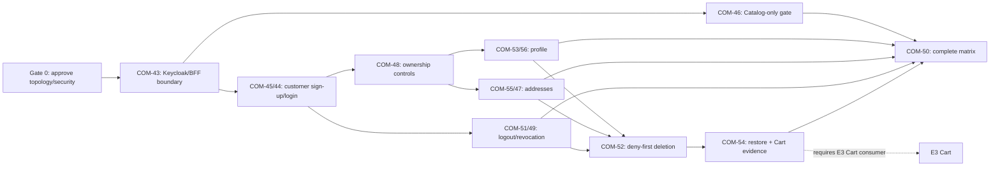

# Customer Identity and Access — Implementation Plan and Technical Specification

> **Status:** Accepted for incremental delivery; Gates 0 and 1 complete  
> **Scope:** [COM-2](https://shubhamjagtap.atlassian.net/browse/COM-2), COM-11–COM-17, COM-43–COM-56  
> **Controlling product source:** [`CF-PRD-001` v1.0](https://app.notion.com/p/3b6faa3e42dd818d8debd9dfffb883ab)  
> **Design inputs:** [`hld.md`](hld.md), [`lld.md`](lld.md), [`schema-design.md`](schema-design.md), [`IDA-DEC-001`](decisions/IDA-DEC-001-microservices-from-start.md), [`IDA-DEC-005`](decisions/IDA-DEC-005-embedded-spring-cloud-gateway.md)  
> **Last updated:** 2026-08-17

## 1. Outcome and implementation strategy

Deliver the COM-2 capability through two application services and Keycloak:

1. **Identity Access Service** — same-origin BFF with embedded Spring Cloud Gateway Server Web MVC, customer and catalog-maintainer login/logout, server-side sessions, customer subject binding, account/profile/address ownership, and deny-first customer deletion.
2. **Catalog Service** — real resource-server boundary and Catalog-owned maintainer grant; E1 adds catalog lifecycle behind this gate.
3. **Keycloak** — credentials, hosted bounded customer registration, hosted login for both actors, OIDC subjects/tokens/sessions, and coarse role claims.

Use a vertical, evidence-first sequence. Establish one executable boundary, pass its negative security gate, and only then add customer capabilities. Keep all changes independently reviewable and reversible until an account deletion is accepted. Embed Gateway MVC in the existing Identity Access artifact; do not add a separate gateway service, Redis, route database, broker, mesh, Kubernetes, cache, replica, search engine, or more service boundaries in COM-2.

The repository now contains the executable two-service foundation selected by Gate 1. Exact versions, commands, runtime boundaries, API-versioning policy, Swagger policy, and validation evidence are recorded in [`local-development-setup.md`](../../development/local-development-setup.md) and [`gate-1-bootstrap-evidence.md`](gate-1-bootstrap-evidence.md).

## 2. Responsibility specification

### 2.1 Login, logout, and registration ownership

| Capability | Customer | Catalog maintainer | Technical owner |
|---|---|---|---|
| Registration/provisioning | Bounded synthetic self-sign-up at a Keycloak-hosted form, initiated by Identity Access `/bff/register` | No self-registration; reviewed fixture/admin workflow creates Keycloak identity and separate Catalog grant | Keycloak owns identity creation; Identity Access binds customer account; Catalog owns maintainer grant |
| Login | Identity Access starts and completes Authorization Code + PKCE; Keycloak authenticates | Same Identity Access flow and endpoints; Keycloak authenticates | Identity Access `auth` + Keycloak |
| Browser session | Opaque BFF cookie; server-held tokens; customer `accountId` resolved after subject binding | Opaque BFF cookie; no customer `accountId`; coarse maintainer hint only | Identity Access `auth` |
| Logout | Local current session invalidated first; Keycloak revocation/RP logout follows | Same behavior; Catalog grant is not revoked by logout | Identity Access `auth` + Keycloak |
| Credential/password data | Email/password/password policy and identity-provider user lifecycle | Same | Keycloak only |
| Customer account/profile/address | Created/resolved by exact `(issuer, subject)`; owner-only | No account is created; no access | Identity Access `customeraccount` |
| Account deletion | Recent-auth customer only; local deny then reconciliation with Keycloak/future Cart | Not applicable in COM-2 | Identity Access `deletion` |
| Catalog permission | Customer always denied | Catalog validates real token and current local grant in write transaction | Catalog `catalogsecurity` |

### 2.2 Why Auth and Customer Account are modules, not separate services

Keep `auth` and `customeraccount` as separately tested modules inside Identity Access at bootstrap. This preserves clean responsibilities while keeping these approved invariants local:

- a BFF session resolves exact `(issuer, subject)` to active customer status on every owned-resource request;
- customer sign-up creates at most one local account after a valid callback;
- deletion increments the account epoch, revokes all local sessions, scrubs profile/address state, and records workflow intent in one database transaction;
- maintainers can hold a BFF session without acquiring a customer account or owner identity.

Splitting the modules into Auth Service and Customer Service now would add a network hop on private customer requests, contract/versioning work, a second database lookup, and distributed revoke/deletion coordination. Extract only after a reviewed driver such as a separate team/release cadence, a trust-zone requirement, or measured independent scaling. The module port becomes the future remote contract; extraction is still a migration, not a switch.

## 3. Target repository/product shape

The setup plan may adjust names before code exists, but it must preserve this logical shape:

```text
services/
  identity-access-service/     # independent build/container/runtime
    auth/                       # OIDC/BFF/session for both actors
    customeraccount/            # customer binding/profile/address
    deletion/                   # deny-first workflow/reconciler
    securityaudit/              # allowlisted pseudonymous audit
    edgegateway/                # embedded Gateway MVC Java routes/filters; no state
  catalog-service/              # independent build/container/runtime
    catalogsecurity/            # COM-2 gate
    catalog/                    # E1 owns catalog behavior
contracts/
  openapi/                      # versioned HTTP contracts
  events/                       # AccountDeletionAccepted.v1
deployment/local/               # exact form chosen in setup plan
test-support/
  acceptance/                   # synthetic principals/data/evidence metadata
docs/architecture/customer-identity-access/
```

Local development may use one physical PostgreSQL server but must create distinct `identity_access`, `catalog`, and `keycloak` databases and roles. No cross-service grants, SQL joins, shared migrations, or shared domain-model library are permitted.

## 4. Contract-first implementation specification

### 4.1 Browser and private service contracts

| Contract | Owner | Caller | Must be fixed before implementation | Compatibility rule |
|---|---|---|---|---|
| BFF login/register/callback/logout | Identity Access `auth` | Browser | Exact paths/redirects/cookie/CSRF/problem shapes; bounded registration flag | Additive fields only; exact redirect/config changes versioned and reviewed |
| `/api/v1/me/**` | Identity Access `customeraccount` | Customer browser | No owner ID; full profile/address candidates; ETag and idempotency rules | Additive optional response fields only; new PII requires approval |
| Explicit Catalog Gateway MVC route/resource server | Catalog | Identity Access BFF | E1 method/path, `MAINTAINER` access, target, size/rate/deadline, sanitation/relay, token validation, idempotency, `401`/`403`/`404`/`413`/`429`/`503`/`504` | Consumer-driven OpenAPI + route-manifest tests; no catch-all; server accepts current and one reviewed prior contract during rollout if needed |
| `AccountDeletionAccepted.v1` | Identity Access `deletion` | Future Cart | `eventId`, opaque `accountId`, `securityEpoch`, `acceptedAt`; no PII | Additive optional fields; major version for semantic/key/order change |

### 4.2 Stable semantic failures

| Condition | External outcome | Commit rule |
|---|---|---|
| Anonymous private request | Generic `401` | Zero state/fields |
| Authenticated wrong actor/action | `403` | Zero protected mutation/fields |
| Missing or cross-owner address | Identical generic `404` | Zero mutation/fields |
| Unmatched gateway method/path | Generic `404 RESOURCE_NOT_FOUND` | Never forwarded; no route inventory disclosure |
| Malformed syntax | `400` | No use-case transaction |
| Request/header limit | `413 REQUEST_TOO_LARGE` | Zero downstream call; rejected content not echoed/logged |
| Valid syntax but invalid candidate | `422` safe field codes | Candidate not persisted or logged |
| Stale version/key fingerprint conflict | `409` stable code | Existing committed state preserved |
| Rate limit | `429` + bounded `Retry-After` | Zero partial state; rejected request does not extend retention |
| Required dependency fails before acceptance | `503` | No false success/stale authority |
| Gateway downstream deadline expires | `504 GATEWAY_TIMEOUT` | No gateway retry; caller uses Catalog idempotency to resolve uncertainty |
| Deletion remote phase fails after acceptance | `202` remains truthful; workflow pending/attention | Local deny never reverses |
| Unexpected error | Generic `500` + correlation ID | No internal/PII detail in response |

### 4.3 Data and transaction requirements

- Apply additive, versioned migrations independently per service.
- Generate UUIDs in the application and store instants as `timestamptz` UTC values.
- Store opaque session and idempotency handles only as 32-byte keyed hashes.
- Encrypt recoverable OIDC token material with a versioned key identifier.
- Use explicit owner-scoped address queries: `account_id` and `address_id` together.
- Serialize default-address changes on the account row and enforce the result with a partial unique index.
- Use optimistic versions for profile/address edits and idempotency key/fingerprint records for unsafe retry.
- Treat Identity Access and Catalog transactions as local only; do not use two-phase commit.
- Use the deletion outbox and durable reconciler for cross-owner cleanup.
- Keep gateway routes and per-instance admission buckets out of PostgreSQL. `bff_session` remains the sole durable browser-session/token authority; do not add Spring Session, an OAuth authorized-client schema, Redis, or route persistence.

## 5. Delivery gates and work packages

### Gate 0 — Approve and synchronize the topology change

**Execution result (2026-08-17): COMPLETE.** `IDA-DEC-001`–`005` are accepted; Notion performance/acceptance/decision sources were amended without weakening the PRD behavior or evidence requirements. See [`gate-0-decision-and-source-sync.md`](gate-0-decision-and-source-sync.md).

**Output**

- Review `IDA-DEC-001`–`005` and approve/reject the proposed two-service topology plus embedded Gateway MVC routing decision.
- Record that the latest microservice decision supersedes only the one-app/modular-monolith topology, not the PRD's behavior, security controls, PostgreSQL-first choice, performance targets, evidence rules, or Week 1/P0 timebox.
- Revise Notion Decisions/Rationale, `CF-PERF-DEC-001`, and `CF-XCAP-SCN-022`–`028` before results use those IDs.
- Obtain security approval or replacement for maintainer-only token relay.

**Exit gate:** no reviewer believes the old one-process environment can be used unchanged to claim new two-service performance evidence.

**Rollback:** reject `IDA-DEC-001` and implement the same modules in one Spring deployment. No data/code exists yet.

### Gate 1 — Repository and local-runtime bootstrap (foundation for COM-43)

**Execution result (2026-08-17): COMPLETE.** The independent builds, local topology, contracts, CI, versioning, Swagger, isolation, fail-closed readiness, route invariants, secret checks, and reproducible evidence manifest are implemented and locally validated. See [`gate-1-bootstrap-evidence.md`](gate-1-bootstrap-evidence.md).

**Output**

- Independent Identity Access and Catalog builds, test suites, health/readiness endpoints, configuration schemas, and container artifacts.
- Select and lock a compatible Spring Boot/Spring Cloud release train; add `spring-cloud-starter-gateway-server-webmvc` to the existing Identity Access artifact and retain its servlet/JDBC execution model.
- Create the `edgegateway` infrastructure package, Java route registry skeleton, route-manifest/startup validator, and configuration assertions that retry/cache/circuit-breaker/discovery/database routes are disabled.
- Local Keycloak and PostgreSQL topology with separate databases/roles and versioned realm/client bootstrap.
- Versioned OpenAPI/event schemas and generated/validated contract artifacts.
- CI stages for unit, architecture, migration, integration, contract, security-negative, canary, and evidence checks.
- Configuration/build/environment digest and secret-safe local override pattern.

**Minimum checks**

- Clean checkout follows one documented start/test/stop path.
- Each service fails readiness when its owned authoritative database is unavailable.
- Catalog database credentials cannot read Identity Access; reverse access is also denied.
- Service source/package dependencies and migrations are independent.
- Identity Access starts with no invalid/duplicate/ambiguous/catch-all route, and enabling Gateway MVC creates no table, migration, route store, Redis dependency, Spring Session schema, or second token store.
- The route manifest and gateway/build/configuration digests are reproducible evidence.
- No real or fixture secret is committed or written to durable evidence.

**Stop conditions:** technology substitution, a third application service, shared application schema/user, inaccessible repository command, or inability to keep the local environment inside the reviewed total resource budget.

### Gate 2 — COM-43 / T26A: versioned Keycloak/BFF principal boundary

**Implementation**

- Configure the reviewed Keycloak version, realm, clients/audiences, exact redirects/post-logout URI, coarse actor role, password/abuse policy, and disabled grants/features.
- Implement `auth_transaction`, OIDC code + PKCE S256, state, nonce, strict callback validation, hashed opaque session cookie, protected token storage, idle/absolute/access bounds, CSRF/origin/CORS/fetch-metadata controls, and pseudonymous auth metrics.
- Configure one servlet `SecurityFilterChain` for both local controllers and future gateway routes; gateway filters consume its trusted `PrincipalContext` instead of caller identity headers.
- Pre-create bounded customer/non-maintainer/catalog-maintainer fixtures. Maintainer bootstrap is administrative; no public maintainer registration route.

**Checks/evidence**

- Real customer and maintainer login; no mock-auth path.
- Claim/algorithm/issuer/audience/authorized-party/time/state/nonce/code/redirect negative matrix.
- Disabled social IdP, direct/implicit/offline/dynamic/wildcard paths.
- Browser/network/storage and log/metric/trace token/secret canary scan.
- Migration and last-known-good realm/client rollback note.

**Exit gate:** COM-43 evidence is reviewable, fail-closed, versioned, and has zero bearer/password/session/CSRF canaries.

### Gate 3 — COM-46 / T26B: catalog-maintainer authorization gate

**Implementation**

- Implement explicit Java WebMvc.fn Gateway MVC routes for the reviewed COM-46 Catalog probe contract only. Each route declares unique ID, method, path, private target, `MAINTAINER` access, one-second deadline, and approved request-size/rate policy; do not add an unrestricted `/api/v1/catalog/**` catch-all.
- Implement startup validation, trusted-proxy/correlation/deadline/request-limit filters, access-class enforcement, per-instance admission, outbound header sanitation, custom maintainer-token relay, response sanitation, and gateway error mapping.
- Use the existing PostgreSQL `bff_session`/token application ports for relay and refresh; do not use Gateway's default in-memory authorized-client store.
- Implement Catalog resource-server validation and `catalog_maintainer_grant` migration/bootstrap.
- Check active grant/version in the same transaction as a minimal probe mutation; E1 later replaces the probe with real catalog commands.
- Add Catalog-owned idempotency for the probe/later unsafe command and bounded one-second BFF-to-Catalog timeout.

**Checks/evidence**

- Maintainer allow, anonymous `401`, customer/authenticated non-maintainer `403`.
- Duplicate/missing/overlapping/catch-all route definitions fail startup; unmatched method/path returns generic `404` without a downstream call.
- The production COM-2 manifest contains no `PUBLIC` product route. A test-only `PUBLIC` route proves session/CSRF bypass does not bypass sanitation, limits, correlation/deadline, admission, or downstream owner policy.
- Approved path/query/body/conditional/idempotency semantics survive routing; size and per-instance admission reject as `413`/`429` with zero downstream call.
- Browser Cookie/CSRF, caller `Authorization`, spoofable identity/role/owner, and untrusted forwarding headers never reach Catalog; only the approved server-held maintainer token is constructed outbound.
- Maintainer against every available customer path receives zero fields/change.
- Forged header/token/role/audience, config drift, concurrent grant revoke/write, dependency loss (`503`), deadline/lost response (`504`), and single-downstream-attempt matrix.
- State-before/after, route manifest, gateway/build/configuration digest, canary result, and human security verdict.

**Exit gate:** any unauthorized field/change, trusted-header bypass, stale-grant write, token canary, or unapproved relay blocks COM-46 and all E1 implementation.

### Gate 4 — COM-45/T7A and COM-44/T7B: customer sign-up/login/account binding

**Implementation**

- Enable bounded customer registration through Keycloak-hosted UI; require a short-lived, signed, single-use BFF intent at the Keycloak registration boundary so login links and direct authorization requests cannot bypass admission.
- After a valid callback, classify actor and invoke `EstablishCustomerAccount` only for a customer—not a maintainer.
- Create/load `customer_account` by exact `(issuer, subject)` and create one opaque session. Never join or transfer ownership by email.
- Preserve a stable post-auth transition port for E3's mandatory guest-cart handoff without implementing Cart in COM-2.

**Checks/evidence**

- New sign-up, existing login, duplicate callback, duplicate registration, dependency failure, deleted-email/new-subject, and account-once tests.
- Password cases 14/15/128/129 and approved blocklist/Argon2 configuration.
- Enumeration shapes plus 1,000 attempts/class and p95 delta ≤100 ms.
- Full browser/telemetry canary scan and exact configuration digest.

**Exit gate:** `(issuer, subject)` uniqueness holds and neither email reuse nor a maintainer session creates/acquires a customer account.

### Gate 5 — COM-48/T11A: reusable principal-derived ownership controls

**Implementation**

- Build `PrincipalContext`, active-account resolution, semantic problem mapping, owner-scoped repository interfaces, CSRF/origin/CORS/forwarded-header/rate policies, audit allowlists, and architecture tests.
- Require every new private endpoint to register actor, action, resource owner, success, denial, field-disclosure, state-change, and evidence rows before implementation.

**Checks/evidence**

- Anonymous, customer A/B, maintainer, disabled/deleting, missing resource, forged owner/header/CSRF/origin, safe/unsafe method, rate, cache/error, and deletion-race paths.

**Exit gate:** no controller or service can accept `accountId`, email, role, issuer, or subject as caller authority; repositories expose no unsafe global address lookup.

### Gate 6 — COM-53/T9A + COM-56/T9B: minimized customer profile

**Implementation**

- Implement optional display name and optional normalized unverified phone only.
- Validate Unicode/control/length rules and E.164 ≤15 digits; replace profile atomically using expected version and idempotency fingerprint.

**Checks/evidence**

- Multi-region phone, boundaries, invalid/partial candidate, owner/cross-owner, maintainer, dependency failure, concurrent writer, retry, deletion compatibility, and zero-canary matrix.

**Exit gate:** no email copy, verification/OTP/marketing semantics, extra profile field, or full phone in non-owner surfaces.

### Gate 7 — COM-55/T10A + COM-47/T10B: owner-scoped addresses/default

**Implementation**

- Implement full-value address CRUD with approved fields/bounds and structural country rules.
- Enforce owner-first queries, optimistic versioning, required idempotency for writes, account-row serialization for default change, and the partial unique index.

**Checks/evidence**

- India/US/UK/non-mandatory-postal cases; NFC, CRLF/NUL, min/max boundaries; owner A/B/missing/maintainer/guest; atomic invalid update; two simultaneous default changes; delete current default leaves none; dependency/lost-response/rollback/canary tests.

**Exit gate:** at most one default in every interleaving; no deliverability claim/vendor/history/duplicated phone/geolocation/instruction field.

### Gate 8 — COM-51/T8A + COM-49/T8B: logout, expiry, refresh, revocation

**Implementation**

- Implement current-session local-first logout for either actor, cookie clearing, refresh grant revocation, RP-Initiated Logout, and validated back-channel logout by `sid` or exact subject.
- Enforce access ≤5 minutes, idle 30 minutes, absolute 8 hours, refresh rotation/replay termination where supported, and all-session revoke for approved credential/disable/deletion events.

**Checks/evidence**

- Logout twice, old handle immediate rejection, one versus two sessions, customer and maintainer logout, dependency outage after local revoke, refresh replay, expiry boundary clocks, ≤60-second all-session event, residual-token limitation, and staggered/synchronized overlay.

**Exit gate:** rollback/config change cannot reactivate a revoked handle; ordinary logout does not delete customer state or revoke the maintainer Catalog grant.

### Gate 9 — COM-52/T12A: deny-first deletion producer and reconciler

**Implementation**

- Require customer auth age ≤5 minutes and valid CSRF/origin.
- In one Identity Access transaction: lock account, set `DELETING`, increment epoch, revoke exact-subject sessions, null profile/phone, delete addresses, and insert workflow/ledger/outbox/audit/idempotency state.
- Return `202` after commit and clear cookies. Reconcile Keycloak and future Cart through ordered idempotent phases, leases, bounded backoff/jitter, ATTENTION state, alert, and operator runbook.

**Checks/evidence**

- Failure immediately before/after every boundary, concurrent profile/address/session action, two sessions, repeat/lost response, Keycloak not-found/timeout, worker crash/restart, same-email new subject, lag/attention alert, and active-data canary scan.

**Exit gate:** a post-acceptance failure never restores access. Producer/Keycloak phases can pass, but story completion remains conditional on the Cart owner/consumer.

### Gate 10 — COM-54/T12B: retention and backup non-resurrection

**Implementation/evidence**

- Apply the deletion ledger before restored services become ready; reapply deny/scrub/outbox state idempotently.
- Prove log 30-day, audit 90-day, backup ≤30-day ceilings and the approved deletion-ledger duration.
- Restore a pre-deletion backup, apply the ledger, and demonstrate old subject and new same-email subject see no prior profile/address/cart state.
- Obtain the future Cart consumer's inbox acknowledgement and complete within the 24-hour boundary.

**Exit gate:** restore traffic cannot start before ledger application; any resurrection/canary or absent Cart acknowledgement blocks COM-54 and COM-16 Done.

### Gate 11 — COM-50/T11B and COM-2 final evidence/review

Run the complete actor × path × state × failure matrix across both services and the real IdP. Capture immutable/checksummed evidence with build/config/dataset/environment/time identity. Re-run revised performance/identity overlays without comparing a two-service result against the old one-app environment as if equivalent.

**Final hard stops:** any unauthorized allow, unauthorized field/state change, multiple address defaults, account duplication/ownership transfer, deletion resurrection, secret/PII canary, unclassified failure, missing rollback/restore evidence, or unsigned human security/privacy review.

## 6. Jira sequencing and dependency map



| Order | Jira output | Why this order | Parallelism allowed |
|---:|---|---|---|
| 1 | COM-43 | Shared real identity/session foundation | Setup subparts only after contract/config decisions |
| 2 | COM-46 | Strict serial security gate for E1 | Evidence harness can grow beside implementation |
| 3 | COM-45/44 | Customer-specific subject binding/enumeration | COM-46 evidence may run concurrently after stable auth boundary |
| 4 | COM-48 | Reusable owner/error controls before private data | Contract tests can be prepared earlier |
| 5 | COM-53/56 and COM-55/47 | Independent profile/address vertical slices on same owner policy | Yes, if migrations and review capacity do not conflict |
| 6 | COM-51/49 | Full session lifecycle after stable actors/account state | Can overlap profile/address with isolated ownership |
| 7 | COM-52 | Depends on session, profile, and address owners | Reconciler adapters/tests can be scaffolded earlier |
| 8 | COM-54 | Requires deletion producer, restore harness, E3 Cart consumer | Cart contract work may proceed in E3 |
| 9 | COM-50 + epic review | Matrix needs every implemented private surface | Harness expands continuously; final verdict is last |

## 7. Cross-cutting implementation rules

### Security and privacy

- Default deny; final authorization beside the owned write.
- Raw passwords only at Keycloak-hosted HTTPS pages.
- Customer bearer tokens stay inside Identity Access. Maintainer relay is conditional on `IDA-DEC-003` approval.
- Gateway routes use only `PUBLIC`, `CUSTOMER`, or `MAINTAINER` coarse access classes; owning services still decide current business authorization.
- Strip browser Cookie/CSRF, caller `Authorization`, identity/role/owner, and untrusted `Forwarded`/`X-Forwarded-*` headers before proxying; reconstruct only an allowlisted downstream request.
- No credential, token, cookie, CSRF value, issuer/subject, phone/address body, or raw idempotency key in logs, metrics, traces, evidence, URLs, or analytics.
- No free-text security audit payload. Use stable allowlisted reason/action/result codes and keyed pseudonyms.
- Trusted proxy data is overwritten at the trust boundary; direct/internal bypass paths are tested.

### Reliability

- One retry owner per operation; never nest client, framework, proxy, and worker retries.
- Gateway retry, response caching, circuit breakers, dynamic discovery, and database-backed routes are disabled initially. No automatic unsafe HTTP mutation retry; recover by the same business idempotency key.
- Identity Access-to-Catalog request budget is one second inside the three-second endpoint budget; exact budgets require setup/performance review.
- Gateway connect/unavailable failures map to `503` and exhausted downstream deadlines to `504`. An unsafe route makes at most one downstream attempt.
- Coarse rate limiting uses bounded in-process per-instance buckets and `429`/`Retry-After`. It is not a cluster-wide quota and does not replace Identity Access/Keycloak credential-abuse controls.
- Every downstream contract must approve numeric header/body and rate/burst limits before its route can be released.
- Local database failure makes the owning service unready and protected operations fail closed.
- Deletion retry is durable, bounded, jittered, observable, and never re-enables access.

### Observability/evidence

- Propagate W3C trace context and one correlation ID through BFF, Catalog, workers, and safe audit records.
- Report stable gateway route IDs/action enums, outcomes, size/rate rejections, filter/session/refresh/downstream latency, safe reasons, route/build/config digest, and aggregate resource signals—never raw paths/queries or high-cardinality identities.
- Evidence identifies build, configuration, dataset, topology/resource manifest, UTC timestamp, scenario/requirement IDs, checksums, pass/fail, defects, limitations, and reviewer.
- Zero-tolerance checks run before percentile/throughput summaries; security/correctness failure invalidates the performance claim.

### Migration and rollback

- Expand/verify/cut over/clean up; avoid destructive schema edits in the same release that removes reader compatibility.
- Realm/client configuration is versioned and rolled back with compatible application configuration.
- Gateway routes are compiled and rolled back with the Identity Access artifact; runtime route mutation is disabled. A rollback must preserve deny-by-default route policy and session invalidation semantics.
- Session migrations preserve expiry/revocation; a rollback must reject handles issued only under incompatible/newer semantics.
- Feature flags may disable new profile/address/deletion acceptance, but never bypass authentication/authorization or reverse an accepted deletion.
- A newer deletion workflow state/event must remain readable by the rollback version or the rollback is blocked.

## 8. Test and evidence matrix

| Test layer | Required coverage | Gate artifact |
|---|---|---|
| Unit | Value normalization, state machines, time boundaries, authorization decisions, error mapping, retry classification | Rule-ID-tagged report |
| Architecture | Domain/framework direction, module ports, no cross-service source/repository/entity import | Dependency report |
| Gateway startup/route policy | Unique/complete route specs, overlap/catch-all rejection, disabled dynamic features, local-controller separation | Route manifest + fail-closed startup report |
| Migration/DB integration | Up/down or safe rollback, constraints, owner queries, locks, versions, idempotency, leases, restore ledger | Migration/SQL state evidence |
| OIDC integration | Real Keycloak success and all protocol/config/claim negatives | `EVID-004` config digest/report |
| API/consumer contract | Browser problem shapes, ETag/idempotency, explicit Gateway-Catalog method/path/`404`/`413`/`429`/`503`/`504`, deletion event compatibility | Versioned contract/route report |
| Authorization/security | Complete actors/resources/actions/CSRF/origin/header sanitation/token relay/rate/cache/error/log matrix | `EVID-005`, `008`; zero leak/state/field result |
| Deterministic concurrency | Duplicate callback, profile versions, address default, grant revoke/write, deletion/write | Interleaving trace + pre/post state |
| Failure/recovery | Keycloak/DB/Catalog connect/timeout, one gateway attempt, lost response, worker crash, each deletion phase, restore | Recovery report and runbook link |
| Session theft boundary | Active copied opaque handle plus logout/expiry/epoch/back-channel/deletion invalidation | Residual bearer-risk and invalidation report |
| Privacy/canary | Phone/address/browser/cache/log/metric/trace/audit/evidence/deletion restore | Zero-canary signed result |
| Performance overlay | Gateway filters, real session lookup, refresh behavior, Catalog hop, per-instance admission, DB/client/thread pools and total/per-service resources | Revised `EVID-009`–`012` only |

## 9. Review, approval, and definition of done

### Required human reviews

| Review | Required before | Decision/evidence |
|---|---|---|
| Product/architecture topology | Bootstrap plan approval | `IDA-DEC-001`, performance/acceptance source sync |
| Security: BFF/OIDC/config/token relay | COM-43/46 Done | `IDA-DEC-003`, config digest, token/canary evidence |
| Architecture/security: embedded gateway | COM-46 Done | `IDA-DEC-005`, route manifest/startup/header/attempt evidence |
| Code/architecture | Each implementation task | Module/data ownership, failure semantics, migrations/rollback |
| Privacy | Profile/address/deletion Done | Field purpose/minimization/redaction/retention/restore evidence |
| Performance | Any latency/capacity conclusion | Revised multi-service manifest and scenario wording |
| Product/security E1 gate | Before catalog lifecycle implementation | COM-46 signed allow/deny/zero-mutation verdict |

### Epic definition of done

COM-2 is Done only when:

- every story/subtask has an independently reviewable implementation or evidence artifact mapped to its requirements/scenarios;
- both services and the real version-pinned Keycloak run through a documented reproducible repository path;
- success, invalid, duplicate, concurrent, timeout, partial-failure, uncertain, restart, recovery, and deletion/restore cases pass;
- unauthorized allows/fields/changes, multiple defaults, ownership transfer, resurrection, and secret/PII canaries are all zero;
- migrations, configuration, rollout, rollback, runbook, retention, and evidence metadata are present;
- COM-46's E1 gate and COM-54's security/privacy/restore reviews are signed; and
- the E3 Cart deletion consumer acknowledges the versioned deletion outcome.

## 10. Assumptions, risks, and stop conditions

| ID/item | Classification | Owner/approval | Implementation impact |
|---|---|---|---|
| `IDA-DEC-001` topology supersession | Proposed product/architecture decision | Product + architecture + performance | Blocks implementation-ready verdict/source claims, not design review |
| `IDA-DEC-005` embedded Gateway MVC | Proposed; owner-selected technical decision | Technical + security reviewer | Select compatible release train and pass route/filter security gate |
| Maintainer token relay | Security assumption | Security reviewer | Blocks COM-46 sign-off; use reviewed alternative if rejected |
| Ordinary idempotency retention = 24 h | Engineering assumption | Product/technical owner | Blocks API freeze, not bootstrap |
| Deletion ledger retention = 90 d | Engineering/privacy assumption | Security/privacy reviewer | Blocks COM-54 sign-off |
| Key management and migration tool | Setup decision | Technical owner | Blocks persisted real sessions/migrations, selected next |
| Cart deletion consumer | Cross-epic dependency | E3 owner | Blocks COM-16/COM-54 Done |
| Two-service performance environment | Source-sync gap | Performance reviewer | Blocks use of old scenario IDs for new claims |
| Per-instance gateway admission | Explicit limitation | Technical/security owner | No Redis now; cannot be represented as a global multi-replica quota |

Stop and review rather than infer behavior when implementation would:

- introduce public/real registration, verified contact, recovery, MFA/OTP, social login, mobile/third-party tokens, support/admin customer access, extra PII, new retention, or another role;
- add a new service, broker, cache, replica, service mesh, orchestrator, or shared database contract;
- substitute Keycloak or PostgreSQL, use per-request introspection, or expose customer tokens;
- accept a caller owner/role/header as authority, weaken generic denial, or make Catalog trust only the BFF;
- weaken session/deletion/retention/non-resurrection bounds;
- omit evidence because code or a happy-path test passes; or
- threaten the hard Week 2 P0 transition. If the learning topology causes that outcome, reopen `IDA-DEC-001` and choose the modular deployment option.

## 11. Learning notes and review questions

### What this plan teaches

- Identity-provider user, BFF session, customer account, and Catalog grant are four different authorities; one login does not collapse them into one database record.
- Good service boundaries keep cohesive invariants local and make remote failure explicit.
- An implementation plan is a sequence of falsifiable gates, not only a list of code components.
- Embedding Gateway MVC standardizes route/filter mechanics without moving session authority or domain authorization out of their owning modules/services.
- A valid copied opaque handle is still a bearer credential; cookie/XSS controls reduce theft, while authoritative lookup, expiry, epoch, logout, and revocation bound replay.
- Security and performance evidence describe a specific build/configuration/topology; changing topology invalidates environmental assumptions even when functional behavior stays the same.
- A later service extraction is easier with ports and private data, but still requires remote contracts, state migration, failure semantics, and operational evidence.

### Questions to test understanding

1. Why does a successful maintainer login not create a customer account or automatically grant Catalog writes?
2. Which exact transaction makes customer deletion safe while Keycloak or Cart is down?
3. What evidence would justify extracting `auth` from Identity Access into a separate service?
4. Why can Identity Access reject Catalog traffic early but not be Catalog's final authorization owner?
5. Why must two-service performance evidence use a revised environment manifest?
6. Why is Gateway Server Web MVC compatible with the JDBC-first design while WebFlux would require another persistence/scheduling decision?
7. Why is a future `PUBLIC` route still subject to sanitation, limits, deadlines, rate control, and Catalog-owned visibility rules?

### What would change the plan

- Rejection of the microservice supersession returns the same module design to one deployable and one approved performance environment.
- Security rejection of token relay changes the BFF-Catalog authentication adapter and may add token exchange/internal assertion work.
- A reviewed team/trust/scale driver may extract an Identity Access module through its existing port and a deliberate data migration.
- Measured independent edge scaling, trust-zone, team, or release-cadence pressure may extract the embedded gateway through its versioned route and principal contracts.
- An approved multi-replica global abuse/fairness SLO may justify a shared limiter or platform-edge control; per-instance buckets alone cannot claim it.
- Introduction of real users/legal data obligations triggers a new privacy, threat, retention, recovery, and abuse-control review.
- Measured platform work or resource use that jeopardizes P0 triggers the topology revisit rather than silent schedule expansion.

## 12. Readiness verdict

**Verdict: Conditionally ready.**

The service/module responsibilities, actor lifecycle, contracts, schema/transactions, delivery order, Jira mapping, test/evidence gates, rollback, and stop conditions are detailed enough to plan the local development setup. Implementation is not yet unconditionally ready: approve/synchronize the topology change, approve or replace maintainer-token relay, choose setup versions/key/migration tools, approve retention assumptions before their API/privacy gates, and link the E3 Cart deletion consumer before COM-52/54 can be fully Done.
