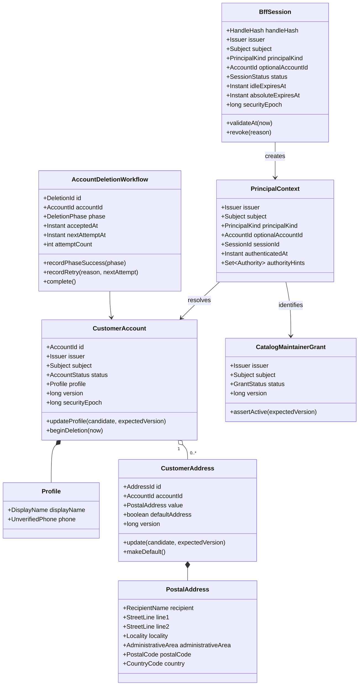
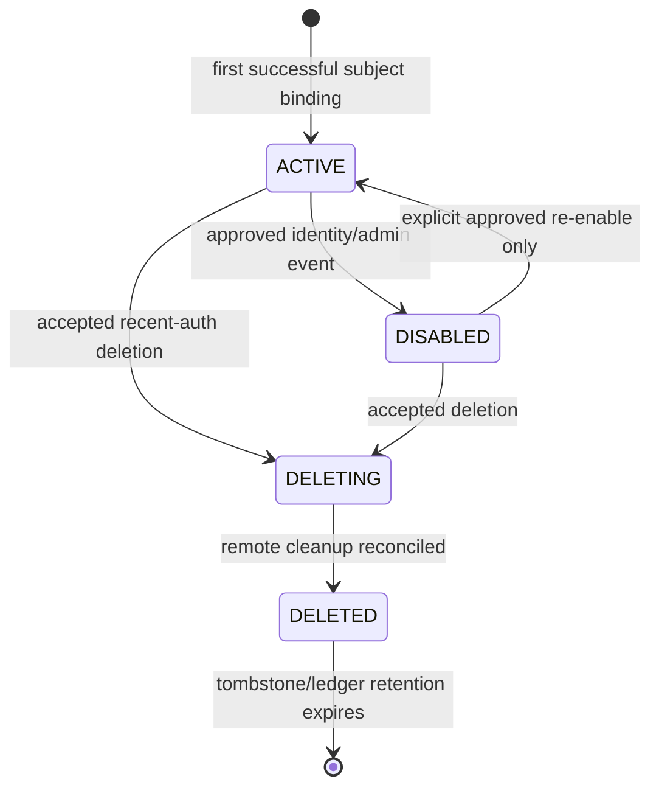
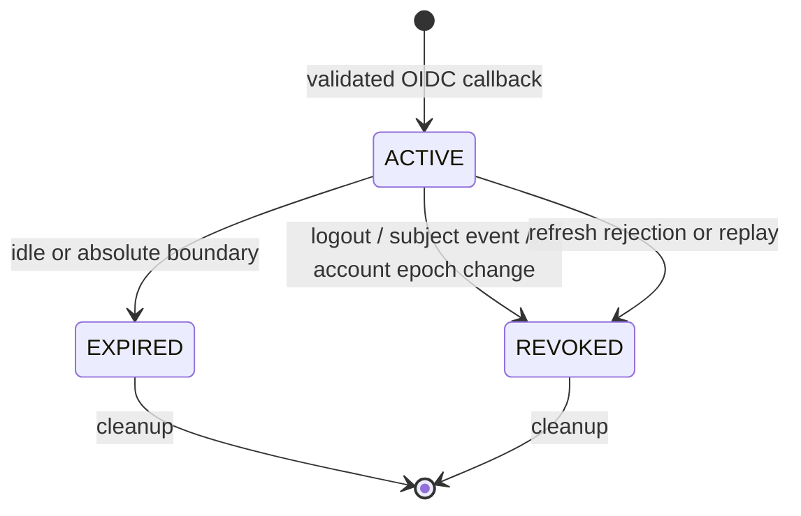
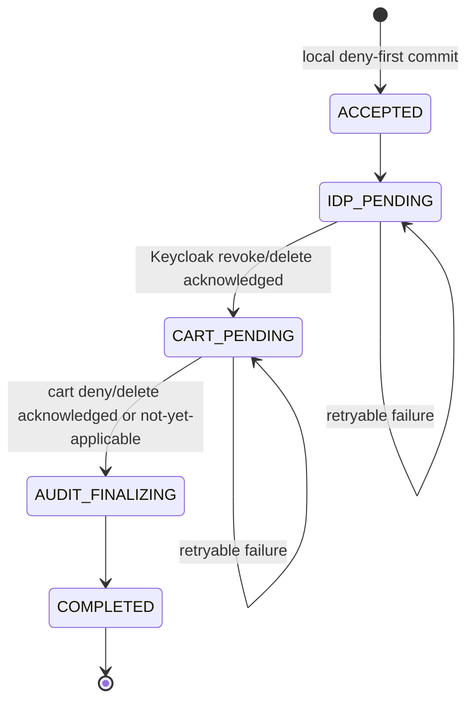

# Customer Identity and Access — Low-Level Design

> **Status:** Proposed; conditionally ready  
> **Owning services:** Identity Access Service, Catalog Service  
> **Controlling HLD/PRD:** [`hld.md`](hld.md), [`CF-PRD-001`](https://app.notion.com/p/3b6faa3e42dd818d8debd9dfffb883ab), [COM-2](https://shubhamjagtap.atlassian.net/browse/COM-2)  
> **Schema:** [`schema-design.md`](schema-design.md)  
> **Related routing decision:** [`IDA-DEC-005`](decisions/IDA-DEC-005-embedded-spring-cloud-gateway.md)  
> **Last updated:** 2026-08-17

## 1. Implementation decision summary

Use a ports-and-adapters structure inside each independently deployable Spring application. The Identity Access Service contains four cohesive business/security modules—`auth`, `customeraccount`, `deletion`, and `securityaudit`—plus an `edgegateway` infrastructure module. `edgegateway` embeds Spring Cloud Gateway Server Web MVC and declares explicit Java WebMvc.fn routes and filters; it owns no session, account, or business state. `auth` manages the real OIDC/BFF/session flow for both customers and catalog maintainers; `customeraccount` creates and manages only local customer accounts after a validated customer sign-up/login. The Catalog Service contains a `catalogsecurity` module now and the E1 catalog domain later. No service imports another service's Java classes or repositories.

One servlet `SecurityFilterChain` builds a `PrincipalContext` only from a validated BFF session for local and gateway routes. Gateway handler filters consume that trusted context, enforce only coarse route access, sanitize the outbound request, and relay only an approved server-held maintainer token. Customer use cases derive `AccountId` from the context and never accept an owner ID. Catalog writes validate the Keycloak token, then lock/version-check a catalog-owned maintainer grant in the same database transaction as the write. Profile writes use optimistic versions. Default-address transitions serialize on the account row and are protected by a partial unique index.

Account deletion is a state machine. Its first transaction changes the account to `DELETING`, increments the security epoch, revokes local sessions, scrubs local PII, deletes addresses, and appends deletion workflow/ledger/outbox/audit rows. Remote Keycloak and future cart cleanup are idempotent phases run after that irreversible deny boundary.

## 2. Requirements and invariants

| Requirement/invariant ID | Implementation mechanism | Enforcing type/module | Test/evidence |
|---|---|---|---|
| `CF-SEC-IDN-001`–`004` | Spring Security OIDC client, PKCE/state/nonce store, exact provider config, post-login claim policy | `auth` | Protocol conformance and negative tests |
| `CF-SEC-IDN-005`, `CF-IDN-004` | Unique `(issuer, subject)` account binding | `CustomerAccountRepository` + DB constraint | Duplicate/re-registration tests |
| `CF-SEC-SES-001`–`004` | Hashed opaque handle, encrypted token material, idle/absolute/access checks | `BffSessionService` | Time-controlled session tests |
| `CF-IDN-003`, `CF-SEC-SES-005`–`006` | Local-first revoke, RP logout, back-channel logout by `sid`/subject | `LogoutCurrentSession`, `BackChannelLogoutHandler` | Logout twice, two-session revocation |
| `CF-ACC-001` | Account-scoped profile aggregate, phone value object, version check | `UpdateProfile` | Owner/validation/concurrency tests |
| `CF-ADDR-001`, `CF-INV-004`, `011` | Queries require derived account ID plus address ID | `AddressRepository` | Complete ownership matrix |
| `CF-ADDR-002`, `CF-INV-005` | Account lock + clear/set + partial unique index | `MakeDefaultAddress` | Deterministic concurrent writers |
| `CF-AUTHZ-001`–`002` | Request principal maps to local owner/action policy; no owner transport field | `PrincipalContext`, `AuthorizationPolicy` | Actor/path/error matrix |
| COM-11 / S26 | Explicit Gateway MVC route, double enforcement at BFF and Catalog, catalog-owned grant | `GatewayRouteRegistry`, `MaintainerTokenRelayFilter`, `CatalogMaintainerPolicy` | COM-46 route/allow-deny/header/TOCTOU tests |
| `IDA-DEC-005` | Every downstream route has explicit method/path/access/target/deadline/size policy; no catch-all | `GatewayRouteSpec`, `GatewayRouteValidator` | Startup fail-closed and route-manifest tests |
| `CF-ACC-002`, `CF-SEC-SES-007`–`008` | Deny-first deletion transaction and durable reconciler | `AcceptAccountDeletion`, `DeletionReconciler` | Phase fault, restart, restore tests |
| `CF-SEC-PII-008`–`010`, NFR-011 | Allowlisted audit fields, redaction filter, canary scanner | `SecurityAuditPort`, logging config | Zero-canary evidence |

## 3. Module and package design

The implementation plan uses a monorepo, but each service has an independent build artifact and runtime.

```text
services/
  identity-access-service/
    src/main/java/com/commerce/access/
      auth/
        api/                 # login/callback/csrf/logout transport
        application/         # auth transaction and session use cases
        domain/              # session/auth transaction rules
        infrastructure/      # OIDC, crypto, JDBC, cookies, filters
      customeraccount/
        api/                 # /api/v1/me contracts
        application/         # profile/address commands and queries
        domain/              # account, profile, address, value objects
        infrastructure/      # JDBC repositories and row mappings
      deletion/
        api/                 # deletion status/event contract
        application/         # accept/reconcile/restore-gate use cases
        domain/              # workflow state machine
        infrastructure/      # Keycloak/cart clients, outbox worker
      securityaudit/
        application/         # allowlisted audit port
        infrastructure/      # audit persistence and redaction
      edgegateway/
        infrastructure/      # Gateway MVC Java routes, filters, limits, deadlines/errors
      sharedkernel/
        ClockProvider.java
        CorrelationId.java
        ProblemCode.java
  catalog-service/
    src/main/java/com/commerce/catalog/
      catalogsecurity/
        api/
        application/
        domain/
        infrastructure/
      catalog/               # implemented by E1, not COM-2
contracts/
  openapi/
  events/
test-support/
  acceptance/               # synthetic fixtures and evidence metadata only
```

| Package/type | Responsibility | May depend on | Must not depend on |
|---|---|---|---|
| `*.domain` | Entities, value objects, policies, state machines | JDK/domain types | Spring MVC, JDBC/JPA, Keycloak, another service |
| `*.application` | Use-case orchestration and transactions | Domain and port interfaces | Controllers, concrete clients, persistence entities |
| `*.api` | Stable HTTP/event DTOs and mapping | Application contracts | JDBC rows or repositories |
| `*.infrastructure` | Framework, SQL, OIDC, crypto, HTTP adapters | Application ports and API schemas | Another service's source packages |
| `sharedkernel` | Domain-neutral time/correlation/error primitives | JDK only | Business policy |

Architecture tests:

1. Domain packages depend only on domain/shared-kernel packages.
2. Application packages cannot depend on `api` controllers or concrete infrastructure.
3. Repositories and database records remain package-private to infrastructure.
4. Public API DTOs are not database records/entities.
5. Identity Access code cannot import `com.commerce.catalog.*`, and Catalog code cannot import `com.commerce.access.*`.
6. Contracts are consumed from generated OpenAPI/event schemas, not a shared business-model JAR.
7. `edgegateway` may depend on `auth` application ports and shared-kernel types, but `auth`/`customeraccount`/`deletion` domain or application packages cannot depend on Spring Cloud Gateway types.

### 3.1 Auth and customer-account boundary

`auth` and `customeraccount` are separate code modules but one deployment and database boundary at bootstrap.

| Concern | Owning module/system | Contract between modules | Important invariant |
|---|---|---|---|
| Hosted customer registration and all password processing | Keycloak | Standard OIDC result to `auth` | Raw password never enters application code |
| Customer registration orchestration | `auth` | `EstablishCustomerAccount(issuer, subject)` application port | One local account per exact subject; bounded synthetic registration only |
| Customer and maintainer login/callback/session | `auth` | `PrincipalContext`; customer account resolution only for customer actions | A maintainer BFF session has no `accountId` and cannot become an owner |
| Current-session logout for either actor | `auth` | Local session revoke, then Keycloak revoke/logout adapter | Local access ends before remote calls |
| Customer profile/address/account status | `customeraccount` | Owner-derived commands/queries | No caller-supplied owner ID; no password/email copy |
| Customer account deletion | `deletion` coordinating `auth` and `customeraccount` ports in one DB transaction | Revoke subject sessions, increment epoch, scrub customer data, append workflow | Deny-all state commits before response |
| Maintainer provisioning | Keycloak admin plus Catalog grant administration | No public application endpoint | Identity authentication and Catalog business authorization remain independent |
| Final catalog authorization | Catalog `catalogsecurity` | Validated server-side token plus Catalog-local grant | Identity Access can reject early but cannot grant a write |

A separate Auth Service and Customer Service would require a remote subject-to-account/active-state call on customer requests and a distributed session-revocation/customer-deletion workflow. Keep the seam as module ports now; extract it only on an approved trust-zone, team/release, or measured scaling trigger.

### 3.2 Embedded edge-gateway boundary

`edgegateway` is a framework adapter in the Identity Access deployable. It uses [`GatewayRouterFunctions`/WebMvc.fn `RouterFunction<ServerResponse>`](https://docs.spring.io/spring-cloud-gateway/reference/spring-cloud-gateway-server-webmvc/java-routes-api.html) and [`HandlerFilterFunction`](https://docs.spring.io/spring-cloud-gateway/reference/spring-cloud-gateway-server-webmvc/writing-custom-predicates-and-filters.html) extension points from Spring Cloud Gateway Server Web MVC. It does not expose its framework types to application or domain packages.

The route registry is compiled Java code rather than a database, discovery service, runtime actuator mutation, or external route file. Downstream base URIs and trusted-proxy settings are external configuration, but a deployment cannot introduce a new public route without a reviewed build.

```java
enum RouteAccessClass {
    PUBLIC,
    CUSTOMER,
    MAINTAINER
}

record GatewayRouteSpec(
    String routeId,
    Set<HttpMethod> methods,
    List<String> pathPatterns,
    URI targetBaseUri,
    RouteAccessClass accessClass,
    Duration downstreamDeadline,
    DataSize maxRequestSize
) {}

interface GatewayRouteRegistry {
    RouterFunction<ServerResponse> routes();
    List<GatewayRouteSpec> manifest();
}

interface MaintainerTokenPort {
    RelayToken resolveCurrentToken(PrincipalContext principal, Instant deadline);
}
```

The exact class names may follow bootstrap naming conventions, but the contracts are fixed:

- every route has one unique ID, at least one explicit method, explicit non-catch-all path predicates, a private target, access class, deadline, and size policy;
- startup fails for missing fields, duplicate IDs, invalid/non-private targets, ambiguous overlapping method/path predicates, or unrestricted `/api/v1/catalog/**` forwarding;
- `PUBLIC`, `CUSTOMER`, and `MAINTAINER` are the only initial access classes; they are edge classifications, not downstream business roles;
- no `PUBLIC` product route exists until E1 defines and approves its contract and visibility semantics;
- local `/bff/**` and `/api/v1/me/**` controllers are not proxied and remain protected by the same servlet `SecurityFilterChain`;
- the default Gateway [`TokenRelay`](https://docs.spring.io/spring-cloud-gateway/reference/spring-cloud-gateway-server-webmvc/filters/tokenrelay.html) store is not used because its default authorized-client service is in-memory. `MaintainerTokenPort` resolves/decrypts/refreshes through the existing persistent `bff_session` authority;
- response caching, circuit breakers, dynamic discovery, database-backed routes, and automatic unsafe retries are disabled initially.

Servlet/filter ordering is security-sensitive. Trusted-proxy normalization and request limits run before authentication; Spring Security resolves the session and CSRF/origin policy before the Gateway route handler; route-specific sanitation and relay run immediately before the downstream HTTP handler. Any servlet filter that consumes form parameters must respect Gateway MVC's form-filter ordering so the forwarded body is not corrupted.

## 4. Domain model

### 4.1 Class diagram



| Type | Kind | Responsibility/invariants | Lifecycle |
|---|---|---|---|
| `Issuer`, `Subject` | Value objects | Nonblank validated OIDC identifiers; used as a pair | Created from validated token only |
| `PrincipalContext` | Application value | Carries authenticated identity, session, auth time, non-authoritative role hints | Per request; never serialized to browser |
| `BffSession` | Aggregate | Active/revoked state, idle/absolute expiry, security epoch, protected token references | Created at callback; expires/revokes/purges |
| `CustomerAccount` | Aggregate root | Unique identity binding, active/deleting/deleted guard, profile atomicity, security epoch | Active → Deleting → Deleted; no reversal |
| `Profile` | Value object | Optional display name/phone; phone always unverified | Replaced atomically |
| `UnverifiedPhone` | Value object | libphonenumber parse, E.164 ≤15 digits, no auth/OTP semantics | Optional; removed on deletion |
| `CustomerAddress` | Entity | Belongs to exactly one account; versioned full-value update | Create/update/default/delete |
| `PostalAddress` | Value object | NFC/trim/control/length/country structural validation | Replaced atomically |
| `CatalogMaintainerGrant` | Catalog aggregate | Active grant required at final write; coarse token role is insufficient | Bootstrap/activate/revoke; versioned |
| `AccountDeletionWorkflow` | Process aggregate | Ordered idempotent remote phases; never restores local access | Accepted → reconciling → completed |

## 5. Contracts

### 5.1 Commands and queries

Illustrative Java signatures; exact package names may be adjusted during bootstrap without changing semantics.

```java
public record PrincipalContext(
    String issuer,
    String subject,
    PrincipalKind principalKind,
    Optional<UUID> accountId,
    UUID sessionId,
    Instant authenticatedAt,
    Set<String> authorityHints,
    long securityEpoch
) {}

public interface ProfileUseCases {
    ProfileView getProfile(PrincipalContext principal);
    ProfileView updateProfile(
        PrincipalContext principal,
        UpdateProfileCommand command,
        long expectedVersion,
        IdempotencyKey idempotencyKey
    );
}

public interface AddressUseCases {
    List<AddressView> list(PrincipalContext principal);
    AddressView get(PrincipalContext principal, UUID addressId);
    AddressView create(PrincipalContext principal, CreateAddressCommand command, IdempotencyKey key);
    AddressView replace(PrincipalContext principal, UUID addressId, ReplaceAddressCommand command,
                        long expectedVersion, IdempotencyKey key);
    AddressView makeDefault(PrincipalContext principal, UUID addressId, IdempotencyKey key);
    void delete(PrincipalContext principal, UUID addressId, IdempotencyKey key);
}

public interface SessionUseCases {
    CsrfTokenView issueCsrf(PrincipalContext principal);
    void logoutCurrent(SessionHandle handle);
    void handleBackChannelLogout(ValidatedLogoutToken token);
}

public interface AccountDeletionUseCases {
    DeletionAccepted accept(PrincipalContext principal, IdempotencyKey key);
    DeletionStatus status(PrincipalContext principal);
}
```

| Contract | Caller | Validation/authorization | Result/errors | Idempotency |
|---|---|---|---|---|
| `GetProfile` | Customer API | Active session → `(iss, sub)` → active account | Profile view; `401`; no cross-owner input | Read |
| `UpdateProfile` | Customer API | CSRF/origin, active derived account, full candidate validation, expected version | `200`; `409`; `422`; `429`; `503` | Key + fingerprint; result reference |
| `CreateAddress` | Customer API | Active derived account, structural validation | `201`; `422`; `429`; `503` | Required key prevents duplicate address |
| `ReplaceAddress` | Customer API | Resolve `(account_id, address_id)`, expected version | `200`; generic `404`; `409`; `422` | Key + fingerprint |
| `MakeDefaultAddress` | Customer API | Owner scope and account lock | `200`; generic `404`; `409` only for deadlock retry exhaustion | Naturally idempotent plus key |
| `DeleteAddress` | Customer API | Owner scope; no implicit replacement default | `204`; generic `404` | Replay uses stored semantic result |
| `LogoutCurrent` | Browser | CSRF/origin when handle valid; invalid handle remains generic | Always safe; clears cookie | Externally idempotent |
| `AcceptDeletion` | Customer API | Active account, authenticated ≤5 min, CSRF/origin | `202`; recent-auth `403`; workflow state | Unique workflow/account + key |
| `AuthorizeCatalogMutation` | Catalog application | Valid maintainer token, active catalog grant locked in write transaction | Allow; `401`; `403`; no mutation | Business command owns key |

### 5.2 API and gateway routes

The browser uses one public origin. Local `/bff/**` and `/api/v1/me/**` endpoints use ordinary Identity Access controllers. `/api/v1/catalog/**` is a namespace for explicit Gateway MVC routes to the private Catalog Service; it is not itself a wildcard forwarding rule. E1 supplies each concrete Catalog method/path contract.

| Method/path | Auth/owner scope | Request | Success | Error semantics |
|---|---|---|---|---|
| `GET /bff/login` | Anonymous | Optional allowlisted return target | `302` to Keycloak | Generic auth dependency failure |
| `GET /bff/register` | Anonymous synthetic demo | No arbitrary return URI | `302` to bounded registration flow | Enumeration-safe external result |
| `GET /login/oauth2/code/keycloak` | One-time state transaction | OIDC callback params | Opaque cookie + exact redirect | Fail-closed; no token/body echo |
| `GET /bff/csrf` | Active BFF session | None | `200 {token}`; `Cache-Control: no-store` | `401` |
| `POST /api/v1/session/logout` | Current session; CSRF/origin | Empty | `204`, cookie cleared | Invalid/old handle is same safe result |
| `GET /api/v1/me` | Active customer account | None | `200 ProfileView`, `ETag` | `401`; inactive generic `401` |
| `PUT /api/v1/me/profile` | Same derived owner | Full approved profile, `If-Match`, `Idempotency-Key` | `200`, new `ETag` | `409`, `422`, `429`, `503` |
| `GET /api/v1/me/addresses` | Same derived owner | None | `200 []` or list | `401`; no pagination needed for bounded Week 1 |
| `POST /api/v1/me/addresses` | Same derived owner | Full address, `Idempotency-Key` | `201`, `Location`, `ETag` | `422`, `429`, `503` |
| `GET /api/v1/me/addresses/{id}` | Resolve inside owner collection | UUID | `200`, `ETag` | Generic `404` for missing/cross-owner |
| `PUT /api/v1/me/addresses/{id}` | Resolve inside owner collection | Full address, `If-Match`, key | `200`, new `ETag` | `404`, `409`, `422` |
| `PUT /api/v1/me/addresses/{id}/default` | Resolve inside owner collection | Empty, key | `200`, new `ETag` | `404`, `429`, `503` |
| `DELETE /api/v1/me/addresses/{id}` | Resolve inside owner collection | Key | `204` | Generic `404`; no default reassignment |
| `DELETE /api/v1/me` | Active customer, auth age ≤5 min | Empty, key | `202 DeletionAccepted` | `403 RECENT_AUTH_REQUIRED`, `429`, pre-accept `503` |

No endpoint accepts `accountId`, `ownerId`, email, role, issuer, or subject as authority. An optional region field used to parse a phone is validation context only.

No public product-search/detail route is added by this LLD. When E1 approves one, its route may declare `PUBLIC` and skip session/CSRF requirements, but it must still apply trusted-proxy handling, header sanitation, correlation, deadline, request limits, per-instance admission, response sanitation, and Catalog-owned visibility policy.

### 5.3 Problem details

Use `application/problem+json` with `type`, `title`, `status`, stable `code`, and `correlationId`. Do not include stack traces, rejected PII values, resource existence, SQL, or dependency internals.

| Failure | HTTP | Stable code | Notes |
|---|---:|---|---|
| No/expired/revoked session | 401 | `AUTHENTICATION_REQUIRED` | Generic; `WWW-Authenticate` only where appropriate |
| Authenticated but action forbidden | 403 | `FORBIDDEN` | Used for maintainer/customer role separation |
| Deletion needs fresh auth | 403 | `RECENT_AUTH_REQUIRED` | Does not expose resource data |
| Missing or cross-owner address | 404 | `RESOURCE_NOT_FOUND` | Identical shape/timing target |
| Unmatched gateway method/path | 404 | `RESOURCE_NOT_FOUND` | Generic; never forwarded and no route inventory disclosure |
| Gateway request/header limit exceeded | 413 | `REQUEST_TOO_LARGE` | No downstream call; do not echo rejected body/header |
| Invalid candidate | 422 | `VALIDATION_FAILED` | Field names/codes allowed; never echo full PII |
| Stale version/idempotency fingerprint conflict | 409 | `VERSION_CONFLICT` / `IDEMPOTENCY_CONFLICT` | Distinct from dependency failure |
| Rate limited | 429 | `RATE_LIMITED` | `Retry-After`; zero partial mutation |
| Required dependency unavailable before acceptance | 503 | `DEPENDENCY_UNAVAILABLE` | No stale result presented as fresh |
| Gateway downstream deadline exhausted | 504 | `GATEWAY_TIMEOUT` | No gateway retry; Catalog idempotency resolves an uncertain mutation outcome |
| Unexpected failure | 500 | `INTERNAL_ERROR` | Correlation only |

### 5.4 Events

| Event/version | Producer/trigger | Key/order | Payload semantics | Delivery/deduplication | Consumers |
|---|---|---|---|---|---|
| `AccountDeletionAccepted.v1` | Identity Access after deny-first commit | `accountId`, ordered by `securityEpoch` | `eventId`, opaque `accountId`, `securityEpoch`, `acceptedAt`; no issuer/sub/PII | Outbox at-least-once; consumer inbox by `eventId`; higher epoch wins | Future Cart Service, other account-data owners |
| `AccountDeletionCompleted.v1` | Reconciler after all mandatory phases | `accountId` | Completion time and phase version only | Outbox at-least-once | Evidence/operations only initially |

No event is required for normal profile/address CRUD in COM-2. Adding events without a consumer would add operational work without a recovery need.

## 6. State machines

### 6.1 Account lifecycle



| Transition | Preconditions/guard | Atomic changes | Event/outcome | Invalid transition |
|---|---|---|---|---|
| New → Active | Valid OIDC identity and unique `(iss, sub)` | Create account with empty minimized profile | Account bound | Duplicate returns existing account |
| Active → Disabled | Valid approved identity/admin event | Increment epoch; revoke sessions | Access denied | Unknown subject is generic/idempotent |
| Active/Disabled → Deleting | Recent auth for customer request or approved admin path | Increment epoch, revoke sessions, scrub PII, delete addresses, workflow/ledger/outbox | `202` after commit | Already deleting/deleted replays state |
| Deleting → Deleted | Keycloak and mandatory data-owner phases acknowledged | Completion timestamps/status | Completion event | Failure stays Deleting and retries |
| Deleted → Active | Never | None | None | Re-registration must have a new subject/account |

### 6.2 BFF session lifecycle



### 6.3 Deletion workflow



For the current repository, `CART_PENDING` cannot be declared complete for full `CF-ACC-002` evidence until the E3 Cart Service owns and acknowledges the contract. A test stub may validate the producer contract but is not completion evidence.

## 7. Principal algorithms and flows

### 7.1 OIDC callback

```text
1. Hash the returned state and atomically claim one unexpired auth transaction.
2. Exchange the authorization code once using the protected PKCE verifier.
3. Validate approved algorithm, signature, issuer, audience, authorized party,
   expiry/not-before and the stored nonce.
4. Begin identity-access database transaction.
5. Insert or load the account by exact (issuer, subject); never join by email.
6. Reject local DELETING/DELETED/DISABLED customer state.
7. Generate a 32-byte opaque handle; store only HMAC(handle).
8. Encrypt token material with the active data-encryption key and key ID.
9. Insert session with idle/absolute expiry, auth_time and account security epoch.
10. Mark auth transaction consumed, commit, then set the __Host- cookie.
```

If token exchange succeeds but the local commit fails, the unused remote tokens expire/revoke normally; no retry attempts to reuse the code.

### 7.2 Resolve owner for every private customer use case

```text
1. Read cookie; compute handle HMAC; load active session.
2. Reject idle/absolute expiry and rotate no authority on failure.
3. Load account by session account ID and exact issuer/subject.
4. Require account ACTIVE and session.securityEpoch == account.securityEpoch.
5. Construct PrincipalContext with account ID internal to the application layer.
6. Query/mutate only through repository methods that require that account ID.
```

The transport DTO never contains the internal account ID. Repository APIs such as `findAddress(accountId, addressId)` make unsafe global lookups unavailable to the application layer.

### 7.3 Route a maintainer Catalog command

```text
1. Trusted-proxy/request-boundary filters reject invalid forwarding syntax, establish a
   server correlation ID, calculate the remaining request deadline, and enforce header/body limits.
2. SecurityFilterChain hashes the opaque cookie, loads bff_session, validates ACTIVE status,
   idle/absolute expiry, account state/epoch where applicable, and builds PrincipalContext.
3. For an unsafe cookie-authenticated request, validate the session-bound CSRF token,
   exact Origin or approved Referer, and Fetch Metadata.
4. GatewayRouteRegistry matches an explicit method/path RouteSpec and enforces MAINTAINER.
   No match returns generic 404; anonymous returns 401; wrong actor returns 403.
5. OutboundSanitizationFilter removes Cookie, CSRF, caller Authorization,
   caller identity/role/owner headers, and untrusted Forwarded/X-Forwarded-* values.
6. MaintainerTokenRelayFilter calls MaintainerTokenPort. Resolve/decrypt the current token;
   if refresh is required, use the existing bounded single-owner refresh/session rules.
   Customer sessions have no relay path.
7. Construct only the approved Authorization, content negotiation, conditional/idempotency,
   correlation/trace, and deadline headers; forward to the configured private Catalog target.
8. Never apply a gateway retry to an unsafe method. Catalog validates the JWT and checks its
   local grant inside the catalog mutation transaction.
9. Sanitize the response, normalize gateway-originated failures, and record low-cardinality
   route/outcome/latency/size/rate signals.
```

The built-in Gateway `TokenRelay` default in-memory authorized-client store is not a session authority in this design. All relay state comes from the custom PostgreSQL session/token ports, so restart, revocation, encryption, idle/absolute expiry, and security-epoch behavior remain unchanged.

### 7.4 Make an address default

```text
1. Authenticate, validate CSRF/origin, claim idempotency key.
2. Begin transaction; lock the derived CustomerAccount row FOR UPDATE.
3. Re-check ACTIVE status and security epoch after the lock.
4. Resolve target with WHERE account_id = :accountId AND address_id = :addressId.
5. UPDATE customer_address SET is_default = false
     WHERE account_id = :accountId AND is_default = true AND id <> :target.
6. UPDATE target SET is_default = true, version = version + 1.
7. Complete idempotency result and append pseudonymous audit metadata.
8. Commit; reconstruct and return the authoritative owner-scoped target.
```

The account lock provides a deterministic lock order. The partial unique index remains the final invariant guard if a code path is defective.

### 7.5 Accept account deletion

```text
1. Authenticate and require authenticatedAt >= now - 5 minutes.
2. Validate CSRF/origin and claim the account-scoped idempotency key.
3. Begin transaction; lock account FOR UPDATE.
4. If DELETING/DELETED, return the existing deletion operation.
5. Require ACTIVE; set DELETING; increment securityEpoch.
6. Revoke every BFF session for exact issuer/subject.
7. Null display name/phone; delete all addresses.
8. Insert deletion workflow, 90-day pseudonymous ledger, audit and outbox rows.
9. Complete idempotency result and commit.
10. Clear browser cookies and return 202. Remote failure after this point cannot restore access.
```

### 7.6 Reconcile deletion

```text
1. Claim one due workflow row using FOR UPDATE SKIP LOCKED and a bounded lease.
2. Execute only the current phase with an idempotent remote operation.
3. On success, persist the next phase and clear retry state.
4. On a classified transient failure, increment attempt count and set jittered next_attempt_at.
5. On a permanent/configuration failure, keep access denied, record a safe reason code,
   stop automated retries at the configured bound, and alert an operator.
6. When all mandatory phases acknowledge, mark account DELETED and workflow COMPLETED.
```

## 8. Transactions, idempotency, and concurrency

| Use case | Transaction boundary | Isolation/locks/version | Idempotency/replay | Conflict/deadlock behavior |
|---|---|---|---|---|
| OIDC callback | Consume transaction + account/session commit | Read committed; unique state and `(iss, sub)` | One-time state; duplicate callback rejected | Unique conflict reloads same account; no code reuse |
| Profile update | Account/profile row | Optimistic `version`; account active checked in update predicate | Key/fingerprint; store account/version reference | Stale version `409`; caller reloads |
| Address create | Idempotency + address insert | Read committed; active account predicate | Required key; store new address ID | Key collision same fingerprint replays; different `409` |
| Address replace/delete | Owner-scoped row | Optimistic address version; account active check | Key/fingerprint | Stale version `409`; missing/cross-owner `404` |
| Make default | Account and target addresses | Account `FOR UPDATE`; fixed lock order; partial unique index | Same target naturally idempotent plus key | Deadlock is defect; at most one service-layer retry |
| Logout | Session row + revoke task | Atomic status transition | Already inactive returns same external result | Remote revoke never reactivates local state |
| Back-channel subject logout | Matching session set | Update by exact issuer + `sid` or subject | Logout token event identifier/claims | Replay changes zero additional state |
| Accept deletion | Account, sessions, PII, workflow, ledger, outbox | Account `FOR UPDATE`; epoch guard | One workflow/account; key/fingerprint | In-flight writes before lock commit or fail on epoch/status |
| Reconcile phase | Workflow row | `SKIP LOCKED`, version/lease | Remote operation key = deletion ID + phase | Retry only transient; no nested retry |
| Catalog mutation | Catalog grant + catalog aggregate | Grant row locked/read in same transaction as mutation | Catalog command key owned by E1 | Revoked/stale grant `403`; zero write |

Idempotency record policy:

- Scope: exact account + operation family + client key.
- Key source: required `Idempotency-Key`, 16–128 printable characters; database stores an HMAC, not the raw key.
- Fingerprint: canonical method/path/API-version/body hash. Full PII bodies are not stored.
- Collision: same key/different fingerprint returns `409 IDEMPOTENCY_CONFLICT`.
- In progress: concurrent duplicate receives `409 OPERATION_IN_PROGRESS` plus bounded `Retry-After`.
- Completed: response is reconstructed from an owner-scoped aggregate ID/version or a non-PII semantic outcome.
- Expiry: proposed 24 hours for ordinary profile/address mutations; deletion workflow/ledger has its approved lifecycle. This is an engineering assumption to confirm in setup review.

## 9. Validation, authorization, and errors

| Rule/failure | Enforcement layer | External semantic outcome | Logging/metric |
|---|---|---|---|
| Malformed JSON/UUID/header | Transport | `400` | Code and route template only |
| Invalid phone/address/length/control | Domain/application before persistence | `422` with safe field code | Validation code, no rejected value |
| No/expired session | BFF filter | Generic `401` | Session outcome with pseudonym |
| Wrong gateway access class | Security/Gateway route policy | `403`; no downstream call | Low-cardinality route/action/reason |
| Wrong actor/business grant | Owning service policy | `403` | Low-cardinality action/reason |
| Unmatched gateway route | Gateway route registry | Generic `404`; no downstream call | Route-miss counter, no raw path label |
| Gateway request/header limit | Servlet/Gateway boundary filter | `413`; no downstream call | Route ID and limit class only |
| Gateway per-instance admission | Bounded local token bucket | `429` + `Retry-After`; no downstream call | Route/access bucket class; not global quota |
| Missing/cross-owner address | Owner-scoped repository | Identical generic `404` | One `not_found_or_not_owned` reason |
| Account disabled/deleting/deleted | Owner resolver | Generic `401` for protected resources | Account-state reason, pseudonymous |
| Stale optimistic version | Application | `409` | Aggregate type, no ID label |
| Same idempotency key/different request | Application | `409` | Fingerprint mismatch boolean only |
| Dependency failure before commit | Adapter/application | `503` | Dependency class and safe reason |
| Gateway downstream timeout | Gateway deadline filter | `504`; no gateway retry | Route ID/outcome; caller resolves uncertainty with Catalog key |
| Lost response after commit | Idempotency replay | Same semantic outcome | Replay counter |
| Unexpected exception | Boundary handler | `500` | Correlation; redacted stack internally |

Validation ownership:

- Transport validates syntax and required headers.
- Domain value objects validate normalization, bounds, country configuration, and state transitions.
- Application services validate authentication age, action permission, account state, version, and idempotency.
- Database constraints enforce unique identity/default address and legal stored shapes.
- Only the owning service decides authorization. The BFF may reject early but cannot grant Catalog access.

## 10. Dependency and failure policy

| Dependency | Timeout budget | Retry/circuit rule | Degraded outcome | Recovery/reconciliation |
|---|---|---|---|---|
| Identity-access PostgreSQL | Within 3 s request budget | No automatic transaction retry except one classified serialization/deadlock retry in owner | Fail closed `503`; readiness false | DB/operator recovery |
| Keycloak auth/token | 2 s per server-side call | No blind code/refresh retry | Login `503`; refresh ends session | Fresh login |
| Keycloak revoke/delete | 2 s per worker attempt | Worker backoff+jitter, bounded; no request retry stack | Local deny remains; deletion pending | Durable workflow + alert |
| Catalog Service | 1 s inside BFF budget | No automatic unsafe retry | `503` on connect/unavailable; `504` on exhausted deadline; no stale catalog mutation result | Same business idempotency key by caller |
| Catalog PostgreSQL | Catalog-owned budget | Catalog policy | Catalog `503`; zero mutation | Catalog recovery |
| Future Cart deletion consumer | Worker budget | Idempotent event/command retry | Account remains denied; workflow pending | Inbox/outbox reconciliation |

Circuit breakers are not added initially. They are justified only when repeated remote calls cause cascading pressure and there is a meaningful safe degraded behavior. Timeouts, bulkheads through bounded pools, and durable deletion retry are sufficient for this slice.

Gateway-specific failure rules:

- an invalid route manifest fails startup/readiness rather than serving a partial route set;
- a connect/no-target failure maps to `503 DEPENDENCY_UNAVAILABLE`;
- an exhausted remaining deadline maps to `504 GATEWAY_TIMEOUT`;
- an unsafe Catalog command is attempted at most once by the gateway, even when the outcome is uncertain;
- response caching and stale authorization fallback are disabled;
- the per-instance limiter sheds coarse bursts only and does not replace Keycloak/Identity Access credential-abuse controls or claim a multi-replica quota.

## 11. Persistence mapping

| Domain concept | Tables | Repository contract |
|---|---|---|
| OIDC auth transaction | `auth_transaction` | Atomically create/consume by state hash |
| BFF session | `bff_session`, `bff_session_authority` | Find active by handle hash; revoke by handle/issuer-subject/oidc sid |
| Customer account/profile | `customer_account` | Insert/load by issuer-subject; lock by ID; conditional profile update |
| Address | `customer_address` | Every method requires account ID; no global API |
| Mutation idempotency | `idempotency_record` | Claim/finalize/replay/expire |
| Deletion | `account_deletion_workflow`, `deletion_ledger`, `outbox_event` | Accept once; claim phase; complete; restore lookup |
| Audit | `security_audit_event` | Append allowlisted fields; retention cleanup |
| Catalog maintainer | `catalog_maintainer_grant` in Catalog DB | Lock/validate by issuer-subject inside catalog transaction |

JDBC-oriented mappings are selected initially because transaction/locking/query shapes are security-relevant and the model is small. Spring Cloud Gateway Server Web MVC uses the servlet stack and therefore does not require R2DBC or a bounded blocking bridge. If JPA is later proposed, repositories must still expose explicit owner-scoped SQL/locking semantics and avoid lazy entity graphs or persistence-entity leakage.

Gateway routes, route manifests, per-instance token buckets, and downstream HTTP-client state are not persisted. The gateway introduces no table, migration, Spring Session schema, OAuth authorized-client schema, Redis keyspace, or second session authority. `bff_session` and `bff_session_authority` remain the sole durable browser-session/token authority.

## 12. Configuration and feature rollout

| Setting/flag | Default | Validation | Runtime/restart | Rollout/rollback use |
|---|---|---|---|---|
| `oidc.issuer` / client ID / exact redirects | No unsafe default | Startup discovery and digest assertion | Restart | Realm/client rollback pair |
| Access/idle/absolute TTL | 5m/30m/8h | Config + boundary tests | Restart | Never lengthen silently |
| Cookie name | `__Host-commerce-session` proposal | Prefix/path/secure assertions | Restart | Old cookie rejected after incompatible rollback |
| Encryption/HMAC key IDs | Required secret refs | Startup key-ring validation | Reload if supported | Read old/write new during rotation |
| `customer.profile.enabled` | Off until COM-53 gate | Route/config test | Runtime flag | Disable route, retain compatible data |
| `customer.address.enabled` | Off until COM-55 gate | Route/config test | Runtime flag | Disable route, retain compatible data |
| `account.deletion.enabled` | Off until COM-52 review | Workflow dependency check | Runtime flag | Stop new accepts; never reverse existing deletion |
| Deletion retry schedule | Bounded proposal | Unit clock tests | Runtime | Tune without restoring access |
| Spring Boot/Cloud release train | No unsafe default | Official compatibility matrix + clean build | Restart/build | Upgrade as one reviewed compatible unit |
| Gateway Catalog target | Required private URI | Startup private-target validation + config digest | Restart | Roll back route/client/server compatible pair |
| Gateway route manifest | Compiled Java declarations | Unique ID, explicit method/path/access/deadline/size; no overlap/catch-all | Build/restart | Roll back the reviewed artifact; no runtime mutation |
| Gateway request/rate limits | No unapproved route default | Each released downstream contract approves numeric values | Restart | Tune from evidence; per-instance scope remains explicit |
| Gateway retry/cache/discovery/circuit breaker | Disabled | Configuration assertion | Restart | Enable only through a new reviewed decision/evidence trigger |

Feature flags control exposure, not security. Disabled routes still require the same fail-closed default security chain.

## 13. Observability

| Signal | Name/fields | Purpose | Alert/runbook | Sensitive-data rule |
|---|---|---|---|---|
| Counter | `auth_attempt_total{outcome,reason}` | Protocol/login outcomes | Config drift/enumeration review | No identity label |
| Gauge | `bff_sessions{status}` | Session lifecycle | Unexpected growth/cleanup | Aggregate only |
| Histogram | `auth_refresh_duration_seconds{outcome}` | Identity overlay | Keycloak/refresh degradation | No token/session |
| Histogram | `gateway_request_duration_seconds{route,outcome}` | Edge/filter and downstream latency | Route/dependency runbook | Stable route ID only; no raw path/query |
| Counter | `gateway_rejection_total{route,class}` | `404`/`413`/`429`/policy rejection | Route/limit review | Stable route ID and safe class only |
| Counter | `authorization_decision_total{service,action,outcome,reason}` | Complete denial matrix | Unauthorized allow hard stop | Route/action enum only |
| Histogram | `customer_operation_duration_seconds{operation,outcome}` | Profile/address latency | Error/latency runbook | No owner/resource ID |
| Gauge | `deletion_workflow_oldest_seconds{phase}` | 24-hour reconciliation | Page before boundary | No account ID |
| Counter | `deletion_retry_total{phase,reason}` | Failure attribution | Operator action | Safe reason code |
| Gauge | `outbox_unpublished` | Worker health | Backlog runbook | Aggregate only |
| Counter | `sensitive_canary_occurrence_total{surface,class}` | Release hard stop | Immediate evidence preservation | Fingerprint/class only |

All synchronous and asynchronous logs include correlation/trace ID and build/config digest. Workflow-specific identifiers may be HMAC-pseudonymized in logs but never metric labels.

## 14. Test and evidence plan

| Level | Scenarios | Fixtures/dependencies | Required evidence |
|---|---|---|---|
| Unit | Value objects, lifecycle/state machines, session time, error mapping, retry classification | Fixed/injected clock; no Spring context | Rule ID in test metadata |
| Architecture | Dependency direction, no cross-service imports, no entity/API leakage | Compiled service code | Architecture report |
| Gateway startup/architecture | Duplicate/missing/overlapping/catch-all routes; local controllers not proxied; disabled dynamic features | Full Identity Access context | Fail-closed startup report + route manifest/config digest |
| Database integration | Constraints, owner queries, locks, optimistic versions, migrations | Real PostgreSQL/Testcontainers | SQL state before/after and migration result |
| OIDC integration | Login/register/callback/logout/back-channel, claim tampering, drift | Real version-pinned Keycloak | `EVID-004` manifest/digest |
| API contract | OpenAPI request/problem shapes, ETag/idempotency | Full Identity Access app | Versioned contract report |
| Service integration | BFF → Catalog token relay and double authorization | Both services + Keycloak + DBs | COM-46 allow/deny/zero-mutation |
| Gateway contract | Explicit method/path forwarding, query/body/conditional/idempotency preservation, unknown route, `413`/`429`/`503`/`504`; production manifest has no `PUBLIC` route; test-only `PUBLIC` route skips session/CSRF but not sanitation/limits/owner policy | Identity Access + controllable downstream | Exact status/problem shape, downstream-attempt count, and access-class behavior |
| Concurrency | Default address, profile version, deletion race, grant revoke/write | Barriers/latches + real DB | Deterministic interleaving proof |
| Failure injection | Keycloak/DB/Catalog timeouts, lost response, worker restart | Controllable proxies/adapters | Recovery/uncertain outcome report |
| Security negative | CSRF/origin/CORS/forwarding/role/owner/canary plus cookie/CSRF/Authorization/identity-header non-forwarding | Synthetic actors A/B/maintainer | `EVID-005`, `008` |
| Session theft boundary | Replay current copied handle; then logout, idle/absolute expiry, epoch change, back-channel revoke, deletion | Two clients + injected clock/real session DB | Residual active-bearer risk documented; copied handle rejected after every invalidation boundary |
| Privacy lifecycle | Address/phone countries/bounds, deletion/restore | Time-controlled backup environment | `EVID-006`, `008` |
| Performance overlay | Gateway filters, real session lookup, optional refresh, Catalog hop, per-instance admission | Revised D0/D2 topology manifest | Updated `EVID-009`–`012`; 3 s end-to-end/1 s Catalog budgets; no old one-app claim |

Every evidence artifact identifies build, configuration digest, dataset, environment, UTC time, scenario IDs, checksums, outcome, defect/limitation, and human reviewer. Raw runtime secrets and full synthetic PII are never durable evidence.

## 15. Implementation sequence

| Step | Change | Dependency | Validation gate | Reversible? |
|---:|---|---|---|---|
| 0 | Approve/sync microservice supersession and acceptance impact | User decision | `IDA-DEC-001` reviewed | Yes before code |
| 1 | Bootstrap monorepo, two services, compatible Spring Boot/Cloud release train, embedded Gateway MVC dependency, contracts, local PostgreSQL/Keycloak, CI skeleton | None | Clean builds, gateway-disabled/enabled context, and health tests | Yes |
| 2 | COM-43: realm/client/session/crypto/auth-transaction foundation | Step 1 | OIDC, cookie, config-drift, browser token scan | Mostly; DB migrations additive |
| 3 | COM-46: explicit Gateway MVC route registry/filters plus Catalog security shell and maintainer gate | COM-43 | Route startup/header/role/customer-data/TOCTOU/zero-retry/zero-mutation matrix | Yes before E1 data |
| 4 | COM-45/44: customer subject binding and protocol/enumeration evidence | COM-43 | `SCN-007`, `008`, `014`, `026` | Additive |
| 5 | COM-48: reusable principal/ownership/error policies | COM-43/45 | CSRF/origin/semantic-denial integration | Additive |
| 6 | COM-53/56: minimized profile/phone | COM-45/48 | Owner, validation, concurrency, canary | Additive |
| 7 | COM-55/47: address CRUD/default | COM-45/48 | Owner/default/country/concurrency/migration | Additive |
| 8 | COM-51/49: refresh/logout/back-channel and timing overlay | COM-43/45 | Time, replay, two-session, dependency tests | Additive; session compatibility needed |
| 9 | COM-52: deny-first deletion producer/reconciler | Steps 5–8 | Immediate local deny and phase fault tests | One-way after deletion accepted |
| 10 | COM-54: restore/non-resurrection and future cart consumer evidence | E3 cart dependency | `SCN-029`, retention/canary/human sign-off | Test environment reversible |
| 11 | Final COM-2 matrix and documentation sync | All | Zero hard failures; human review | Documentation only |

## 16. Decisions, alternatives, and risks

| Topic | Selected design | Alternatives | Accepted trade-off/risk | Mitigation | Revisit trigger |
|---|---|---|---|---|---|
| Internal structure | Ports/adapters per service | Layered CRUD/JPA entities | More types/boilerplate | Apply only at business/security boundaries | Cognitive cost exceeds benefits |
| Persistence | Explicit owner-scoped JDBC-style repositories | Generic CRUD/JPA repository | More SQL | SQL is reviewable and constraint-aligned | Model grows enough to justify ORM |
| Session store | Custom explicit PostgreSQL schema | In-memory; default serialized Spring Session; Redis | More implementation | Security tests and transparent lifecycle | Spring library meets encrypted/hash requirements cleanly |
| Public-edge routing | Embedded Spring Cloud Gateway Server Web MVC with Java route DSL | Custom proxy; Gateway WebFlux; separate gateway deployable | Framework/filter-order risk and shared Identity Access blast radius | Typed route specs, startup/header tests, owner-service authorization | Independent scale/team/release/trust-zone evidence |
| Principal propagation | Maintainer token relay only | Trusted headers/custom JWS/introspection | Private-hop bearer exposure | TLS, audience, redaction, Catalog validation/local grant | Security review or client topology changes |
| Gateway rate limiting | Bounded per-instance coarse admission | Redis/shared limiter; defer all admission | Not a global multi-replica quota | Explicit scope, `Retry-After`, strict login controls remain in Identity Access/Keycloak | Approved global abuse/fairness SLO across replicas |
| Default address | Pessimistic account lock + unique index | Optimistic-only | Serializes same-account defaults | Very short transaction | Measured hot-account contention |
| Deletion | Local deny + saga/reconciler | 2PC/synchronous cascade | Eventual physical cleanup | 24-hour alert, idempotent phases, restore gate | Approved immediate erasure requirement |
| Broker | None initially; DB outbox + direct worker | Kafka/RabbitMQ | Less broker experience in this slice | P0 later supplies genuine event needs | Multiple consumers/backlog require it |

## 17. Teaching notes

### What you should learn from this design

- Put the final authorization check beside the protected invariant. Edge authorization is a fast rejection, not the sole grant.
- Use a gateway for standardized route/filter mechanics, not as a replacement for the BFF session authority or downstream business policy.
- A valid opaque handle is still a replayable bearer credential; hashing protects stored verifiers, while expiry and revocation bound a stolen raw handle.
- Model owner scope in repository method signatures so an unsafe global lookup is difficult to call accidentally.
- Use a database constraint even when application locking is correct; it catches alternate or future defective paths.
- Separate an accepted business outcome from remote cleanup. Deletion succeeds at the deny boundary, while reconciliation has its own durable lifecycle.
- Microservice contracts include timeouts, retry ownership, authentication, versioning, and failure semantics—not just JSON fields.

### Questions to test your understanding

1. Why is the catalog-maintainer role claim not enough for a catalog write?
2. Why is the account row locked before changing the default address?
3. What is stored for idempotency when a response contains address PII?
4. Which deletion failures can safely return after the local commit, and why?
5. How does a deleted account invalidate a session that was created earlier?
6. Why does Server Web MVC fit the selected JDBC repositories without a reactive bridge?
7. Why is Gateway's default in-memory token relay store not used?
8. Which controls still apply to a future `PUBLIC` product route?

### What would change this implementation design

- A security review that prohibits server-side maintainer token relay.
- Measured independent gateway scaling, trust-zone, team, or release-cadence evidence that justifies extracting it as another deployable.
- An approved multi-replica global rate requirement that justifies a shared limiter or platform-edge policy.
- A Spring Security/Session facility that demonstrably supplies the required handle hashing, token encryption, lifecycle, and back-channel behavior with less custom code.
- A product decision to introduce verified contact data, public registration, recovery, or non-browser clients.
- Measured contention requiring a different address/profile concurrency strategy.
- A real broker and Cart Service becoming available, replacing the direct deletion worker adapter without changing the event semantics.

## 18. Readiness verdict

**Verdict: Conditionally ready.**

The module boundaries, class model, endpoints, error semantics, state machines, transactions, concurrency, idempotency, dependency policy, tests, and delivery order are implementable. The remaining conditions are the same as the HLD: architecture/performance source synchronization, security approval of maintainer token relay, setup/version decisions, and the E3 cart deletion consumer before COM-52/54 can be fully Done.
