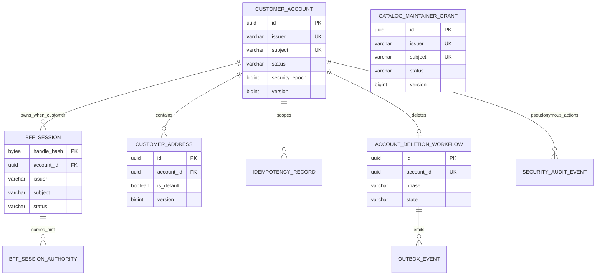

# Customer Identity and Access — Schema Design

> **Status:** Proposed; conditionally ready  
> **Database/dialect:** PostgreSQL 18.x  
> **Owning services:** Identity Access Service (`identity_access` database), Catalog Service (`catalog` database)  
> **Controlling PRD/HLD:** [`CF-PRD-001`](https://app.notion.com/p/3b6faa3e42dd818d8debd9dfffb883ab), [`hld.md`](hld.md)  
> **Related routing decision:** [`IDA-DEC-005`](decisions/IDA-DEC-005-embedded-spring-cloud-gateway.md)  
> **Last updated:** 2026-08-17

## 1. Decision summary

Use normalized relational tables and service-owned databases. The Identity Access Service stores only the identity reference needed for ownership—exact OIDC issuer and subject—and the approved mutable profile/address/session/deletion data. It does not store email or a password verifier. The Catalog Service stores its own maintainer grant and later catalog data; it has no foreign key or SQL access to customer tables.

Application-generated UUIDs identify aggregates. Opaque browser/session/idempotency secrets are represented in the database only by 32-byte keyed hashes. OAuth token material and OIDC transaction secrets are encrypted before persistence with a versioned key ID. Low-contention profile/address edits use optimistic versions; default-address changes lock the account row and rely on a partial unique index as the final invariant guard. Account deletion is a one-way local transaction plus a durable workflow/ledger/outbox.

Local development may use one physical PostgreSQL server, but `identity_access`, `catalog`, and `keycloak` are different logical databases with different owners. This reduces local cost without creating a shared-database contract.

Embedding Spring Cloud Gateway Server Web MVC changes no database ownership, table, column, constraint, index, transaction, lock order, migration, or retention rule in this design. Gateway Java routes, route manifests, per-instance rate buckets, and downstream HTTP-client state are non-persistent infrastructure. The gateway does not introduce Spring Session, an OAuth authorized-client schema, a route database, Redis, or another durable authority.

## 2. Requirements, invariants, and assumptions

| ID/source | Requirement or assumption | Database enforcement | Application enforcement | Evidence |
|---|---|---|---|---|
| `CF-SEC-IDN-005` | Account keyed by `(iss, sub)`, never email | Unique `(issuer, subject)` | Only validated token constructs key | Re-registration/duplicate tests |
| `CF-SEC-PII-001` | No password verifier or copied email | No such columns | DTO/log allowlist | Schema/redaction review |
| `CF-ACC-001` | Optional display name and unverified E.164 phone | Length/E.164 checks; `phone_verified = false` | Unicode/libphonenumber validation | Phone matrix |
| `CF-ADDR-001` | Address belongs to exactly one account | FK; owner-first unique key | All repository methods require account ID | Ownership matrix |
| `CF-ADDR-002`, `CF-INV-005` | At most one default address/account | Partial unique index | Account lock and atomic clear/set | Concurrent default test |
| `CF-SEC-SES-001`–`003` | Opaque handle, protected tokens, bounded TTLs | Hash/cipher columns and time checks | Crypto/key ring and expiry validation | Browser/storage/time tests |
| `CF-SEC-SES-006`–`008` | Subject-wide revoke and deny-first deletion | Session subject indexes; account status/epoch | Back-channel/logout/deletion use cases | Two-session/deletion tests |
| `CF-SEC-NFR-009`–`010` | Durable reconcile and restore non-resurrection | Workflow and deletion ledger | Worker/startup restore gate | Phase/restore tests |
| `CF-SEC-PII-008`–`010` | Pseudonymous audit only | Allowlisted columns; no free-text payload | HMAC pseudonyms; safe reason enums | Canary scan |
| Engineering assumption `IDA-ASM-DB-001` | Ordinary mutation idempotency retained 24 h | `expires_at` | Cleanup worker; no analytics reuse | Replay/cleanup tests; confirm during setup |
| Engineering assumption `IDA-ASM-DB-002` | Deletion ledger retained 90 days | `expires_at` ≥ 90 days | Restore gate and cleanup after backup horizon | Restore/retention tests |

## 3. Ownership and aggregate boundaries

| Aggregate/table group | Owner | Atomic invariants | External references | Forbidden cross-boundary access |
|---|---|---|---|---|
| Auth transaction | Identity Access `auth` module | State is unique, unexpired, consumed at most once | Keycloak authorization request | Catalog/Keycloak SQL access |
| BFF session | Identity Access `auth` module | Handle unique; active state and TTL; authority rows share lifecycle | Keycloak issuer/sub/`sid` values | Browser/raw cookie persistence; Catalog DB access |
| Customer account/profile/address | Identity Access `customeraccount` module | Unique subject; active-state/epoch; profile atomicity; one default | OIDC issuer/sub only | Email/password copy; cross-service FK |
| Idempotency record | Owning Identity Access use case | Key/fingerprint/outcome uniqueness per account/operation | Aggregate result reference | Stored request/response PII |
| Deletion workflow/ledger/outbox | Identity Access `deletion` module | One deletion/account; deny state precedes remote phases | Opaque future consumer IDs | Remote table updates or 2PC |
| Security audit | Identity Access `securityaudit` module | Append-only allowlisted metadata | HMAC actor/target/session fingerprints | Raw identity/PII/secrets |

The `edgegateway` infrastructure module owns no aggregate or table. It may read session/token state only through `auth` application ports; it cannot query `bff_session` or customer tables directly.
| Maintainer grant | Catalog Service | Exact subject has at most one grant; active/version checked with write | OIDC issuer/sub | Customer/profile/address access |

## 4. Access paths and workload

Reads and writes are defined before indexes. Cardinalities are for the bounded synthetic system; actual values must be measured.

| Access path | Filters | Ordering | Cardinality/frequency | Consistency | Latency target |
|---|---|---|---|---|---|
| Resolve BFF session | `handle_hash = ?`, active/expiry | None | Every private request; point lookup | Authoritative | Included in endpoint target |
| Revoke subject sessions | `issuer = ? AND subject = ? AND status='ACTIVE'` | None | Credential/delete event; low frequency | Strong local | ≤60 s boundary, normally immediate |
| Revoke OIDC session | `issuer = ? AND oidc_sid = ?` | None | Back-channel logout | Strong local | Immediate after validated token |
| Clean expired sessions | `cleanup_after <= now()` | `cleanup_after, handle_hash` | Scheduled batches | Eventual cleanup; authority already expired | Bounded batch |
| Bind/load account | `issuer = ? AND subject = ?` | None | Login + every owner resolution | Authoritative | Included in endpoint target |
| Lock account | `id = ? FOR UPDATE` | None | Default/deletion; low frequency | Strong | Short transaction |
| List addresses | `account_id = ?` | `is_default DESC, created_at, id` | Usually small | Authoritative | p95 within private-read budget |
| Resolve owned address | `account_id = ? AND id = ?` | None | Detail/update/delete/default | Authoritative and owner-hidden | Point lookup |
| Find current default | `account_id = ? AND is_default` | None | Default transition/list | Authoritative | Point/partial lookup |
| Claim idempotency | `account_id, operation, key_hash` | None | Every unsafe customer mutation | Strong | Included in mutation budget |
| Clean idempotency | `expires_at <= now()` | `expires_at, id` | Scheduled batches | Eventual cleanup | Bounded batch |
| Claim deletion work | `state != COMPLETED AND next_attempt_at <= now()` | `next_attempt_at, id` | Worker poll | Strong lease | Bounded poll |
| Publish outbox | `published_at IS NULL AND available_at <= now()` | `available_at, id` | Worker poll | At-least-once | Backlog monitored |
| Reapply deletion ledger | `subject_fingerprint = ?` or active unexpired scan | `accepted_at` | Restore/startup | Authoritative restore gate | Before readiness |
| Query security audit | `occurred_at` range + safe event/result filters | `occurred_at, id` | Evidence/operator only | Append history | Offline/bounded |
| Validate catalog grant | `issuer = ? AND subject = ?` | None | Every catalog mutation | Strong with catalog transaction | Included in catalog target |

## 5. Conceptual model



The Catalog maintainer aggregate is in a different database; the diagram intentionally shows no cross-service relationship or foreign key. OIDC issuer/sub values are references to Keycloak authority, not foreign keys into the Keycloak database.

## 6. Logical schema

### 6.1 `auth_transaction`

**Purpose and owner:** One-time server-side OIDC state/nonce/PKCE transaction owned by Identity Access `auth`.

| Column | Type | Null/default | Meaning | Classification |
|---|---|---|---|---|
| `state_hash` | `bytea` | PK, not null | HMAC-SHA-256 of browser state | Secret-derived verifier |
| `nonce_ciphertext` | `bytea` | not null | Protected nonce | Secret |
| `pkce_verifier_ciphertext` | `bytea` | not null | Protected PKCE verifier | Secret |
| `key_id` | `varchar(64)` | not null | Encryption key version | Configuration metadata |
| `flow_kind` | `varchar(32)` | not null | `LOGIN` or bounded `CUSTOMER_REGISTRATION` | Security/control state |
| `return_target` | `varchar(128)` | not null | Allowlisted logical target, not arbitrary URI | Internal |
| `created_at` | `timestamptz` | not null | Creation time | Operational |
| `expires_at` | `timestamptz` | not null | Hard expiry, proposed 10 min | Operational |
| `consumed_at` | `timestamptz` | nullable | One-time claim marker | Operational |

**Keys and constraints**

- Primary key: `state_hash`; exact 32 bytes.
- Check: `flow_kind` is `LOGIN` or `CUSTOMER_REGISTRATION`; there is no maintainer-registration value.
- Check: `expires_at > created_at`.
- Consumption uses `UPDATE ... WHERE consumed_at IS NULL AND expires_at > :now RETURNING ...`.

### 6.2 `customer_account`

**Purpose and owner:** Authoritative application account status, identity binding, and minimized profile.

| Column | Type | Null/default | Meaning | Classification |
|---|---|---|---|---|
| `id` | `uuid` | PK | Internal account ID | Private identifier |
| `issuer` | `varchar(512)` | not null | Exact validated OIDC issuer | Pseudonymous identity |
| `subject` | `varchar(255)` | not null | Exact validated OIDC subject | Pseudonymous identity |
| `status` | `varchar(16)` | `ACTIVE` | `ACTIVE`, `DISABLED`, `DELETING`, `DELETED` | Security state |
| `display_name` | `varchar(100)` | nullable | Optional approved display name | PII |
| `phone_e164` | `varchar(16)` | nullable | Optional normalized phone | PII |
| `phone_verified` | `boolean` | `false` | Always false in Week 1 | Security metadata |
| `security_epoch` | `bigint` | `0` | Invalidates older sessions/commands | Security state |
| `version` | `bigint` | `0` | Optimistic profile/account version | Concurrency |
| `created_at` | `timestamptz` | not null | Creation | Operational |
| `updated_at` | `timestamptz` | not null | Last committed update | Operational |
| `deletion_accepted_at` | `timestamptz` | nullable | Deny-first boundary | Privacy lifecycle |
| `deleted_at` | `timestamptz` | nullable | Reconciliation completion | Privacy lifecycle |

**Keys and constraints**

- Unique: `(issuer, subject)`; email is intentionally absent.
- Checks: legal status; `version >= 0`; `security_epoch >= 0`; phone matches E.164 when present; `phone_verified = false` for Week 1.
- Status/timestamp consistency checks make invalid lifecycle combinations hard to store.

### 6.3 `bff_session`

**Purpose and owner:** Sole durable server-side browser-session and protected-token authority owned by Identity Access `auth`. The embedded gateway accesses it only through application ports and does not create a parallel Spring Session or OAuth authorized-client store.

| Column | Type | Null/default | Meaning | Classification |
|---|---|---|---|---|
| `handle_hash` | `bytea` | PK | HMAC of 32-byte opaque browser handle | Secret-derived verifier |
| `session_id` | `uuid` | unique, not null | Internal correlation key | Private identifier |
| `principal_kind` | `varchar(16)` | not null | `CUSTOMER` or `MAINTAINER` | Authorization metadata |
| `account_id` | `uuid` | nullable FK | Customer account; null for maintainer-only principal | Private identifier |
| `issuer` | `varchar(512)` | not null | Validated issuer | Pseudonymous identity |
| `subject` | `varchar(255)` | not null | Validated subject | Pseudonymous identity |
| `oidc_sid` | `varchar(255)` | nullable | Provider session for back-channel logout | Security identifier |
| `status` | `varchar(16)` | `ACTIVE` | `ACTIVE`, `REVOKED`, `EXPIRED` | Security state |
| `security_epoch` | `bigint` | `0` | Account epoch captured at login | Security state |
| `authenticated_at` | `timestamptz` | not null | OIDC `auth_time`/validated equivalent | Security state |
| `last_seen_at` | `timestamptz` | not null | Successful owner-authorized activity/session use | Operational |
| `idle_expires_at` | `timestamptz` | not null | 30-minute idle boundary | Security state |
| `absolute_expires_at` | `timestamptz` | not null | 8-hour boundary | Security state |
| `access_expires_at` | `timestamptz` | not null | Access token ≤5-minute boundary | Security state |
| `token_ciphertext` | `bytea` | not null | Protected access/refresh/ID token bundle | Secret |
| `token_key_id` | `varchar(64)` | not null | Encryption key version | Configuration metadata |
| `csrf_hash` | `bytea` | not null | HMAC of synchronizer token | Secret-derived verifier |
| `revoked_at` | `timestamptz` | nullable | Local invalidation time | Security state |
| `revoke_reason` | `varchar(32)` | nullable | Allowlisted reason code | Security metadata |
| `created_at` / `updated_at` | `timestamptz` | not null | Audit times | Operational |
| `cleanup_after` | `timestamptz` | not null | Physical purge eligibility | Retention |

**Keys and constraints**

- Primary key: `handle_hash`, exactly 32 bytes; raw handle is never stored.
- Foreign key `account_id → customer_account(id) ON DELETE RESTRICT`.
- Check: a `CUSTOMER` session has a non-null `account_id`; a `MAINTAINER` session has a null `account_id`.
- Checks legal state, nonnegative epoch, and `idle/access/absolute > created_at`.
- Revoked sessions remain only as long as needed for idempotent logout/audit, then purge.

### 6.4 `bff_session_authority`

**Purpose and owner:** Small normalized set of coarse authority hints from the validated identity token.

| Column | Type | Null/default | Meaning | Classification |
|---|---|---|---|---|
| `handle_hash` | `bytea` | PK/FK | Owning session | Secret-derived verifier |
| `authority_code` | `varchar(64)` | PK | Allowlisted hint such as `CATALOG_MAINTAINER` | Authorization metadata |

Authority hints permit early BFF rejection but do not replace Catalog Service policy.

### 6.5 `customer_address`

**Purpose and owner:** Owner-scoped, minimized active address data.

| Column | Type | Null/default | Meaning | Classification |
|---|---|---|---|---|
| `id` | `uuid` | PK | Address ID | Private identifier |
| `account_id` | `uuid` | not null FK | Owner | Private identifier |
| `recipient_name` | `varchar(100)` | not null | Recipient | PII |
| `street_line1` | `varchar(200)` | not null | Required street | PII |
| `street_line2` | `varchar(200)` | nullable | Optional street | PII |
| `locality` | `varchar(100)` | nullable | Country-dependent | PII |
| `administrative_area` | `varchar(100)` | nullable | Country-dependent | PII |
| `postal_code` | `varchar(32)` | nullable | Country-dependent | PII |
| `country_code` | `char(2)` | not null | ISO 3166-1 alpha-2 | PII/context |
| `is_default` | `boolean` | `false` | Default marker | Account state |
| `version` | `bigint` | `0` | Optimistic version | Concurrency |
| `created_at` / `updated_at` | `timestamptz` | not null | Audit times | Operational |

**Keys and constraints**

- Foreign key: `account_id → customer_account(id) ON DELETE RESTRICT`.
- Unique owner-first key: `(account_id, id)` supports owner-scoped resolution and makes intent explicit.
- Partial unique index: one `is_default = true` row per account.
- Length, uppercase-country, nonblank required fields, and nonnegative version checks.
- NFC/control/country-conditional validation remains application-owned because it depends on reviewed configuration/libphonenumber-style metadata, not portable SQL alone.

### 6.6 `idempotency_record`

**Purpose and owner:** Safe mutation replay without copying PII request/response bodies.

| Column | Type | Null/default | Meaning | Classification |
|---|---|---|---|---|
| `id` | `uuid` | PK | Record ID | Internal |
| `account_id` | `uuid` | not null FK | Scope | Private identifier |
| `operation_code` | `varchar(64)` | not null | Allowlisted use case | Operational |
| `key_hash` | `bytea` | not null | HMAC of client key | Secret-derived verifier |
| `request_fingerprint` | `bytea` | not null | SHA-256 canonical request fingerprint | Non-reversible metadata |
| `status` | `varchar(16)` | `IN_PROGRESS` | `IN_PROGRESS`, `COMPLETED`, `FAILED_FINAL` | Workflow state |
| `result_kind` | `varchar(32)` | nullable | Safe semantic outcome | Operational |
| `result_resource_id` | `uuid` | nullable | Owner-scoped aggregate reference | Private identifier |
| `result_version` | `bigint` | nullable | Version for reconstruction | Concurrency metadata |
| `http_status` | `smallint` | nullable | Safe replay status | Operational |
| `created_at` / `completed_at` | `timestamptz` | required/nullable | Lifecycle | Operational |
| `expires_at` | `timestamptz` | not null | Purpose expiry | Retention |

Unique `(account_id, operation_code, key_hash)`. The table stores no raw key, request body, phone, address, or response body.

### 6.7 `account_deletion_workflow`

**Purpose and owner:** Durable, idempotent cross-system cleanup after local denial.

| Column | Type | Null/default | Meaning | Classification |
|---|---|---|---|---|
| `id` | `uuid` | PK | Deletion operation | Private identifier |
| `account_id` | `uuid` | unique, not null FK | Deleted account | Private identifier |
| `state` | `varchar(16)` | `PENDING` | `PENDING`, `RUNNING`, `RETRY`, `COMPLETED`, `ATTENTION` | Workflow state |
| `phase` | `varchar(32)` | not null | `IDP`, `CART`, `FINALIZE` | Workflow state |
| `accepted_at` | `timestamptz` | not null | Local deny boundary | Privacy lifecycle |
| `attempt_count` | `integer` | `0` | Current phase attempts | Operational |
| `next_attempt_at` | `timestamptz` | not null | Retry schedule | Operational |
| `lease_owner` | `uuid` | nullable | Worker lease | Operational |
| `lease_expires_at` | `timestamptz` | nullable | Worker lease expiry | Operational |
| `last_error_code` | `varchar(64)` | nullable | Allowlisted safe reason | Operational |
| `completed_at` | `timestamptz` | nullable | All mandatory phases done | Privacy lifecycle |
| `version` | `bigint` | `0` | Optimistic workflow version | Concurrency |

One workflow per account. No raw remote response or PII is stored.

### 6.8 `deletion_ledger`

**Purpose and owner:** Restore-time non-resurrection record independent of active account data.

| Column | Type | Null/default | Meaning | Classification |
|---|---|---|---|---|
| `id` | `uuid` | PK | Ledger entry | Internal |
| `account_id` | `uuid` | not null | Original opaque local ID | Pseudonymous |
| `subject_fingerprint` | `bytea` | not null | HMAC of canonical issuer + subject | Pseudonymous verifier |
| `security_epoch` | `bigint` | not null | Minimum deny epoch | Security state |
| `accepted_at` | `timestamptz` | not null | Deletion boundary | Privacy lifecycle |
| `expires_at` | `timestamptz` | not null | Proposed 90-day retention | Retention |
| `reapplied_at` | `timestamptz` | nullable | Most recent restore-gate application | Operational |

Unique `subject_fingerprint` for the active retention window. The ledger has no FK so it survives later account-row purge and backup restoration ordering.

### 6.9 `outbox_event`

**Purpose and owner:** Atomic publication intent for deletion events.

| Column | Type | Null/default | Meaning | Classification |
|---|---|---|---|---|
| `id` | `uuid` | PK | Event/deduplication ID | Internal |
| `aggregate_type` | `varchar(32)` | not null | Allowlisted aggregate | Operational |
| `aggregate_id` | `uuid` | not null | Opaque aggregate | Pseudonymous |
| `event_type` | `varchar(64)` | not null | Versioned event name | Operational |
| `event_version` | `smallint` | not null | Schema version | Operational |
| `payload` | `jsonb` | not null | Validated no-PII event payload | Pseudonymous metadata |
| `occurred_at` / `available_at` | `timestamptz` | not null | Event/retry timing | Operational |
| `attempt_count` | `integer` | `0` | Publish attempts | Operational |
| `published_at` | `timestamptz` | nullable | Successful publish | Operational |
| `last_error_code` | `varchar(64)` | nullable | Safe failure | Operational |

Payloads are validated against repository event schemas before insert; JSON is not a substitute for aggregate storage.

### 6.10 `security_audit_event`

**Purpose and owner:** Purpose-bound pseudonymous audit with 90-day ceiling.

| Column | Type | Null/default | Meaning | Classification |
|---|---|---|---|---|
| `id` | `uuid` | PK | Audit event | Internal |
| `occurred_at` | `timestamptz` | not null | Event time | Operational |
| `event_type` / `result_code` / `reason_code` | `varchar` | not null | Allowlists | Security metadata |
| `actor_fingerprint` | `bytea` | nullable | Rotating-HMAC pseudonym | Pseudonymous |
| `target_fingerprint` | `bytea` | nullable | Rotating-HMAC pseudonym | Pseudonymous |
| `session_fingerprint` | `bytea` | nullable | Rotating-HMAC pseudonym | Pseudonymous |
| `network_bucket` | `bytea` | nullable | Coarse/HMAC network signal | Pseudonymous |
| `client_code` | `varchar(32)` | nullable | Allowlists only | Security metadata |
| `correlation_id` | `uuid` | not null | Request correlation | Operational |
| `key_id` | `varchar(64)` | not null | HMAC key version | Configuration metadata |
| `expires_at` | `timestamptz` | not null | 90-day ceiling | Retention |

There is deliberately no arbitrary message or JSON details column.

### 6.11 `catalog_maintainer_grant` (`catalog` database)

**Purpose and owner:** Catalog-owned final maintainer authorization record.

| Column | Type | Null/default | Meaning | Classification |
|---|---|---|---|---|
| `id` | `uuid` | PK | Grant ID | Internal |
| `issuer` | `varchar(512)` | not null | Validated token issuer | Pseudonymous identity |
| `subject` | `varchar(255)` | not null | Validated token subject | Pseudonymous identity |
| `status` | `varchar(16)` | `ACTIVE` | `ACTIVE`, `REVOKED` | Authorization state |
| `version` | `bigint` | `0` | TOCTOU/version guard | Concurrency |
| `created_at` / `updated_at` / `revoked_at` | `timestamptz` | required/required/nullable | Lifecycle | Operational |

Unique `(issuer, subject)`. The row is read/locked inside the same catalog transaction as a protected mutation. A Keycloak role claim alone cannot write catalog state.

## 7. Physical schema and representative DDL

The DDL is representative and dialect-correct for the proposed model. Migration filenames and schema names are decided during repository bootstrap.

```sql
CREATE TABLE customer_account (
    id uuid PRIMARY KEY,
    issuer varchar(512) NOT NULL,
    subject varchar(255) NOT NULL,
    status varchar(16) NOT NULL DEFAULT 'ACTIVE',
    display_name varchar(100),
    phone_e164 varchar(16),
    phone_verified boolean NOT NULL DEFAULT false,
    security_epoch bigint NOT NULL DEFAULT 0,
    version bigint NOT NULL DEFAULT 0,
    created_at timestamptz NOT NULL,
    updated_at timestamptz NOT NULL,
    deletion_accepted_at timestamptz,
    deleted_at timestamptz,
    CONSTRAINT uq_customer_account_subject UNIQUE (issuer, subject),
    CONSTRAINT ck_customer_account_status
        CHECK (status IN ('ACTIVE', 'DISABLED', 'DELETING', 'DELETED')),
    CONSTRAINT ck_customer_account_nonnegative
        CHECK (security_epoch >= 0 AND version >= 0),
    CONSTRAINT ck_customer_account_phone
        CHECK (phone_e164 IS NULL OR phone_e164 ~ '^\+[1-9][0-9]{1,14}$'),
    CONSTRAINT ck_customer_account_phone_unverified
        CHECK (phone_verified = false),
    CONSTRAINT ck_customer_account_deletion_times CHECK (
        (status IN ('ACTIVE', 'DISABLED') AND deletion_accepted_at IS NULL AND deleted_at IS NULL)
        OR (status = 'DELETING' AND deletion_accepted_at IS NOT NULL AND deleted_at IS NULL)
        OR (status = 'DELETED' AND deletion_accepted_at IS NOT NULL AND deleted_at IS NOT NULL)
    )
);

CREATE TABLE auth_transaction (
    state_hash bytea PRIMARY KEY,
    nonce_ciphertext bytea NOT NULL,
    pkce_verifier_ciphertext bytea NOT NULL,
    key_id varchar(64) NOT NULL,
    flow_kind varchar(32) NOT NULL,
    return_target varchar(128) NOT NULL,
    created_at timestamptz NOT NULL,
    expires_at timestamptz NOT NULL,
    consumed_at timestamptz,
    CONSTRAINT ck_auth_state_hash CHECK (octet_length(state_hash) = 32),
    CONSTRAINT ck_auth_flow_kind CHECK (flow_kind IN ('LOGIN', 'CUSTOMER_REGISTRATION')),
    CONSTRAINT ck_auth_transaction_time CHECK (expires_at > created_at)
);

CREATE TABLE bff_session (
    handle_hash bytea PRIMARY KEY,
    session_id uuid NOT NULL UNIQUE,
    principal_kind varchar(16) NOT NULL,
    account_id uuid REFERENCES customer_account(id) ON DELETE RESTRICT,
    issuer varchar(512) NOT NULL,
    subject varchar(255) NOT NULL,
    oidc_sid varchar(255),
    status varchar(16) NOT NULL DEFAULT 'ACTIVE',
    security_epoch bigint NOT NULL DEFAULT 0,
    authenticated_at timestamptz NOT NULL,
    last_seen_at timestamptz NOT NULL,
    idle_expires_at timestamptz NOT NULL,
    absolute_expires_at timestamptz NOT NULL,
    access_expires_at timestamptz NOT NULL,
    token_ciphertext bytea NOT NULL,
    token_key_id varchar(64) NOT NULL,
    csrf_hash bytea NOT NULL,
    revoked_at timestamptz,
    revoke_reason varchar(32),
    created_at timestamptz NOT NULL,
    updated_at timestamptz NOT NULL,
    cleanup_after timestamptz NOT NULL,
    CONSTRAINT ck_bff_handle_hash CHECK (octet_length(handle_hash) = 32),
    CONSTRAINT ck_bff_csrf_hash CHECK (octet_length(csrf_hash) = 32),
    CONSTRAINT ck_bff_principal_kind CHECK (principal_kind IN ('CUSTOMER', 'MAINTAINER')),
    CONSTRAINT ck_bff_principal_account CHECK (
        (principal_kind = 'CUSTOMER' AND account_id IS NOT NULL)
        OR (principal_kind = 'MAINTAINER' AND account_id IS NULL)
    ),
    CONSTRAINT ck_bff_status CHECK (status IN ('ACTIVE', 'REVOKED', 'EXPIRED')),
    CONSTRAINT ck_bff_epoch CHECK (security_epoch >= 0),
    CONSTRAINT ck_bff_time_order CHECK (
        idle_expires_at > created_at
        AND absolute_expires_at > created_at
        AND access_expires_at > created_at
        AND cleanup_after >= absolute_expires_at
    ),
    CONSTRAINT ck_bff_revocation CHECK (
        (status = 'ACTIVE' AND revoked_at IS NULL AND revoke_reason IS NULL)
        OR (status IN ('REVOKED', 'EXPIRED') AND revoked_at IS NOT NULL)
    )
);

CREATE TABLE bff_session_authority (
    handle_hash bytea NOT NULL REFERENCES bff_session(handle_hash) ON DELETE CASCADE,
    authority_code varchar(64) NOT NULL,
    PRIMARY KEY (handle_hash, authority_code),
    CONSTRAINT ck_bff_authority CHECK (authority_code IN ('CUSTOMER', 'CATALOG_MAINTAINER'))
);

CREATE TABLE customer_address (
    id uuid PRIMARY KEY,
    account_id uuid NOT NULL REFERENCES customer_account(id) ON DELETE RESTRICT,
    recipient_name varchar(100) NOT NULL,
    street_line1 varchar(200) NOT NULL,
    street_line2 varchar(200),
    locality varchar(100),
    administrative_area varchar(100),
    postal_code varchar(32),
    country_code char(2) NOT NULL,
    is_default boolean NOT NULL DEFAULT false,
    version bigint NOT NULL DEFAULT 0,
    created_at timestamptz NOT NULL,
    updated_at timestamptz NOT NULL,
    CONSTRAINT uq_customer_address_owner_id UNIQUE (account_id, id),
    CONSTRAINT ck_customer_address_required CHECK (
        length(btrim(recipient_name)) > 0
        AND length(btrim(street_line1)) > 0
        AND country_code ~ '^[A-Z]{2}$'
    ),
    CONSTRAINT ck_customer_address_version CHECK (version >= 0)
);

CREATE UNIQUE INDEX uq_customer_address_one_default
    ON customer_address (account_id)
    WHERE is_default = true;

CREATE TABLE idempotency_record (
    id uuid PRIMARY KEY,
    account_id uuid NOT NULL REFERENCES customer_account(id) ON DELETE RESTRICT,
    operation_code varchar(64) NOT NULL,
    key_hash bytea NOT NULL,
    request_fingerprint bytea NOT NULL,
    status varchar(16) NOT NULL DEFAULT 'IN_PROGRESS',
    result_kind varchar(32),
    result_resource_id uuid,
    result_version bigint,
    http_status smallint,
    created_at timestamptz NOT NULL,
    completed_at timestamptz,
    expires_at timestamptz NOT NULL,
    CONSTRAINT uq_idempotency_scope UNIQUE (account_id, operation_code, key_hash),
    CONSTRAINT ck_idempotency_hashes CHECK (
        octet_length(key_hash) = 32 AND octet_length(request_fingerprint) = 32
    ),
    CONSTRAINT ck_idempotency_status
        CHECK (status IN ('IN_PROGRESS', 'COMPLETED', 'FAILED_FINAL')),
    CONSTRAINT ck_idempotency_time CHECK (expires_at > created_at)
);

CREATE TABLE account_deletion_workflow (
    id uuid PRIMARY KEY,
    account_id uuid NOT NULL UNIQUE REFERENCES customer_account(id) ON DELETE RESTRICT,
    state varchar(16) NOT NULL DEFAULT 'PENDING',
    phase varchar(32) NOT NULL,
    accepted_at timestamptz NOT NULL,
    attempt_count integer NOT NULL DEFAULT 0,
    next_attempt_at timestamptz NOT NULL,
    lease_owner uuid,
    lease_expires_at timestamptz,
    last_error_code varchar(64),
    completed_at timestamptz,
    version bigint NOT NULL DEFAULT 0,
    CONSTRAINT ck_deletion_state
        CHECK (state IN ('PENDING', 'RUNNING', 'RETRY', 'COMPLETED', 'ATTENTION')),
    CONSTRAINT ck_deletion_phase CHECK (phase IN ('IDP', 'CART', 'FINALIZE')),
    CONSTRAINT ck_deletion_counts CHECK (attempt_count >= 0 AND version >= 0)
);

CREATE TABLE deletion_ledger (
    id uuid PRIMARY KEY,
    account_id uuid NOT NULL,
    subject_fingerprint bytea NOT NULL UNIQUE,
    security_epoch bigint NOT NULL,
    accepted_at timestamptz NOT NULL,
    expires_at timestamptz NOT NULL,
    reapplied_at timestamptz,
    CONSTRAINT ck_deletion_fingerprint CHECK (octet_length(subject_fingerprint) = 32),
    CONSTRAINT ck_deletion_ledger_time CHECK (expires_at > accepted_at),
    CONSTRAINT ck_deletion_ledger_epoch CHECK (security_epoch > 0)
);

CREATE TABLE outbox_event (
    id uuid PRIMARY KEY,
    aggregate_type varchar(32) NOT NULL,
    aggregate_id uuid NOT NULL,
    event_type varchar(64) NOT NULL,
    event_version smallint NOT NULL,
    payload jsonb NOT NULL,
    occurred_at timestamptz NOT NULL,
    available_at timestamptz NOT NULL,
    attempt_count integer NOT NULL DEFAULT 0,
    published_at timestamptz,
    last_error_code varchar(64),
    CONSTRAINT ck_outbox_version CHECK (event_version > 0 AND attempt_count >= 0),
    CONSTRAINT ck_outbox_payload_object CHECK (jsonb_typeof(payload) = 'object')
);

CREATE TABLE security_audit_event (
    id uuid PRIMARY KEY,
    occurred_at timestamptz NOT NULL,
    event_type varchar(64) NOT NULL,
    result_code varchar(32) NOT NULL,
    reason_code varchar(64) NOT NULL,
    actor_fingerprint bytea,
    target_fingerprint bytea,
    session_fingerprint bytea,
    network_bucket bytea,
    client_code varchar(32),
    correlation_id uuid NOT NULL,
    key_id varchar(64) NOT NULL,
    expires_at timestamptz NOT NULL,
    CONSTRAINT ck_security_audit_time CHECK (expires_at > occurred_at)
);

-- In the separately owned catalog database:
CREATE TABLE catalog_maintainer_grant (
    id uuid PRIMARY KEY,
    issuer varchar(512) NOT NULL,
    subject varchar(255) NOT NULL,
    status varchar(16) NOT NULL DEFAULT 'ACTIVE',
    version bigint NOT NULL DEFAULT 0,
    created_at timestamptz NOT NULL,
    updated_at timestamptz NOT NULL,
    revoked_at timestamptz,
    CONSTRAINT uq_catalog_maintainer_subject UNIQUE (issuer, subject),
    CONSTRAINT ck_catalog_grant_status CHECK (status IN ('ACTIVE', 'REVOKED')),
    CONSTRAINT ck_catalog_grant_version CHECK (version >= 0)
);
```

## 8. Index design

PostgreSQL creates indexes for primary and unique constraints. The explicit indexes below serve named access paths.

| Index | Access path/query | Column order rationale | Include/partial predicate | Cost and limitation |
|---|---|---|---|---|
| `uq_customer_account_subject` | Bind/resolve account by exact issuer/sub | Both equality; issuer first groups tenant/realm | Unique | Write uniqueness check; issuer/subject index contains pseudonymous identifiers |
| `idx_bff_session_subject_active` | Revoke all sessions for subject | Equality issuer/subject; active subset | Partial `WHERE status='ACTIVE'`; include `session_id` optional | Session writes update partial index; required for ≤60 s revoke |
| `idx_bff_session_oidc_sid_active` | Back-channel revoke by provider `sid` | Issuer then sid equality | Partial `WHERE status='ACTIVE' AND oidc_sid IS NOT NULL` | Extra write/storage; `sid` absent for some tokens |
| `idx_bff_session_account_active` | Revoke customer sessions/delete account | Account equality | Partial active | Maintainer sessions with null account omitted |
| `idx_bff_session_cleanup` | Batch expired/revoked cleanup | Oldest cleanup first, hash tie-break | Partial non-active or all rows depending plan | Time-ordered write amplification; bounded cleanup only |
| `uq_customer_address_owner_id` | Resolve owner-scoped address | Account equality then ID equality | Unique | Duplicates PK storage, but directly supports ownership path and possible composite FK |
| `idx_customer_address_list` | Owner list/default-first stable order | Account equality; default/order fields | `(account_id, is_default DESC, created_at, id)` | Additional write cost per address mutation; bounded rows may make it optional after `EXPLAIN` |
| `uq_customer_address_one_default` | Enforce at most one default | Account is invariant scope | Partial `WHERE is_default` | Default switch touches index; essential invariant |
| `uq_idempotency_scope` | Claim/replay mutation | Exact account/operation/key | Unique | Write per mutation and cleanup burden |
| `idx_idempotency_expiry` | Purpose cleanup | Expiry then ID | None | Append/update index; required only for bounded batches |
| `uq_account_deletion_account` | Accept once/replay deletion | Exact account | Unique | Minimal; one row/account |
| `idx_deletion_due` | Claim due workflow | State/next time/id | Partial `WHERE state IN ('PENDING','RETRY','RUNNING')` | Updates on every retry; operationally necessary |
| `idx_deletion_ledger_active` | Startup active-ledger scan | Expiry/accepted order | Partial `WHERE expires_at > now()` is not permitted because `now()` is not immutable; query uses ordinary expiry index | Full index retains expired entries until cleanup |
| `idx_outbox_due` | Publish due events | Available time/id | Partial `WHERE published_at IS NULL` | Every publish removes entry; necessary for worker |
| `idx_audit_time` | Retention/evidence range scan | Occurred time/id | None | Potentially largest audit index; no actor index to discourage profiling |
| `uq_catalog_maintainer_subject` | Final grant lookup | Exact issuer/sub | Unique | Small synthetic grant set; necessary authority path |

Representative index DDL omitted above:

```sql
CREATE INDEX idx_bff_session_subject_active
    ON bff_session (issuer, subject)
    INCLUDE (session_id)
    WHERE status = 'ACTIVE';

CREATE INDEX idx_bff_session_oidc_sid_active
    ON bff_session (issuer, oidc_sid)
    WHERE status = 'ACTIVE' AND oidc_sid IS NOT NULL;

CREATE INDEX idx_bff_session_account_active
    ON bff_session (account_id)
    WHERE status = 'ACTIVE' AND account_id IS NOT NULL;

CREATE INDEX idx_bff_session_cleanup
    ON bff_session (cleanup_after, handle_hash);

CREATE INDEX idx_customer_address_list
    ON customer_address (account_id, is_default DESC, created_at, id);

CREATE INDEX idx_idempotency_expiry
    ON idempotency_record (expires_at, id);

CREATE INDEX idx_deletion_due
    ON account_deletion_workflow (next_attempt_at, id)
    WHERE state IN ('PENDING', 'RETRY', 'RUNNING');

CREATE INDEX idx_deletion_ledger_expiry
    ON deletion_ledger (expires_at, id);

CREATE INDEX idx_outbox_due
    ON outbox_event (available_at, id)
    WHERE published_at IS NULL;

CREATE INDEX idx_security_audit_time
    ON security_audit_event (occurred_at, id);
```

The address-list index is the only potentially unnecessary index at small cardinality. Keep it only if D0/D1 plans or latency show value; the owner-first unique index may already be sufficient. No index is added on display name, phone, address fields, or audit pseudonyms because there is no approved query path and such indexes increase PII exposure/write cost.

## 9. Transactions and concurrency

| Operation | Read/write set | Isolation | Lock/version strategy | Conflict/deadlock outcome |
|---|---|---|---|---|
| Consume auth callback | `auth_transaction`, account, session | Read committed | Atomic conditional consume; unique account | Duplicate callback fails; unique race reloads account |
| Update profile | Account row | Read committed | `UPDATE ... WHERE id=? AND status='ACTIVE' AND version=?` | Zero rows → `409` or inactive denial |
| Create address | Idempotency + account + address | Read committed | Active account check and unique idempotency | Duplicate key replays/refuses fingerprint conflict |
| Replace/delete address | Account + owned address + idempotency | Read committed | Owner-first query; address version | Stale `409`; cross-owner/missing `404` |
| Make default | Account + current/target addresses | Read committed | Lock account `FOR UPDATE`; clear then set; unique partial index | One winner at a time; constraint violation treated as defect/conflict |
| Logout current | Session + optional revoke work | Read committed | Conditional `ACTIVE → REVOKED` | Replay changes zero rows but same external result |
| Revoke subject | Matching active sessions + account epoch when applicable | Read committed | Set-based update | Replay idempotent |
| Accept deletion | Account, sessions, addresses, workflow, ledger, outbox, audit, idempotency | Read committed | Lock account first; fixed order; epoch increment | In-flight mutation commits before lock or fails status/epoch check |
| Claim deletion phase | Workflow | Read committed | `FOR UPDATE SKIP LOCKED`; lease/version | Another worker skips; expired lease recoverable |
| Catalog mutation | Grant + catalog aggregate | Catalog transaction isolation defined by E1 | Lock/conditional active grant first, then catalog rows in documented order | Revoked grant `403`; deadlock hard fail/diagnose |

Global lock order inside Identity Access Service:

1. `customer_account`;
2. `bff_session` set when needed;
3. `customer_address` rows ordered by UUID;
4. `idempotency_record`;
5. deletion workflow/ledger/outbox/audit.

Use database lock/statement timeouts so a request fails safely rather than waits indefinitely. The service may retry one database serialization/deadlock failure only when the entire command is idempotent and the outer HTTP/client layer is not also retrying. PostgreSQL deadlocks in acceptance evidence remain a hard failure to diagnose, not a success hidden by retries.

## 10. Idempotency and uncertain outcomes

### Ordinary profile/address mutations

- Scope: `account_id + operation_code + HMAC(Idempotency-Key)`.
- Fingerprint: API version + method + normalized path template + canonical validated command hash.
- Stored outcome: semantic result kind, owner-scoped resource ID/version, HTTP status; never the PII body.
- In-progress duplicate: `409 OPERATION_IN_PROGRESS` with short `Retry-After`.
- Completed duplicate: reconstruct current owner-scoped representation when compatible; deletion returns stored semantic state.
- Different fingerprint: `409 IDEMPOTENCY_CONFLICT`.
- Proposed expiry: 24 hours, confirmed during setup/design review.

### OIDC and session operations

- Auth transaction state is single-use and expires after the configured transaction window.
- Callback replay never returns a prior token/session body.
- Logout is state-transition idempotent and does not reveal prior validity.
- Back-channel logout is idempotent by validated logout-token identity/claims and the resulting set update.

### Deletion

- Unique workflow per account is the durable idempotency record.
- Each remote phase uses operation identity `deletion_id + phase`.
- Lost response from Keycloak/cart triggers a status-safe repeat of the same revoke/delete operation, never an enable/create operation.

## 11. Data lifecycle, privacy, and audit

| Data | Authority/classification | Retention | Delete/de-identify | Backup/restore | Logging rule |
|---|---|---|---|---|---|
| Issuer/subject active binding | Keycloak reference; pseudonymous | Active account + bounded tombstone/ledger need | Keep only for deny/reconcile, then purge/hash per retention job | Deletion ledger wins after restore | Never raw in logs/labels |
| Display name/phone | Identity Access PII | Active only | Null in deny-first transaction | Ledger prevents restored value serving | Never body/full value |
| Address | Identity Access PII | Active only; no history | Physical delete in deny-first transaction/address delete | Ledger/startup gate prevents resurrection | Never body/full value |
| Token material | Keycloak-derived secret | Active session + short cleanup window | Crypto-erase/purge after revoke/expiry | Encrypted backup; restored revoked/expired state rejected | Never log/screenshot/metric |
| Handle/CSRF/idempotency raw secret | Browser-generated/server-generated secret | Never persisted raw | Only keyed hashes; purge by purpose | Hash alone grants no browser authority | Never log |
| Auth transaction secrets | BFF secret | ≤ transaction window + cleanup | Purge; encrypted at rest | Expired after restore | Never URL-log state/code |
| Operational logs | Operator | 30 days | Delete at ceiling | Backup policy ≤30 days | Redacted at first boundary |
| Security audit | Pseudonymous security | 90 days | Time-partition/batch delete or indexed cleanup | Encrypted; no raw PII | Allowlisted fields only |
| Deletion ledger | Privacy/security | Proposed 90 days, at least backup horizon | Purge only after no retained backup can resurrect data | Must be applied before readiness | Pseudonymous fingerprint only |
| Encrypted backups | Operator | At most 30 days | Rolling expiry | Restore gate reapplies ledger | Never copy raw evidence externally |

The exact ledger/tombstone purge job must prove that the maximum retained backup age is shorter than the remaining ledger coverage. Before real users, this lifecycle requires privacy/legal review; this design authorizes synthetic fixtures only.

## 12. Schema evolution and migration

### Bootstrap

1. Provision `identity_access`, `catalog`, and `keycloak` databases and distinct login roles.
2. Grant each service only connect/usage/DML on its own database/schema.
3. Run separate Flyway/Liquibase histories selected during setup; never one cross-service migration transaction.
4. Apply identity tables and constraints before enabling login routes.
5. Apply catalog grant table and seed only reviewed synthetic principals before COM-46.
6. Verify that enabling Spring Cloud Gateway Server Web MVC produces no additional application schema, migration history, Redis keyspace, or route/session persistence.

### Later additive change pattern

1. Add nullable column/table/index concurrently when appropriate.
2. Deploy code that can read old and new forms.
3. Backfill in bounded primary-key/time batches with checkpoints and safe metrics.
4. Verify counts, null/range/uniqueness invariants, owner-scoped queries, and query plans.
5. Enforce `NOT NULL`/check/unique constraints after data verification.
6. Cut over writes/read paths.
7. Roll back application code while additive schema remains compatible.
8. Remove old columns/contracts only in a later release after backup/rollback windows.

### Migration-specific safety

- A rollback must not change `DELETING/DELETED` back to `ACTIVE`, accept a revoked session, or recreate address/profile values.
- Encryption-key migrations read old/write new and re-encrypt in bounded batches; never require raw token export.
- Gateway route/filter rollbacks are application/configuration rollbacks only. They must not migrate or reinterpret session rows, and an older build must preserve all session/deletion denial semantics.
- `CREATE INDEX CONCURRENTLY` is used for populated high-write tables and cannot run inside a migration transaction; migration tooling must mark this explicitly.
- Cross-service events use additive fields and versioned event names. Consumers ignore unknown additive fields and reject incompatible major versions.
- No migration reads or writes Keycloak internal tables. Keycloak uses its own supported migration/configuration mechanisms.

## 13. Query and performance validation

Representative security-critical queries:

```sql
-- Session resolution; application additionally compares all time boundaries.
SELECT *
FROM bff_session
WHERE handle_hash = :handle_hash
  AND status = 'ACTIVE';

-- Owner-hidden address lookup.
SELECT *
FROM customer_address
WHERE account_id = :derived_account_id
  AND id = :address_id;

-- Subject-wide revocation.
UPDATE bff_session
SET status = 'REVOKED', revoked_at = :now, revoke_reason = :reason, updated_at = :now
WHERE issuer = :issuer
  AND subject = :subject
  AND status = 'ACTIVE';

-- Claim deletion work without duplicate workers.
SELECT id
FROM account_deletion_workflow
WHERE state IN ('PENDING', 'RETRY', 'RUNNING')
  AND next_attempt_at <= :now
  AND (lease_expires_at IS NULL OR lease_expires_at <= :now)
ORDER BY next_attempt_at, id
FOR UPDATE SKIP LOCKED
LIMIT :batch_size;
```

Validation at D0/D1 and revised D2 must capture `EXPLAIN (ANALYZE, BUFFERS, FORMAT JSON)` for session resolution, subject revoke, owner address list/detail, idempotency claim/replay, deletion due poll, outbox poll, and catalog grant validation. Expected plans are unique/index scans for point paths and bounded index scans for cleanup/work queues. A sequential scan over the small synthetic maintainer grant table may be cost-correct, but the unique constraint still exists for correctness.

Dataset/evidence must record:

- active/revoked/expired session distribution and sessions per subject;
- address count/default distribution per account;
- idempotency and audit retention backlog;
- deletion/outbox queue depth and retry distribution;
- table/index sizes, writes, bloat, autovacuum/analyze state;
- Identity Access DB pool, Catalog DB pool, and combined physical-server connection budget;
- the added BFF-to-Catalog network hop separately from SQL time.

Stop adding indexes when named access paths meet targets. Do not index PII merely to make an unapproved search use case faster.

## 14. Alternatives and decisions

| Topic | Selected | Alternatives | Why selected | Accepted cost | Revisit trigger |
|---|---|---|---|---|---|
| Key | UUID from application | Sequence bigint; UUIDv7 | Stable opaque cross-boundary ID without database round trip | Larger random index than bigint/time UUID | Measured insert/index pressure |
| Account identity | Unique issuer + subject | Email; subject alone | OIDC identity is issuer-scoped and email reuse must not transfer ownership | Longer composite index | Multi-issuer policy changes |
| Session handle | HMAC hash primary key | Raw handle; surrogate + raw unique | Stolen DB does not expose live cookie handles | HMAC computation/key operation | Proven framework mechanism offers same property |
| Token storage | Encrypted explicit columns/blob + key ID | Plain DB; process memory; serialized framework session | Persistent restart-safe session and controlled crypto rotation | Custom crypto/storage code | Reviewed library meets all controls |
| Gateway state | Compiled Java routes and per-instance ephemeral admission buckets; no persistence | Route database; Spring Session/OAuth client schema; Redis | Keeps routing from becoming a second durable/security authority | Route changes require a reviewed build; limits are not global | Approved runtime-route owner or multi-replica global quota requirement |
| Address default | Boolean + partial unique index | Default address ID on account; separate table | Simple reads and direct invariant | Default switch updates two rows/index | Address lifecycle model changes |
| Profile/address history | None | Temporal/history tables | Approved minimization and deletion | No user-visible history | Approved audit/history requirement |
| Idempotency response | Reference/version | Full JSON response | Avoids duplicated PII | Reconstruction can see newer state; semantic replay must be defined | Requirement demands byte-identical response |
| Workflow payload | Relational state + small validated JSON event | Generic JSON workflow | Queryable phases/constraints, event flexibility | More tables/types | Many workflow variants emerge |
| Physical DB | One local server, separate logical DBs/users | Shared schema; separate server/container per service | Low local overhead with ownership enforcement | Shared failure/resource domain | Deployment/isolation evidence requires separation |
| Partitioning | None | Time partitions for audit/outbox | Current scale does not justify operations | Cleanup may become expensive | Measured cleanup/vacuum/bloat issue |

## 15. Risks, open questions, and traceability

| Item/requirement | Resolution or evidence | Owner | Blocks readiness? |
|---|---|---|---|
| `IDA-ASM-DB-001` idempotency 24 h | Approve during API/setup review; replay/cleanup tests | Product/technical owner | No bootstrap; yes before API freeze |
| Deletion ledger 90-day policy | Aligns with audit ceiling and exceeds 30-day backup; validate restore/purge arithmetic | Privacy/security reviewer | Yes before COM-54 sign-off |
| Key management mechanism | Select environment/secret store and rotation procedure in setup | Technical owner | Yes before real session storage |
| Persistence adapter | JDBC-style explicit repositories selected; Gateway Server MVC requires no reactive rewrite | Technical owner | No after compatible build/version selection |
| Shared local PostgreSQL resource contention | Revised performance manifest reports per-DB/pool and total server resources | Performance reviewer | Yes for performance claim |
| Cart deletion acknowledgement | Version event and consumer inbox with E3 | E3 owner | Yes for COM-52/54 Done |
| `CF-INV-004`, `011` | Owner-first unique index/repository queries plus negative matrix | Identity Access | No after tests pass |
| `CF-INV-005` | Account lock and unique partial index | Identity Access | No after concurrency tests pass |

## 16. Teaching notes

### What you should learn from this design

- Start schema design from access paths and invariants, not entity classes.
- A partial unique index expresses “at most one default” more directly than hoping every code path clears the old flag.
- Microservice data ownership can share a physical database server locally without sharing schemas, credentials, migrations, or SQL contracts.
- Hash browser bearer handles and idempotency keys; encrypt values the server must later recover, such as refresh tokens.
- A routing framework should not silently create a second session or route-state authority; keeping gateway state ephemeral preserves the existing ownership and restore model.
- Deletion ledgers and restore gates solve a different problem from deleting active rows: they stop older backups from reintroducing previously deleted state.

### Questions to test your understanding

1. Why are email and password columns absent from `customer_account`?
2. Why does `customer_address` have both a primary key and an owner-first unique constraint/index?
3. Why is token material encrypted while the session handle is only hashed?
4. What prevents two workers from running the same deletion phase concurrently?
5. Why is there no cross-database foreign key from catalog grants to customer accounts?
6. Why does embedding Gateway Server MVC require no R2DBC tables or persistence rewrite?

### What would change this schema

- Approved support for public/real users, verified phone/email, recovery, or business/legal retention.
- A mobile/third-party client changing session/token storage and revocation requirements.
- Measured address/session/audit scale that justifies different keys, partitioning, or physical database isolation.
- A broker-backed deletion workflow; the outbox schema remains useful, while direct-delivery fields may change additively.
- A requirement for byte-identical idempotent response replay, which would require encrypted/retained response snapshots and a privacy review.

## 17. Readiness verdict

**Verdict: Conditionally ready.**

The ownership model, columns, constraints, indexes, transactions, locks, idempotency, lifecycle, representative DDL, migrations, and query evidence are explicit. Before implementation-ready status, approve the ordinary idempotency and deletion-ledger retention assumptions, select the key-management/migration tool during local setup, synchronize the microservice performance baseline, and link the future cart deletion consumer.
