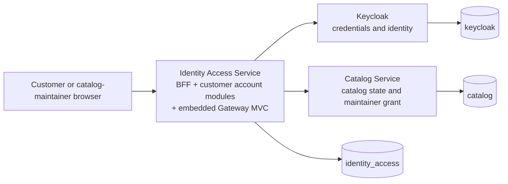

# Commerce Platform — Master Local Setup and Decision Guide

> **Status:** Gate 0 and Gate 1 baseline implemented and validated  
> **Last validated:** 2026-08-17  
> **Audience:** Developers and reviewers working on the Commerce Platform monorepo  
> **Technical source of truth:** This repository; Notion remains the product-knowledge source and Jira remains the delivery system

## 1. Purpose and current scope

This is the single starting point for setting up, operating, validating, and extending the local Commerce Platform environment. It consolidates the local-development instructions and the consequential decisions made during Customer Identity and Access Gates 0 and 1.

The current foundation proves two independently deployable Spring services, isolated database ownership, Keycloak bootstrap, native API versioning, annotated OpenAPI/Swagger UI, observability foundations, an embedded gateway skeleton, and executable boundary checks.

It does **not** yet implement customer or catalog-maintainer registration, login, logout, BFF sessions, CSRF controls, customer account binding, or final Catalog authorization. Those capabilities begin in Gate 2. The `/api/v1/foundation` endpoints are development-only probes, not product APIs.

## 2. Architecture and ownership



| Capability | Owner | Boundary rule |
|---|---|---|
| Customer and maintainer login/logout orchestration | Identity Access `auth` module | Browser uses the same-origin BFF; tokens will remain server-side. |
| Credentials and identity-provider sessions | Keycloak | Application services never store passwords. |
| Customer identity creation | Keycloak-hosted bounded registration, initiated by Identity Access | Disabled in Gate 1; no arbitrary public registration. |
| Catalog-maintainer provisioning | Reviewed administrative/fixture workflow | Maintainers never receive a public self-registration path. |
| Customer account/profile/address | Identity Access `customeraccount` module | Bound by exact OIDC `(issuer, subject)`, never by email. |
| Catalog authorization and catalog state | Catalog Service | Catalog validates the token and its own current maintainer grant. |
| Browser-facing downstream routing | Embedded Gateway MVC in Identity Access | Explicit routes only; it is not a separate service or authority. |

Auth and customer-account behavior remain separate modules inside Identity Access rather than separate services. This keeps subject binding, session revocation, deletion denial, and customer-owned data in one local transaction boundary. Extraction is reconsidered only after evidence of an independent team/release cadence, trust-zone requirement, or measured scaling need.

## 3. Locked platform

| Concern | Selection |
|---|---|
| Java | 25 |
| Gradle | Wrapper 9.6.1, Kotlin DSL |
| Spring Boot | 4.1.0 |
| Spring Cloud | 2025.1.2 |
| Gateway | Spring Cloud Gateway Server Web MVC 5.0.2, embedded in Identity Access |
| API documentation | Springdoc 3.0.3 with Swagger annotations/UI |
| Persistence | Spring Data JPA, Hibernate validation, Flyway, PostgreSQL 18.4 |
| Identity provider | Keycloak 26.7.0 |
| Observability | Actuator, Micrometer/Prometheus, Spring Boot OpenTelemetry starter, ECS JSON stdout |
| Local orchestration | Docker Compose |

Versions are centralized in `gradle/libs.versions.toml`, locked in per-service Gradle lockfiles, and pinned in container definitions. Upgrade them as one reviewed compatibility change and rerun the complete Gate 1 verification.

## 4. Prerequisites

Required:

- Docker Desktop or Docker Engine with Compose v2
- OpenSSL
- sufficient Docker memory for PostgreSQL, Keycloak, and both Spring services
- ports `8080`, `8081`, `8082`, `9000`, and `55432` available

A host Java installation is optional. If the host does not run Java 25, `./dev` uses the pinned `gradle:9.6.1-jdk25` container. Do not bypass the Gradle wrapper or pinned container with an unrelated local Gradle installation.

## 5. First-time setup

From the repository root:

```bash
./dev start
./dev verify
```

`./dev start` performs these operations:

1. creates a mode-600, Git-ignored `.env` with random local secrets when it does not exist;
2. builds independent Identity Access and Catalog images;
3. starts PostgreSQL and creates separate `identity_access`, `catalog`, and `keycloak` databases/roles;
4. imports the versioned `commerce` Keycloak realm;
5. runs each application's independent Flyway migrations; and
6. waits for container health checks.

Never copy `.env` into documentation, logs, screenshots, evidence, commits, or chat. `.env.example` documents names only and intentionally contains no usable values.

## 6. Everyday command reference

| Command | Purpose |
|---|---|
| `./dev start` | Generate missing local secrets, build images, and start the complete environment. |
| `./dev test` | Run unit, architecture, contract, and committed-secret checks. |
| `./dev verify` | Run the complete Gate 1 validation against the live topology. |
| `./dev status` | Show container state and health. |
| `./dev digest` | Print the secret-safe build/configuration/environment evidence manifest. |
| `./dev stop` | Stop containers while preserving the PostgreSQL volume. |
| `./dev reset` | Delete local containers and the PostgreSQL volume. This is intentionally destructive. |

Recommended development loop:

```bash
./dev start
./dev test
./dev verify
./dev stop
```

After source or dependency changes, `./dev start` rebuilds the affected service images. The Dockerfiles use BuildKit caches to keep repeated builds bounded.

## 7. Local endpoints and ports

| Component | URL/port | Notes |
|---|---|---|
| Identity Access | `http://localhost:8080` | BFF/service foundation |
| Identity readiness | `http://localhost:8080/actuator/health/readiness` | Includes the owned database |
| Identity liveness | `http://localhost:8080/actuator/health/liveness` | Excludes the database |
| Identity Swagger UI | `http://localhost:8080/swagger-ui.html` | Development profile only |
| Identity OpenAPI | `http://localhost:8080/v3/api-docs` | Development profile only |
| Gateway route manifest | `http://localhost:8080/actuator/gatewayRoutes` | Development profile; initially zero routes |
| Catalog | `http://localhost:8081` | Resource-server/catalog foundation |
| Catalog readiness | `http://localhost:8081/actuator/health/readiness` | Includes the owned database |
| Catalog liveness | `http://localhost:8081/actuator/health/liveness` | Excludes the database |
| Catalog Swagger UI | `http://localhost:8081/swagger-ui.html` | Development profile only |
| Catalog OpenAPI | `http://localhost:8081/v3/api-docs` | Development profile only |
| Keycloak | `http://localhost:8082` | Realm: `commerce` |
| Keycloak management health | `http://localhost:9000/health/ready` | Container health check target |
| PostgreSQL | `localhost:55432` | Optional host access; containers use port `5432` internally |

Quick versioning probes:

```bash
curl --fail http://localhost:8080/api/v1/foundation
curl --fail http://localhost:8081/api/v1/foundation
curl --write-out '%{http_code}\n' --output /dev/null http://localhost:8080/api/v2/foundation
```

The first two calls return `200`; unsupported `v2` returns `400`.

## 8. API versioning standard

Both services use Spring Framework's native MVC API-version mechanism:

- public application APIs use `/api/v{major}/...`;
- path segment index `1` parses `v1` as semantic version `1.0`;
- controllers declare the supported semantic version with `@RequestMapping(version = "1.0")`;
- supported versions are explicitly registered;
- automatic version detection is disabled;
- unsupported or missing versions fail closed;
- Actuator and Swagger paths remain outside the application API-version resolver.

Example controller shape:

```java
@RestController
@RequestMapping(path = "/api/{version}/items", version = "1.0")
class ItemController {
    // handlers
}
```

When adding a new major API version:

1. obtain contract and compatibility approval;
2. add the semantic version to each affected service's `ApiVersioningConfiguration`;
3. add a distinct controller mapping or reviewed baseline mapping;
4. update the checked-in OpenAPI contract under `contracts/openapi`;
5. add current, prior-version, unsupported-version, and error-shape tests; and
6. update gateway routes explicitly—never add a catch-all to make a version work.

## 9. Swagger and API-contract standard

Use Swagger annotations on HTTP controller contracts:

- `@Operation` for behavior and intent;
- `@ApiResponse` for stable outcomes;
- `@Parameter` for non-obvious inputs; and
- `@Schema` for request/response DTO fields and constraints.

Runtime `/v3/api-docs` and Swagger UI are enabled only in `dev`. They are disabled in `stg` and `prd`; checked-in versioned OpenAPI files remain the reviewed wire-contract source. Swagger UI “try it out” is disabled at the foundation stage.

Do not expose persistence entities directly as API DTOs. Use the global `@RestControllerAdvice` and RFC 9457 `ProblemDetail` for stable HTTP failures rather than constructing ad hoc error bodies in every controller.

## 10. Configuration and profiles

Each service owns:

- `application.yml` for safe shared defaults;
- `application-dev.yml` for local-only exposure and sampling;
- `application-stg.yml`; and
- `application-prd.yml`.

Configuration rules:

- YAML is the standard configuration format.
- Secrets have no source-controlled defaults and enter through environment variables.
- Swagger/OpenAPI runtime endpoints are disabled outside development.
- `ddl-auto=validate`; Flyway alone changes the schema.
- `open-in-view=false`; use-case transactions must be explicit.
- virtual threads are enabled for the servlet/JDBC workload.
- service discovery and registry auto-registration are disabled.
- local JDBC connect/socket timeouts are bounded at two seconds.
- Spring Cloud Config is deferred until configuration scale or dynamic-refresh evidence justifies another operational service.

## 11. Database ownership and migrations

One local PostgreSQL container reduces cost, but it hosts three logically and access-isolated databases:

| Database | Owner role | Authority |
|---|---|---|
| `identity_access` | `identity_access_app` | BFF/session and customer account data in later gates |
| `catalog` | `catalog_app` | Catalog state and maintainer grants |
| `keycloak` | `keycloak_app` | Keycloak-owned identity data |

Rules:

- no cross-service grants, joins, foreign keys, migrations, or shared application user;
- each service owns its Flyway location and lockstep migration history;
- no shared domain-model library or Gradle project dependency between services;
- application-generated UUIDs and UTC `timestamptz` are the future schema defaults;
- every database use case must first be recorded in `database-query-register.md` with its JPA operation, equivalent raw SQL, cardinality, index, concurrency rule, and evidence trigger.

To inspect a database locally without exposing the password in command history, load the appropriate value from the private `.env` through an intentional local shell process or use `docker compose exec postgres psql` interactively. Never paste credentials into a committed script.

## 12. Keycloak foundation

The versioned realm import defines:

- realm `commerce`;
- coarse roles `CUSTOMER` and `CATALOG_MAINTAINER`;
- confidential `identity-access-bff` client;
- Authorization Code flow and PKCE S256;
- exact local redirect and origin values;
- bearer-only `catalog-api` client; and
- disabled implicit grant, password/direct grant, service accounts, and public registration.

Gate 1 intentionally contains no users and keeps registration disabled. Gate 2 will implement and prove the real BFF Authorization Code + PKCE boundary. Bounded customer registration is enabled only in its approved later gate; maintainer self-registration remains prohibited.

## 13. Gateway foundation

Gateway Server Web MVC is embedded in Identity Access to provide one browser-facing service without introducing a third deployable. Gate 1 starts with an empty route manifest.

The following are prohibited unless a later accepted decision replaces this baseline:

- catch-all, duplicate, or ambiguous routes;
- dynamic discovery or database-backed routes;
- Redis or Spring Session;
- Gateway's default OAuth authorized-client token store;
- automatic gateway retries, cache, or circuit breaker;
- caller-supplied identity, owner, or role headers as authority; and
- an independent gateway database or deployable gateway service.

Catalog routes will be explicit and carry a named method, path, target, access class, deadline, size/admission policy, and header sanitation behavior. Catalog remains the final authorization authority.

## 14. Security and secret handling

- `.env` is generated with `umask 077`, remains Git-ignored, and is excluded from digests.
- The CI/static secret heuristic rejects common private-key and credential shapes.
- Runtime verification sends a unique header canary through both services and proves it is absent from service logs.
- Security configuration denies all unknown application routes by default.
- Foundation probes and API documentation are development scaffolding, not the final authentication policy.
- Passwords remain exclusively in Keycloak; customer ownership will derive from the authenticated principal, never a caller-provided account ID or email.
- Real tokens, cookies, CSRF values, passwords, addresses, phone numbers, and client secrets must never appear in logs, metrics, traces, test artifacts, or evidence manifests.

To rotate all local secrets safely:

```bash
./dev reset
```

Then delete the local `.env` file using your normal recoverable file-management workflow and run `./dev start`. Do not delete `.env` while retaining the old PostgreSQL volume: the generated replacement passwords would no longer match the existing database roles.

## 15. Observability and health policy

- Actuator supplies health and standard framework instrumentation.
- Micrometer exposes Prometheus metrics.
- the Spring Boot OpenTelemetry starter provides the tracing foundation;
- stdout uses structured ECS JSON;
- local OTLP export is disabled until a collector is intentionally added;
- development trace sampling is `1.0`; staging/production values must be bounded and configured;
- readiness includes the owned authoritative database and fails closed;
- liveness excludes the database so dependency failure does not create a restart loop.

Do not introduce generic logging/timing AOP. Prefer framework instrumentation and Micrometer Observation. Add filters for request-boundary concerns, Spring Security filters for authentication/CSRF, MVC interceptors only when handler metadata is required, and Gateway filters only for explicit downstream routing policy.

## 16. What `./dev verify` proves

The single verification entrypoint checks:

1. unit and gateway-route validator tests;
2. independent monorepo source/build/migration boundaries;
3. versioned OpenAPI and event contract sources;
4. Git-ignore and committed-secret rules;
5. Identity and Catalog readiness;
6. both generated OpenAPI documents and Swagger UIs;
7. Keycloak issuer discovery;
8. empty and valid Gateway route manifest;
9. supported `/api/v1` and rejected `/api/v2` behavior;
10. denial of Identity-to-Catalog and Catalog-to-Identity database credentials;
11. absence of a runtime request-secret canary from service logs; and
12. database-failure behavior: liveness `200`, readiness `503`, then readiness recovery.

Passing Gate 1 validates the foundation only. It is not evidence that authentication, CSRF, token validation, customer ownership, maintainer authorization, deletion, or performance targets are complete.

## 17. Repository layout and monorepo rules

```text
services/
  identity-access-service/   # independent build, container, config, migrations
  catalog-service/           # independent build, container, config, migrations
contracts/
  openapi/                   # reviewed HTTP contract sources
  events/                    # versioned event schemas
deployment/local/            # Compose, PostgreSQL bootstrap, Keycloak realm
docs/
  architecture/customer-identity-access/
  development/
scripts/                     # executable validation and evidence helpers
.github/workflows/ci.yml
dev                          # one local entrypoint
```

The monorepo centralizes dependency versions, build conventions, contracts, CI, and local orchestration. It does not erase service boundaries. A service must remain independently buildable, testable, migratable, deployable, rollbackable, and observable.

Adding a new microservice requires an accepted boundary decision, named data authority and owner, independent build and migrations, SLO/failure analysis, contract and compatibility plan, CI coverage, and evidence that the added operational cost is justified.

## 18. Decision register

| Decision | Selected option and reason | Cost/limitation | Revisit trigger |
|---|---|---|---|
| Repository topology | One monorepo with two application microservices, matching the explicit learning objective while keeping boundaries small. | More operational work than one deployment. | Boundary stops being independently valuable or resource/time budget is exceeded. |
| Identity boundary | Auth and customer account are modules inside Identity Access. | They share a release/runtime. | Independent team/release cadence, trust zone, or measured scaling demand. |
| Gateway | Embed stateless Gateway MVC in Identity Access. | Gateway and BFF scale together. | Independently measured gateway scaling/fault-isolation requirement. |
| Catalog authorization | Keycloak coarse role plus Catalog-owned current grant. | One local Catalog grant lookup on protected writes. | Approved authority model changes with equivalent revocation correctness. |
| Principal propagation | Later relay only the server-held maintainer access token; Catalog revalidates. | Private-hop token exposure must be tightly controlled. | Security review selects token exchange or another bounded credential. |
| Persistence | One local PostgreSQL server, isolated databases/roles per owner. | Local server failure affects all three databases. | Production availability/load evidence justifies separate infrastructure. |
| API versioning | Native Spring path versioning at `/api/v{major}`. | Major version remains visible in URLs and controllers. | Consumer requirements demonstrate header/media-type negotiation is superior. |
| API docs | Swagger annotations plus dev-only Springdoc UI; checked-in OpenAPI is reviewed source. | Annotation/contract drift requires tests. | A generated-first or design-first pipeline proves safer and simpler. |
| Configuration | YAML profiles and environment secrets; no Config Server. | No dynamic centralized refresh. | Configuration fleet size or operational evidence requires it. |
| Observability | Actuator/Micrometer/OpenTelemetry/ECS; no generic AOP. | Collector/backend is not part of local Gate 1. | An approved observability backend is selected. |
| Resilience | Bounded JDBC timeouts; no gateway retry/cache/circuit breaker. | Dependency failures surface directly. | A measured failure mode has a safe, specified retry/open-state policy. |
| Schema evolution | Independent Flyway migrations; Hibernate validates only. | Each service owns migration discipline. | No planned relaxation; replacement requires equivalent auditability. |
| Secrets | Generated local `.env`, never committed or included in evidence. | Local reset is needed for coordinated rotation. | Adopted secret manager provides an equally simple local workflow. |

## 19. Deliberately deferred infrastructure

The baseline does not include a broker, Redis, cache, service mesh, Kubernetes, dynamic service discovery, centralized configuration server, search engine, replica, distributed transaction coordinator, or circuit breaker. These are not prohibited forever; each requires a named failure/performance problem, a safe operating policy, measurable benefit, and acceptance that it will not displace correctness work.

The microservice topology is therefore intentionally small: two application services plus Keycloak and PostgreSQL infrastructure.

## 20. Troubleshooting

### A port is already in use

Check the ports in Section 7. PostgreSQL intentionally uses host port `55432` because local `5432` is commonly occupied. If a port must change, update the Compose/configuration source and evidence together rather than applying an undocumented one-off override.

### Docker is unavailable

Start Docker Desktop/Engine and confirm:

```bash
docker compose version
docker info
```

Then rerun `./dev start`.

### A service is unhealthy

```bash
./dev status
docker compose --env-file .env -f deployment/local/compose.yaml logs --no-color identity-access-service
docker compose --env-file .env -f deployment/local/compose.yaml logs --no-color catalog-service
docker compose --env-file .env -f deployment/local/compose.yaml logs --no-color postgres
docker compose --env-file .env -f deployment/local/compose.yaml logs --no-color keycloak
```

Do not attach full logs to evidence until they have passed the secret/PII canary policy.

### Database authentication fails after changing `.env`

The persisted database roles still hold the old passwords. Run `./dev reset`, recreate `.env`, and start again. This deletes local database data.

### Host Java is not version 25

This is expected and supported. `./dev test` and `./dev verify` use the pinned Gradle Java 25 container fallback. If using the wrapper directly, install a Java 25 runtime/toolchain first.

### An unsupported API version does not fail

Confirm the controller uses `@RequestMapping(version = "...")`, the path starts with `/api/v`, and the semantic version is explicitly listed in `ApiVersioningConfiguration`. Never weaken `setVersionRequired(true)` to hide a missing mapping.

## 21. Next implementation gate

Gate 2 / COM-43 implements the first real identity boundary:

- Keycloak Authorization Code + PKCE S256;
- state, nonce, issuer, audience, authorized-party, time, code, and redirect validation;
- opaque BFF session cookie and protected server-held tokens;
- customer-versus-maintainer principal classification;
- real login/logout behavior;
- CSRF/origin/CORS/fetch-metadata enforcement; and
- token/session/secret telemetry canary evidence.

Do not add mock authentication as a shortcut. Catalog maintainer authorization, customer account binding, bounded customer registration, profile/address ownership, and deletion follow their ordered implementation gates.

## 22. Related source documents

- [`../architecture/customer-identity-access/implementation-plan.md`](../architecture/customer-identity-access/implementation-plan.md)
- [`../architecture/customer-identity-access/gate-0-decision-and-source-sync.md`](../architecture/customer-identity-access/gate-0-decision-and-source-sync.md)
- [`../architecture/customer-identity-access/gate-1-bootstrap-evidence.md`](../architecture/customer-identity-access/gate-1-bootstrap-evidence.md)
- [`../architecture/customer-identity-access/hld.md`](../architecture/customer-identity-access/hld.md)
- [`../architecture/customer-identity-access/lld.md`](../architecture/customer-identity-access/lld.md)
- [`../architecture/customer-identity-access/schema-design.md`](../architecture/customer-identity-access/schema-design.md)
- [`database-query-register.md`](database-query-register.md)
- [`github-jira-workflow.md`](github-jira-workflow.md)

## What you should learn from this setup

- A monorepo can centralize developer experience without sharing service data or business implementation.
- Authentication orchestration and customer account ownership are different responsibilities, but they do not automatically require separate deployments.
- A microservice boundary is meaningful only when authority, data, migrations, failure behavior, and validation remain independent.
- Readiness should fail when authoritative data is unavailable; liveness should not turn dependency failure into a restart loop.
- API versioning, contracts, secret handling, and observability are platform policies that should be executable from the first foundation gate.

## Questions to test your understanding

1. Why does Catalog check its own maintainer grant after validating a Keycloak token?
2. Why are customer account management and BFF authentication modules in one service today?
3. What does Gate 1 prove, and which security claims must wait for Gate 2 or later?
4. Why does the local environment use one PostgreSQL server but three roles and databases?
5. What evidence would justify adding Redis, a broker, a separate gateway, or another service?

## What would change this architecture

- an approved product/security decision changing actor flows or authority ownership;
- independent team or release ownership with a stable remote contract;
- a measured capacity or fault-isolation bottleneck;
- a production trust-zone or regulatory requirement;
- reproducible failure evidence requiring a new resilience mechanism; or
- a schedule/resource result showing that the two-service topology prevents delivery of the approved P0 outcome.
